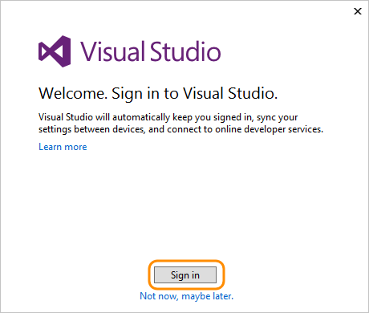
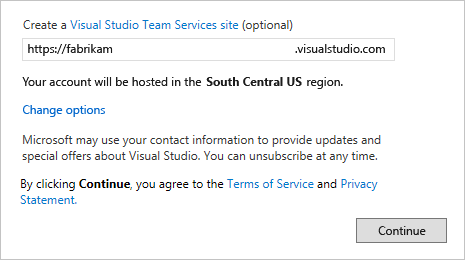

# Launch Visual Studio via Azure DevOps Services

[!INCLUDE [version-vsts-only](../../includes/version-vsts-only.md)]

When you first open [Visual Studio 2015](https://visualstudio.microsoft.com/products/vs-2015-product-editions), 
you can sign in and connect to [Azure DevOps Services](https://visualstudio.microsoft.com/products/visual-studio-team-services-vs).

If you're already signed in to Visual Studio or using Visual Studio 2017, [connect to Azure DevOps Services](../../repos/git/gitquickstart.md).

Once you're connected, you can store or share code in free, unlimited, private, 
cloud-based Git repositories or Team Foundation Version Control (TFVC). 
Organize and manage your work with Agile tools for DevOps, 
continuous integration, and continuous delivery. Your team can build often, 
test early, and ship faster.

> To set up Visual Studio without Azure DevOps Services, 
> learn how to [get started](/visualstudio/install/install-visual-studio-2015). 
> To host your own server, 
> learn how to [install and set up Azure DevOps Server](/azure/devops/server/install/get-started).

Azure DevOps Services is free for [up to five users with access to Basic features](https://visualstudio.microsoft.com/products/visual-studio-team-services-feature-matrix-vs) and for unlimited [Visual Studio subscribers](https://visualstudio.microsoft.com/products/how-to-buy-vs) and [Stakeholders who can access limited features](https://visualstudio.microsoft.com/products/visual-studio-team-services-feature-matrix-vs).
Learn [what else you get with Azure DevOps Services](https://visualstudio.microsoft.com/pricing/visual-studio-team-services-pricing-vs). 
If you want, you can also use Azure DevOps Services with any IDE or code editor, like the following examples:

* [Eclipse, Android Studio, or IntelliJ](/previous-versions/azure/devops/java/)
* Xcode (see [Git](../../repos/git/share-your-code-in-git-xcode.md) or [TFVC](../../repos/tfvc/share-your-code-in-tfvc-xcode.md))
* [Visual Studio Code](https://code.visualstudio.com/docs/editor/versioncontrol)

## How do I set up Visual Studio 2015 for Azure DevOps Services when I sign in?

1. [Download and install Visual Studio](https://go.microsoft.com/fwlink/?LinkId=309297&clcid=0x409&slcid=0x409), 
if you don't have the version you want already. 
[Which versions can I use with Azure DevOps Services?](./faq-set-up-vs.yml)

    If you have a Visual Studio subscription that 
    includes the Visual Studio IDE, get the version 
    that's available with your subscription.

2. Start Visual Studio, and then sign in to create your profile. 

    This profile saves your settings and roams with you 
    when you sign in to Visual Studio on any computer. 
    [Why else should I sign in?](./faq-set-up-vs.yml)
    If you're a Visual Studio subscriber, use the sign in address for your subscription. 

    

    [Can't sign in?](/azure/devops/organizations/accounts/faq-set-up-vs#t-i-assign-azure-devops-permissions-directly-to-an-azure-ad-group-)

3. Enter your sign in address, 
and then enter your password.

4. Add your Visual Studio profile details. You only need to add these details once. 

    

5. Give your organization a name, and confirm its location. 

    

    [How can I create an organization later](faq-configure-customize-organization.yml#create-organization-faqs) or [change its location?](change-organization-location.md)

6. Create your first project to store your code, 
work items, backlog, builds, tests, and other assets. 
Name your project, select a process to organize your work, 
and choose the version control to manage your code.

    

    Not sure which to choose? Learn which 
    [process](../../boards/work-items/guidance/choose-process.md) 
    and version control ([Git](../../repos/git/index.yml) 
    or [TFVC](../../repos/tfvc/index.yml))
    work best for you.

7. If you're a new Visual Studio user, you can change your settings here, 
or change them later in Visual Studio options.

    

    These changes are saved with your profile, 
    and your settings roam with you wherever you sign in. 

8. To view your new organization, sign in to ```https://dev.azure.com/{yourorganization}```.

## Next steps

> [!div class="nextstepaction"]
   > [Add users to your organization](add-organization-users.md)

## Related articles

* Add code to [Git](../../repos/git/share-your-code-in-git-vs.md) or [TFVC](../../repos/tfvc/share-your-code-in-tfvc-vs.md).

* [Create your backlog](../../boards/backlogs/create-your-backlog.md) to organize your work, [manage your process](../../organizations/settings/work/manage-process.md), or [customize your process](../../organizations/settings/work/customize-process.md).