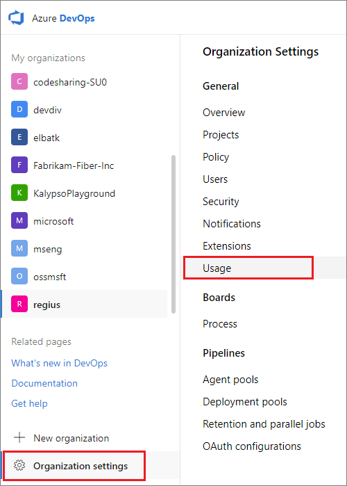

# Usage monitoring

[!INCLUDE [version-vsts-only](../../includes/version-vsts-only.md)]

You can investigate the usage of your users in Azure DevOps Services. Usage monitoring is important to identify causes for bandwidth bottlenecks, that aren't caused by faulty systems. See the following most common commands or operations that might trigger a usage message.

- Requests that were delayed
- Requests that exceeded thresholds

## Prerequisites

You must be a member of the Project Collection Administrators group to view the Usage page.

## Usage concepts

When a user's request is delayed by a significant amount of time, that user gets a notification email. There's also a warning banner displayed on the web. Both the warning banner and notification email have a link to the usage page. If the user doesn't have an email address, the notification email gets sent to the Project Collection Administrators group members.

Commands that consume a high number of Azure DevOps throughput units (TSTUs) (in the hundreds, for example) are responsible for the user exceeding the threshold. The User Agent and IP address columns can be helpful to see where these commands are coming from. Custom tools or build service accounts might be making a large number of calls in a short time window. 

To avoid issues, you may need to rewrite tools or update build processes. This action reduces the type and number of calls. For example, a tool may be pulling a large version control repository from scratch regularly, when it could pull incrementally instead.

- Request history on the Usage page is in descending order by default.
- Usage is grouped by command into five-minute time windows.
- The Count column gives the number of commands in the window.
- Other columns highlight total TSTUs and delay time.

For information on rate limits, see [Current rate limits](../../integrate/concepts/rate-limits.md#current-rate-limits).

## View usage

1. Sign in to your organization (```https://dev.azure.com/{yourorganization}```).

2. Select  **Organization settings** > **Usage**.

   

3. Use this page to investigate the usage of other users. Usage can occur from regular web portal operations or use of command line or REST API tools.

   a. View by the following categories:
     - Usage By User
     - Usage By Pipeline
     - Top user agents
     - Top commands
     - Top Build Pipelines
     - Top Release Pipelines
  
   b. Filter by the following column options:
     - User
     - User agent
     - IP address
     - Time range
     - ServiceApplication
     - Command
     - Status
     - Count
     - Usage (TSTUs)
     - Delay(s)
   
   Azure DevOps displays the last hour of requests by default. You can select from other increments of time.
   
   d. Select from the following statuses:
     - All statuses
     - Normal
     - Delayed
     - Blocked
   
   e. The usage page is scoped to the 30 minutes before and after the first delayed request. Review the request history leading up to delayed requests.

   :::image type="content" source="media/usage-screenshot-example.png" alt-text="Usage page screenshot example":::

## Related articles

- [Work tracking, process, and project limits](../settings/work/object-limits.md)
- [Access, export, and filter Azure DevOps audit logs](../audit/azure-devops-auditing.md)
- [About Settings at the user, team, project, and organizational level](../settings/about-settings.md)
- [Get list of organizations backed by Azure AD](get-list-of-organizations-connected-to-azure-active-directory.md)
