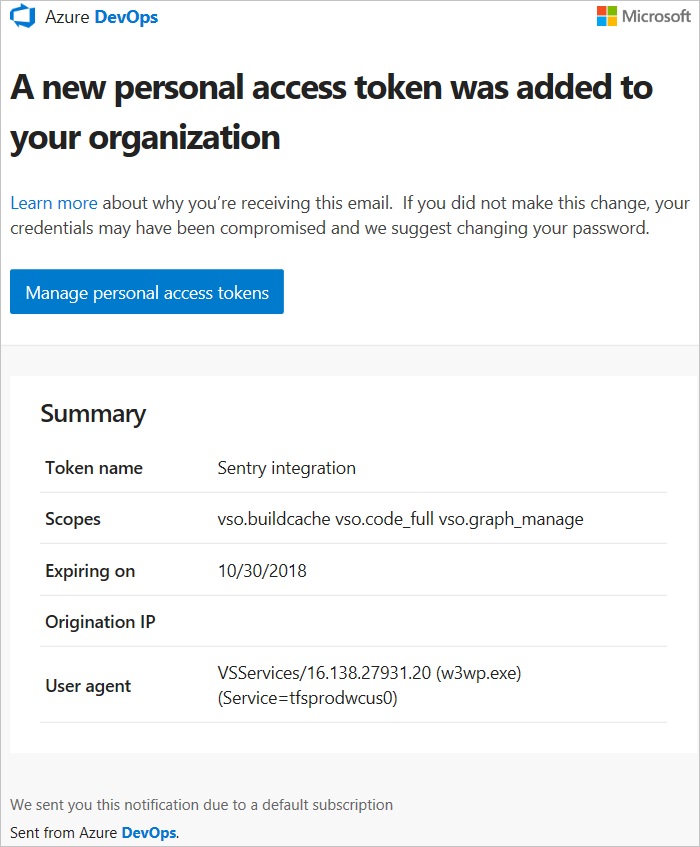
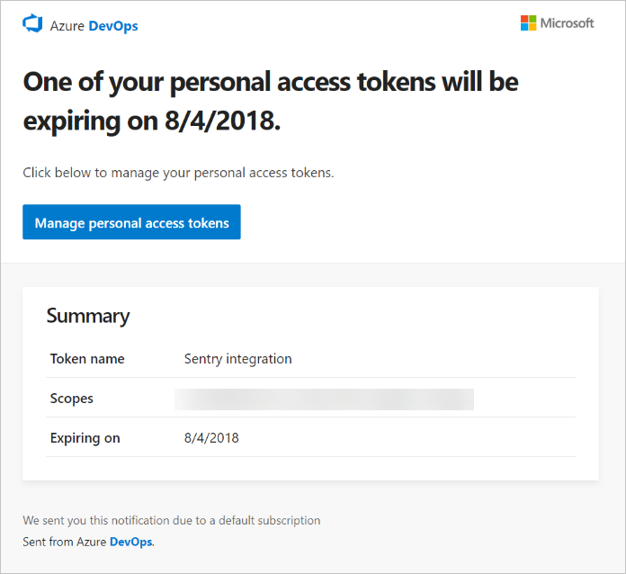

# Authenticate access with personal access tokens

[!INCLUDE [version-tfs-2017-through-vsts](../../_shared/version-tfs-2017-through-vsts.md)]

Personal access tokens (PATs) are alternate passwords that you can use to authenticate in to Azure DevOps. In this article, we walk you through how to create or revoke PATS.

Azure DevOps use enterprise-grade authentication to help protect and secure your data. Clients like Visual Studio and Eclipse (with the Team Explorer Everywhere plug-in) also support Microsoft account and Azure AD authentication.

For non-Microsoft tools that integrate into Azure DevOps but don't support Microsoft account or Azure AD authentication, you must use PATs. Examples include Git, NuGet, or Xcode. To set up PATs for non-Microsoft tools, use [Git credential managers](../../repos/git/set-up-credential-managers.md) or create them manually.

[!INCLUDE [personal-access-tokens-procedure](../../repos/git/_shared/personal-access-tokens.md)]

To learn more about how security and identity are managed, see [About security and identity](../security/about-security-identity.md).

To learn more about permissions and access levels for common user tasks, see [Default permissions and access for Azure DevOps](../security/permissions-access.md).

For administrators to revoke organization user PATs, see [Revoke other users' personal access tokens](admin-revoke-user-pats.md).

## Frequently asked questions  

### What is my Azure DevOps Services URL?

https://dev.azure.com/{yourorganization}

### Where can I learn more about how to use PATs?

For examples of how to use PATs, see [Git credential managers](../../repos/git/set-up-credential-managers.md), [REST APIs](../../integrate/get-started/rest/basics.md), [NuGet on a Mac](../../artifacts/nuget/consume.md#mac-os), and [Reporting clients](../../report/powerbi/client-authentication-options.md#enter-credentials-within-a-client).

### What notifications will I get about my PAT?

Users receive two notifications during the lifetime of a PAT, one at creation and the other seven days before the expiration.

The following notification is sent at PAT creation:

The following notification is sent - a PAT is near expiration:

### What do I do if I get an unexpected PAT notification?

An administrator or a tool might have created a PAT on your behalf. See the following examples:

- When you connect to an Azure DevOps Services Git repo through git.exe. it creates a token with a display name like "git: https://MyOrganization.visualstudio.com/ on MyMachine."
- When you or an admin sets up an Azure App Service web app deployment, it creates a token with a display name like "Service Hooks :: Azure App Service :: Deploy web app."
- When you or an admin sets up web load testing as part of a pipeline, it creates a token with a display name like "WebAppLoadTestCDIntToken".
- When a Microsoft Teams Integration Messaging Extension is set up, it creates a token with a display name like "Microsoft Teams Integration".

If you still believe that a PAT exists in error, we suggest that you [revoke the PAT](../../integrate/get-started/authentication/PATs.md). Next, change your password. As an Azure Active Directory user, check with your administrator to see if your organization was used from an unknown source or location.

