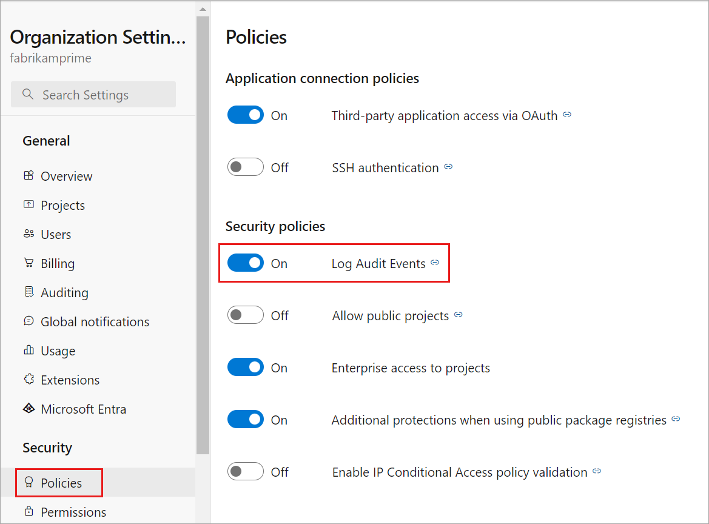

# Access, export, and filter audit logs

[!INCLUDE [version-eq-azure-devops](../../includes/version-eq-azure-devops.md)]

> [!NOTE]
> Auditing is still in public preview.

On the Auditing page of your Organization Settings, you can access, export, and filter audit logs, which track the many changes that occur within your Azure DevOps organization(s). With these logs, you can use them to meet your organization's compliance and governance goals.

[!INCLUDE [important-backed-by-azure-active-directory](includes/important-backed-by-azure-active-directory.md)]

Audit changes occur whenever a user or service identity within the organization edits the state of an artifact. You may see events logged for any of the following occurrences:

- permissions changes
- deleted resources
- branch policy changes
- auditing log access and downloads
- and much much more...

Events get stored for 90 days, after which they're deleted. However, you can back up audit events to an external location to keep the data for longer than the 90-day period. 

Auditing events can be accessed through two methods on the Auditing page in your Organization Settings:
- Through the Auditing logs available under the main Logs tab, and
- via any Auditing streams set up through the [Streams](auditing-streaming.md) tab.

> [!NOTE]
> Auditing isn't available for on-premises deployments of Azure DevOps Server. It is possible to connect an [Auditing stream](auditing-streaming.md) from an Azure DevOps Services instance to an on-premises or cloud-based instance of Splunk, but you must make sure you allow IP ranges for inbound connections. For details, see [Allowed address lists and network connections, IP addresses and range restrictions](../security/allow-list-ip-url.md#range-restrictions).


## Prerequisites

Auditing is turned off by default for all Azure DevOps Services organizations and can be [toggled on and off](#enable-and-disable-auditing) by organization Owners and Project Collection Administrators in the *Organization Settings* page.
By default, Project Collection Administrators are the only group that has full access to the Auditing feature.

### Audit permissions

- By default, members of the **organization Owners** and **Project Collection Administrators** groups have full access to all Auditing features.
- Specific Audit permissions can be granted to any group via the Security Permissions page in Organization Settings. 

> [!NOTE]  
> If the **Limit user visibility and collaboration to specific projects** preview feature is enabled for the organization, users added to the **Project-Scoped Users** group can't view **Auditing** and have limited visibility to **Organization settings** pages. For more information and important security-related mentions, see [Manage your organization, Limit  user visibility for projects and more](../../user-guide/manage-organization-collection.md#project-scoped-user-group). 

## Enable and disable auditing

#### [Preview page](#tab/preview-page)

1. Sign in to your organization (```https://dev.azure.com/{yourorganization}```).
2. Select  **Organization settings**.
3. Select **Policies** under the **Security** header.   
4. Toggle the **Log Audit Events** button ON.

     

The organization will now have Auditing enabled. You may need to refresh the page to see **Auditing** appear in the sidebar. Audit events will start appearing on Auditing Logs and through any audit streams that have been configured.

5. If you no longer want to receive Auditing events, toggle the **Enable Auditing** button to OFF. When the button is toggled off, the **Auditing** page will no longer appear in the sidebar and the Auditing Logs page will be unavailable. Any audit streams will stop receiving events.

#### [Current page](#tab/current-page)

1. Sign in to your organization (```https://dev.azure.com/{yourorganization}```).
2. Select  **Organization settings**.
3. Select **Policies** under the **Security** header.   
4. Toggle the **Log Audit Events** button ON.

     

The organization will now have Auditing enabled. You may need to refresh the page to see **Auditing** appear in the sidebar. Audit events will start appearing on Auditing Logs and through any audit streams that have been configured.

5. If you no longer want to receive Auditing events, toggle the **Enable Auditing** button to OFF. When the button is toggled off, the **Auditing** page will no longer appear in the sidebar and the Auditing Logs page will be unavailable. Any audit streams will stop receiving events.

* * *


## Access auditing

#### [Preview page](#tab/preview-page)

1. Sign in to your organization (```https://dev.azure.com/{yourorganization}```).
2. Select  **Organization settings**.

   

3. Select **Auditing**.

   
   
4. If you don't see Auditing in Organization settings, then you don't have access to view audit events. Project Collection Administrators group can give permissions to other users and groups so that they can view the auditing pages. To do so, select **Permissions**, and then find the group or users to provide auditing access to.

     

5. Set **View audit log** to **allow**, and then select **Save changes**.

   

The user or group members will now have access to view your organization's audit events.

#### [Current page](#tab/current-page)

1. Sign in to your organization (```https://dev.azure.com/{yourorganization}```).
2. Select  **Organization settings**.
   
   
   
3. Select **Auditing**.

   

4. If you don't see Auditing in Organization settings, then you don't have access to view audit events. Project Collection Administrators group can give permissions to other users and groups so that they can view the auditing pages. Select **Security**, and then find the group or users to provide auditing access to.

     

5. Set **View audit log** to **allow**, and then select **Save changes**.

   

The user or group members will now have access to view your organization's audit events.

* * *

## Review audit log

The Auditing page provides a simple view into the audit events recorded for your organization. See the following description of the information that is visible on the auditing page:

### Audit event information and details

|Information  |Details  |
|---------|---------|
|Actor     | Display name of the individual that triggered the audit event.      |
|IP    |  IP address of the individual that triggered the audit event.    |
|Timestamp     | Time that the triggered event happened. Time is localized to your time zone.        |
|Area     | Product area in Azure DevOps where the event occurred.        |
|Category     | Description of the type of action that occurred (for example, modify, rename, create, delete, remove, execute, and access event).   |
|Details    | Brief description of what happened during the event.        |

Each audit event also records additional information to what's viewable on the auditing page. This information includes the authentication mechanism, a correlation ID to link similar events together, user agent, and more data depending on the audit event type. This information can only be viewed by exporting the auditing events via CSV or JSON.

### ID & correlation ID

Each audit event has unique identifiers called the “ID” and “CorrelationID”. The correlation ID is helpful for finding related audit events. For example, a created project can generate several dozen audit events. You can link these events together because they all have the same correlation ID. 

When an audit event ID matches its correlation ID, it indicates that the audit event is the parent or original event. To see only originating events, look for the events where “ID” equals the “Correlation ID” in question. Then, if you want to investigate an event and its related events, you can look up all events with a correlation ID that matches the originating event's ID. Not all events have related events. 

### Bulk events

Some audit events can contain multiple actions that took place at once, also known as "bulk audit events". You can distinguish these events from others with an "Information icon" on the far right of the event. You can find individual details on the actions included in the bulk audit events through the downloaded audit data.


Selecting the information icon displays additional information about what happened in this audit event.

As you look through the audit events, you may find the *Category* and *Area* columns of interest. These columns allow you to sift through to find only the types of events that you're interested in. The following tables are a list of categories and areas, and their descriptions:

### List of events

We try our best to add new auditing events monthly. If you would like to see an event that isn't currently tracked, consider sharing that with us in the [Developer Community](https://developercommunity.visualstudio.com/search?space=21). 

For a full list of all events that we currently can emit through the Auditing feature, see the [Auditing Events List](/azure/devops/organizations/audit/auditing-events).

> [!NOTE]
> Want to find out what event areas your organization logs? Be sure to check out the [Audit Log Query API](/rest/api/azure/devops/audit/audit-log/query): `https://auditservice.dev.azure.com/{YOUR_ORGANIZATION}/_apis/audit/actions`, replacing {YOUR_ORGANIZATION} with the name of your organization. This API returns a list of all audit events (or actions) your organization could emit. 

## Filter audit log by date and time

In the current Auditing UI, you can only filter events by a date or time range. To scope down the viewable audit events by a date range, select the time filter on the top-right-hand side of the page. 


Use the filters to select any time range over the last 90 days and scope it down to the minute. Once you've selected a time range, select Apply on the time range selector to start the search. By default, the top 200 results are returned for that time selection. If there are more results, then you can scroll down to load them onto the page.

## Export auditing events

To do a more detailed search on the auditing data or store data for more than 90 days of data, you'll need to export existing audit events. The exported data can then be stored in another location or service. 

Select the **Download** button in the top-right-hand side of the auditing page to export auditing events. You can select to download as a CSV or JSON file. 

Selecting either option starts the download. Events get downloaded based on the time range you've selected in the filter. If you have one day selected, then you get one day’s worth of data returned. Transversely, if you wanted all 90 days, select 90 days from the time range filter and then start the download. 

> [!NOTE]
> For long-term storage and analysis of your auditing events, consider sending your events downstream to a Security Information and Event Management (SIEM) tool using the [Audit Streaming feature](auditing-streaming.md). Exporting the auditing logs is recommended for cursory data analysis.

To filter data by more than the date/time range, we recommend downloading logs as CSV files and importing Microsoft Excel or other CSV parsers to sift through Area and Category columns. For analysis on even larger datasets, we recommend uploading exported audit events into a Security Incident and Event Management (SIEM) tool using the [Audit Streaming function](auditing-streaming.md). Such tools allow you to keep greater than 90 days of events, searches, generated reports, and configured alerts based on audit events. 

## Limitations

The following limitations exist for what can be audited.

* Azure Active Directory (Azure AD) group membership changes – Auditing Logs include updates to Azure DevOps groups and group membership (when an event Area is "Groups"). However, if you manage membership via Azure AD groups, such additions and removals of users from those Azure AD groups aren't audited by Azure DevOps in these logs. Review the Azure AD audit logs to see when a user or group was added or removed from an Azure AD group. 
* Sign in events – We don't track sign in events for Azure DevOps. View the Azure AD audit logs to review sign in events to your Azure AD. 

## Frequently asked questions

### Q: What is the DirectoryServiceAddMember group and why is it appearing on the audit log?
A: The DirectoryServiceAddMember group is a system group used to help manage membership to your Azure DevOps organization. Membership to this system group can be affected by many system, user, and administrative actions. As this group is a system group used only for internal processes, customers can disregard audit log entries that capture membership changes to this group. 

## Related articles
- [Auditing streaming](auditing-streaming.md)
