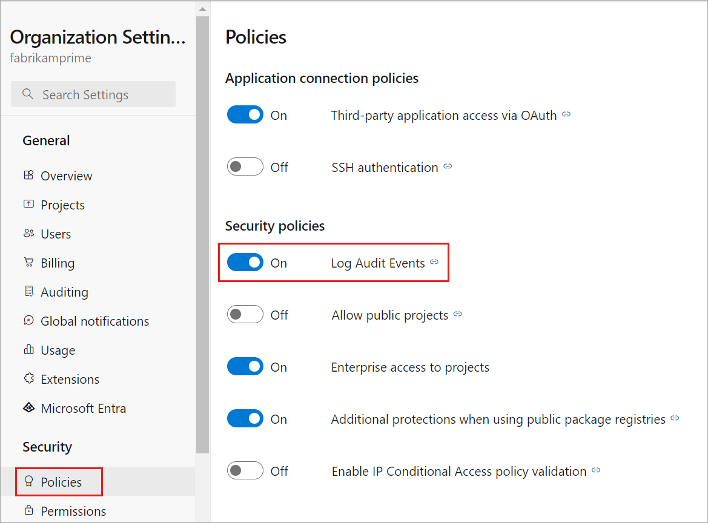
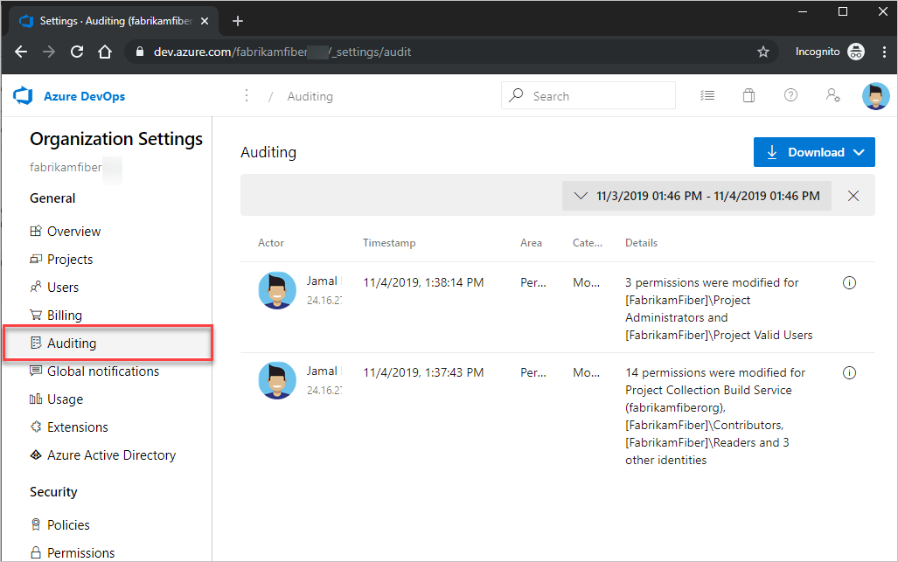
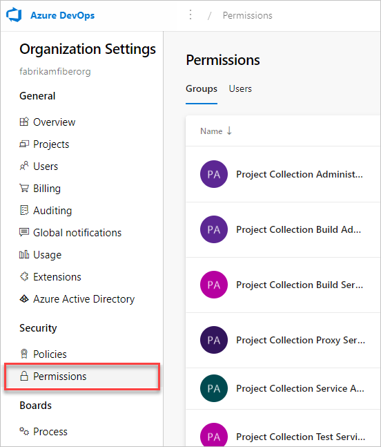
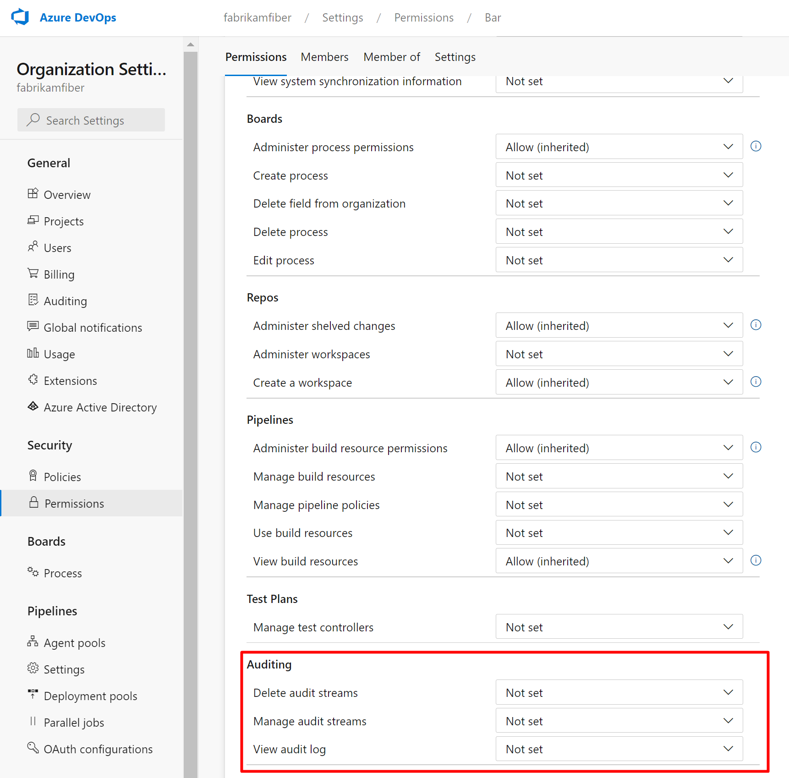
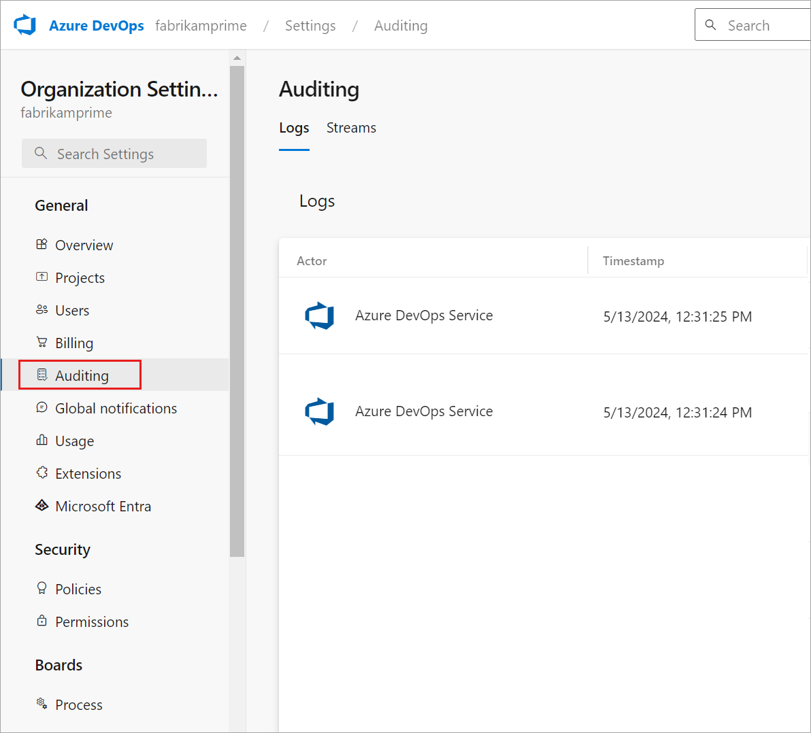
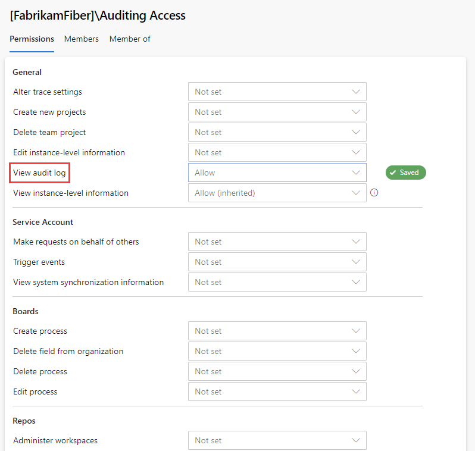
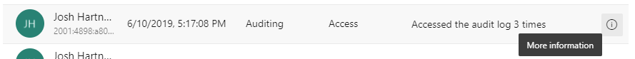
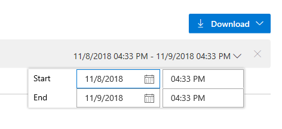

# Access, export, and filter audit log

[!INCLUDE [version-eq-azure-devops](../../includes/version-eq-azure-devops.md)]

> [!NOTE]
> Auditing is currently in public preview.

Keeping track of activities within your Azure DevOps environment is crucial for security and compliance. Auditing helps you monitor and log these activities, providing transparency and accountability. This article explains the auditing features and shows how to set up and use them effectively.

[!INCLUDE [important-backed-by-azure-active-directory](includes/important-backed-by-azure-active-directory.md)]

Audit changes occur whenever a user or service identity within the organization edits the state of an artifact. Events that might get logged include:

- Permissions changes
- Deleted resources
- Branch policy changes
- Log access and downloads
- Many other types of changes

These logs provide a comprehensive record of activities, helping you monitor and manage the security and compliance of your Azure DevOps organization.

Audit events are stored for 90 days before they're deleted. To retain the data for longer, you can back up audit events to an external location.

Auditing isn't available for on-premises deployments of Azure DevOps. However, you can connect an [Auditing stream](auditing-streaming.md) from an Azure DevOps Services instance to an on-premises or cloud-based instance of Splunk. Ensure you allow IP ranges for inbound connections. For details, see [Allowed address lists and network connections, IP addresses and range restrictions](../security/allow-list-ip-url.md#range-restrictions).

[!INCLUDE [ai-assistance-mcp-server-tip](../../includes/ai-assistance-mcp-server-tip.md)]

### Prerequisites

[!INCLUDE [prerequisites-auditing](includes/prerequisites-auditing.md)]

## Enable and disable auditing

#### [Preview page](#tab/preview-page)

1. Sign in to your organization (```https://dev.azure.com/{yourorganization}```).
1. Select  **Organization settings**.
1. Select **Policies** under the **Security** header.   
1. Switch the **Log Audit Events** button to **ON**.

     

   Auditing is enabled for the organization. Refresh the page to see **Auditing** appear in the sidebar. Audit events start appearing in Auditing Logs and through any configured audit streams.
1. If you no longer want to receive Auditing events, switch the **Enable Auditing** button to **OFF**. This action removes the **Auditing** page from the sidebar and makes the Auditing Logs page unavailable. Any audit streams stop receiving events.

#### [Current page](#tab/current-page)

1. Sign in to your organization (```https://dev.azure.com/{yourorganization}```).
1. Select  **Organization settings**.
1. Select **Policies** under the **Security** header.   
1. Switch the **Log Audit Events** button to **ON**.

     

   Auditing is enabled for the organization. Refresh the page to see **Auditing** appear in the sidebar. Audit events start appearing in Auditing Logs and through any configured audit streams.
1. If you no longer want to receive Auditing events, switch the **Enable Auditing** button to **OFF**. This action removes the **Auditing** page from the sidebar and makes the Auditing Logs page unavailable. Any audit streams stop receiving events.

* * *

## Access auditing

#### [Preview page](#tab/preview-page)

1. Sign in to your organization (```https://dev.azure.com/{yourorganization}```).
1. Select  **Organization settings**.

   

1. Select **Auditing**.

   
   
1. If you don't see **Auditing** in **Organization settings**, then you don't have access to view audit events. Project Collection Administrators group can give permissions to other users and groups so that they can view the auditing pages. To do so, select **Permissions**, and then find the group or users to provide auditing access to.

     

1. Set **View audit log** to **Allow**, and then select **Save changes**.

   

   The user or group members now have access to view your organization's audit events.

#### [Current page](#tab/current-page)

1. Sign in to your organization (```https://dev.azure.com/{yourorganization}```).
1. Select  **Organization settings**.
   
   
   
1. Select **Auditing**.

   

1. If you don't see **Auditing** in **Organization settings**, then you don't have access to view audit events. Project Collection Administrators group can give permissions to other users and groups so that they can view the auditing pages. Select **Security**, and then find the group or users to provide auditing access.

     

1. Set **View audit log** to **allow**, and then select **Save changes**.

   

   The user or group members now have access to view your organization's audit events.

* * *

## Review audit log

The Auditing page provides a simple view into the audit events recorded for your organization. See the following description of the information that's visible on the auditing page:

### Audit event information and details

|Information  |Details  |
|---------|---------|
|Actor     | Display name of the individual that triggered the audit event.      |
|IP    |  IP address of the individual that triggered the audit event.    |
|Timestamp     | Time that the triggered event happened. Time is localized to your time zone.        |
|Area     | Product area in Azure DevOps where the event occurred.        |
|Category     | Description of the type of action that occurred (for example, modify, rename, create, delete, remove, execute, and access event).   |
|Details    | Brief description of what happened during the event.        |

Each audit event also records additional information to what's viewable on the auditing page. This information includes the authentication mechanism, a correlation ID to link similar events together, user agent, and more data depending on the audit event type. You can view this information only by exporting the auditing events via CSV or JSON.

### ID and correlation ID

Each audit event has unique identifiers called the `ID` and `CorrelationID`. The correlation ID is useful for finding related audit events. For example, creating a project can generate several dozen audit events, all linked by the same correlation ID.

When an audit event ID matches its correlation ID, it indicates that the audit event is the parent or original event. To see only originating events, look for events where the `ID` equals the `Correlation ID`. If you want to investigate an event and its related events, look up all events with a correlation ID that matches the originating event's ID. Not all events have related events.

### Bulk events

Some audit events, known as "bulk audit events," can contain multiple actions that took place simultaneously. You can identify these events by the **Information icon** on the far right of the event. To view individual details of the actions included in bulk audit events, refer to the downloaded audit data.



Selecting the information icon displays more details about the audit event.

As you review the audit events, the *Category* and *Area* columns can help you filter and find specific types of events. The following tables list the categories and areas, along with their descriptions:

#### List of events

The product team strives to add new auditing events on a monthly basis. If there's an event you'd like to see tracked that isn't currently available, share your suggestion with them in the [Developer Community](https://developercommunity.visualstudio.com/search?space=21).

For a comprehensive list of all events that can be emitted through the Auditing feature, see the [Auditing Events List](/azure/devops/organizations/audit/auditing-events).

> [!NOTE]
> Want to find out what event areas your organization logs? Check out the [Audit Log Query API](/rest/api/azure/devops/audit/audit-log/query): `https://auditservice.dev.azure.com/{YOUR_ORGANIZATION}/_apis/audit/actions`. Replace {YOUR_ORGANIZATION} with the name of your organization. This API returns a list of all audit events (or actions) your organization can emit. 

## Filter audit log by date and time

In the current Auditing UI, you can filter events only by date or time range. 

1. To narrow down the viewable audit events, select the time filter.

   

1. Use the filters to select any time range within the last 90 days and scope it down to the minute.

1. Select **Apply** on the time range selector to start the search. 
   By default, the top 200 results return for that time selection. If there are more results, you can scroll down to load more entries onto the page.

## Export audit events

To perform a more detailed search on the auditing data or store data for more than 90 days, export the existing audit events. You can store the exported data in another location or service.

To export auditing events, select the **Download** button. You can choose to download the data as a CSV or JSON file.

The download includes events based on the time range you select in the filter. For example, if you select one day, you get one day's worth of data. To get all 90 days, select **90 days** from the time range filter and then start the download.

> [!NOTE]
> For long-term storage and analysis of your auditing events, consider using the [Audit Streaming feature](auditing-streaming.md) to send your events to a Security Information and Event Management (SIEM) tool. We recommend exporting the auditing logs for cursory data analysis.

- To filter data beyond the date and time range, download logs as CSV files and import them into Microsoft Excel or other CSV parsers to sift through the Area and Category columns. 
- To analyze larger datasets, upload exported audit events into a Security Incident and Event Management (SIEM) tool using the [Audit Streaming function](auditing-streaming.md). SIEM tools allow you to retain more than 90 days of events, perform searches, generate reports, and configure alerts based on audit events.

## Limitations

The following limitations apply to what the system can audit:

* **Microsoft Entra group membership changes**: Auditing Logs include updates to Azure DevOps groups and group membership when an event `Area` is `Groups`. However, if you manage membership through Microsoft Entra groups, these logs don't include additions and removals of users from those Microsoft Entra groups. Review the Microsoft Entra audit logs to see when a user or group was added or removed from a Microsoft Entra group.
* **Sign-in events**: Azure DevOps doesn't track sign-in events. To review sign-in events to your Microsoft Entra ID, view the Microsoft Entra audit logs.
* **Indirect user additions:** In some cases, users get added to your organization indirectly and show in the audit log as added by Azure DevOps Services. For instance, if you assign a user to a work item, you might add them automatically to the organization. While an audit event is generated for the user being added, there's no corresponding audit event for the work item assignment that triggered the user addition. To trace these events, consider the following actions:
  * Review your work item history for the corresponding timestamps to see if this user was assigned to any work items.
  * Check the audit log for any related events that might provide context.


## Frequently asked questions

### Q: What is the DirectoryServiceAddMember group and why is it appearing on the audit log?
A: The `DirectoryServiceAddMember` group helps manage membership in your organization. Many system, user, and administrative actions can affect membership in this system group. Since this group is used only for internal processes, you can disregard audit log entries that capture membership changes to this group.

<a id="use-ai-assistance"></a>

## Use AI to query and analyze audit logs

If you configure the [Azure DevOps MCP Server](../../mcp-server/mcp-server-overview.md), you can use AI assistants to query and analyze audit events by using natural language prompts. The MCP Server provides your AI assistant with secure access to your Azure DevOps data, so you can investigate activity, track changes, and identify security concerns without manually filtering through audit log exports.

### Example prompts for audit log analysis

| Task | Example prompt |
|------|----------------|
| Investigate permission changes | `Show me all permission changes in <organization-name> over the last 7 days, including who made the change and what was modified` |
| Track user activity after incident | `Find all audit events for <user-email> in <organization-name> from the last 48 hours, grouped by action category` |
| Detect unusual deletions | `List all resource deletions in <organization-name> in the past 30 days, including repos, pipelines, and projects, and who performed each deletion` |
| Audit PAT and token events | `Show me all PAT creation, modification, and revocation events in <organization-name> this month and flag any full-scope tokens that were created` |
| Review policy modifications | `What security policy or organization setting changes were made in <organization-name> in the last 14 days and by whom?` |
| Compliance spot check | `Generate a summary of audit activity in <organization-name> for the last 90 days, grouped by category - permissions, groups, policy changes, and resource modifications` |

> [!TIP]
> If you're using Visual Studio Code, [agent mode](/visualstudio/ide/copilot-chat-context#agent-mode) is especially helpful for correlating audit events across multiple categories to investigate security incidents.
> - To avoid using stale or cached data from previous queries, add to your prompt, `Do not use previously fetched data`.

## Related content

- [Create audit streaming](auditing-streaming.md)
- [Learn about auditing events](auditing-events.md)
