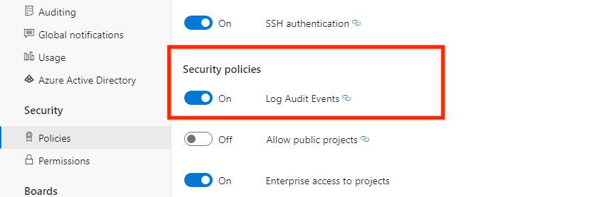

# Access, export, and filter audit logs

[!INCLUDE [version-eq-azure-devops](../../includes/version-eq-azure-devops.md)]

> [!NOTE]
> Auditing is still in public preview.

Keeping track of activities within your Azure DevOps environment is crucial for security and compliance. Auditing helps you monitor and log these activities, providing transparency and accountability. This article explains the auditing features and shows how to set it up and use it effectively.

[!INCLUDE [important-backed-by-azure-active-directory](includes/important-backed-by-azure-active-directory.md)]

Audit changes occur whenever a user or service identity within the organization edits the state of an artifact. Events that might get logged include:

- Permissions changes
- Deleted resources
- Branch policy changes
- Log access and downloads
- Many other types of changes

These logs provide a comprehensive record of activities, helping you monitor and manage the security and compliance of your Azure DevOps organization.

Audit events are stored for 90 days before they're deleted. To retain the data for longer, you can back up audit events to an external location.

> [!NOTE]
> Auditing isn't available for on-premises deployments of Azure DevOps Server. However, you can connect an [Auditing stream](auditing-streaming.md) from an Azure DevOps Services instance to an on-premises or cloud-based instance of Splunk. Ensure you allow IP ranges for inbound connections. For details, see [Allowed address lists and network connections, IP addresses and range restrictions](../security/allow-list-ip-url.md#range-restrictions).

### Prerequisites

Auditing is turned off by default for all Azure DevOps Services organizations.

**Permissions:** 
- To to [enable auditing](#enable-and-disable-auditing), be a member of the Project Collection Administrators group. Organization owners are automatically members of this group.
- Grant specific auditing permissions to any group via the **Security > Permissions** page in **Organization settings**. This action allows for flexible management of who can view and manage audit logs, ensuring that only authorized personnel have access to sensitive auditing information.

> [!NOTE]  
> If the **Limit user visibility and collaboration to specific projects** preview feature is enabled for the organization, users in the **Project-Scoped Users** group can't view **Auditing** and have limited visibility to **Organization settings** pages. For more information and important security-related details, see [Manage your organization, Limit user visibility for projects and more](../../user-guide/manage-organization-collection.md#project-scoped-user-group).

## Enable and disable auditing

#### [Preview page](#tab/preview-page)

1. Sign in to your organization (```https://dev.azure.com/{yourorganization}```).
2. Select  **Organization settings**.
3. Select **Policies** under the **Security** header.   
4. Switch the **Log Audit Events** button to ON.

     

   Auditing is enabled for the organization. Refresh the page to see **Auditing** appear in the sidebar. Audit events start appearing in Auditing Logs and through any configured audit streams.
5. If you no longer want to receive Auditing events, switch the **Enable Auditing** button to OFF. This action removes the **Auditing** page from the sidebar and makes the Auditing Logs page unavailable. Any audit streams stop receiving events.

#### [Current page](#tab/current-page)

1. Sign in to your organization (```https://dev.azure.com/{yourorganization}```).
2. Select  **Organization settings**.
3. Select **Policies** under the **Security** header.   
4. Switch the **Log Audit Events** button to ON.

     

   Auditing is enabled for the organization. Refresh the page to see **Auditing** appear in the sidebar. Audit events start appearing in Auditing Logs and through any configured audit streams.
5. If you no longer want to receive Auditing events, switch the **Enable Auditing** button to OFF. This action removes the **Auditing** page from the sidebar and makes the Auditing Logs page unavailable. Any audit streams stop receiving events.

* * *

## Access auditing

#### [Preview page](#tab/preview-page)

1. Sign in to your organization (```https://dev.azure.com/{yourorganization}```).
2. Select  **Organization settings**.

   

3. Select **Auditing**.

   
   
4. If you don't see Auditing in Organization settings, then you don't have access to view audit events. Project Collection Administrators group can give permissions to other users and groups so that they can view the auditing pages. To do so, select **Permissions**, and then find the group or users to provide auditing access to.

     

5. Set **View audit log** to **allow**, and then select **Save changes**.

   

   The user or group members have access to view your organization's audit events.

#### [Current page](#tab/current-page)

1. Sign in to your organization (```https://dev.azure.com/{yourorganization}```).
2. Select  **Organization settings**.
   
   
   
3. Select **Auditing**.

   

4. If you don't see Auditing in Organization settings, then you don't have access to view audit events. Project Collection Administrators group can give permissions to other users and groups so that they can view the auditing pages. Select **Security**, and then find the group or users to provide auditing access to.

     

5. Set **View audit log** to **allow**, and then select **Save changes**.

   

   The user or group members have access to view your organization's audit events.

* * *

## Review audit log

The Auditing page provides a simple view into the audit events recorded for your organization. See the following description of the information that is visible on the auditing page:

### Audit event information and details

|Information  |Details  |
|---------|---------|
|Actor     | Display name of the individual that triggered the audit event.      |
|IP    |  IP address of the individual that triggered the audit event.    |
|Timestamp     | Time that the triggered event happened. Time is localized to your time zone.        |
|Area     | Product area in Azure DevOps where the event occurred.        |
|Category     | Description of the type of action that occurred (for example, modify, rename, create, delete, remove, execute, and access event).   |
|Details    | Brief description of what happened during the event.        |

Each audit event also records additional information to what's viewable on the auditing page. This information includes the authentication mechanism, a correlation ID to link similar events together, user agent, and more data depending on the audit event type. This information can only be viewed by exporting the auditing events via CSV or JSON.

### ID & correlation ID

Each audit event has unique identifiers called the `ID` and `CorrelationID`. The correlation ID is useful for finding related audit events. For example, creating a project can generate several dozen audit events, all linked by the same correlation ID.

When an audit event ID matches its correlation ID, it indicates that the audit event is the parent or original event. To see only originating events, look for events where the `ID` equals the `Correlation ID`. If you want to investigate an event and its related events, look up all events with a correlation ID that matches the originating event's ID. Not all events have related events.

### Bulk events

Some audit events, known as "bulk audit events," can contain multiple actions that took place simultaneously. You can identify these events by the "Information icon" on the far right of the event. To view individual details of the actions included in bulk audit events, refer to the downloaded audit data.


Selecting the information icon displays more details about the audit event.

As you review the audit events, the *Category* and *Area* columns can help you filter and find specific types of events. The following tables list the categories and areas, along with their descriptions:

#### List of events

We strive to add new auditing events on a monthly basis. If there's an event you would like to see tracked that isn't currently available, share your suggestion with us in the [Developer Community](https://developercommunity.visualstudio.com/search?space=21).

For a comprehensive list of all events that can be emitted through the Auditing feature, see the [Auditing Events List](/azure/devops/organizations/audit/auditing-events).

> [!NOTE]
> Want to find out what event areas your organization logs? Be sure to check out the [Audit Log Query API](/rest/api/azure/devops/audit/audit-log/query): `https://auditservice.dev.azure.com/{YOUR_ORGANIZATION}/_apis/audit/actions`, replacing {YOUR_ORGANIZATION} with the name of your organization. This API returns a list of all audit events (or actions) your organization could emit. 

## Filter audit log by date and time

In the current Auditing UI, you can filter events only by date or time range. 

1. To narrow down the viewable audit events, select the time filter.

   

2. Use the filters to select any time range within the last 90 days and scope it down to the minute. Once you select a time range, c
3. Select **Apply** on the time range selector to start the search. 
   By default, the top 200 results return for that time selection. If there are more results, you can scroll down to load more entries onto the page.

## Export audit events

To perform a more detailed search on the auditing data or store data for more than 90 days, export the existing audit events. You can store the exported data in another location or service.

To export auditing events, select the **Download** button. You can choose to download the data as a CSV or JSON file.

The download includes events based on the time range you select in the filter. For example, if you select one day, you get one day's worth of data. To get all 90 days, select **90 days** from the time range filter and then start the download.

> [!NOTE]
> For long-term storage and analysis of your auditing events, consider using the [Audit Streaming feature](auditing-streaming.md) to send your events to a Security Information and Event Management (SIEM) tool. We recommend exporting the auditing logs for cursory data analysis.

- To filter data beyond the date/time range, download logs as CSV files and import them into Microsoft Excel or other CSV parsers to sift through the Area and Category columns. 
- To analyze larger datasets, upload exported audit events into a Security Incident and Event Management (SIEM) tool using the [Audit Streaming function](auditing-streaming.md). SIEM tools allow you to retain more than 90 days of events, perform searches, generate reports, and configure alerts based on audit events.

## Limitations

The following limitations apply to what can be audited:

* **Microsoft Entra group membership changes**: Auditing Logs include updates to Azure DevOps groups and group membership, when an event Area is `Groups`. However, if you manage membership via Microsoft Entra groups, additions and removals of users from those Microsoft Entra groups aren't included in these logs. Review the Microsoft Entra audit logs to see when a user or group was added or removed from a Microsoft Entra group.
* **Sign-in events**: Azure DevOps doesn't track sign-in events. To review sign-in events to your Microsoft Entra ID, view the Microsoft Entra audit logs.
* **Indirect user additions:** In some cases, users might get added to your organization indirectly. For instance, if a user is assigned a work item, they might automatically get added to the organization. However, this action doesn't generate a corresponding audit event for the work item assignment. To trace these events, consider the following actions:
  - Review the work item history to see who assigned the work item.
  - Check the audit log for any related events that might provide context.

## Frequently asked questions

### Q: What is the DirectoryServiceAddMember group and why is it appearing on the audit log?
A: The `DirectoryServiceAddMember` group helps manage membership in your organization. Many system, user, and administrative actions can affect membership in this system group. Since this group is used only for internal processes, you can disregard audit log entries that capture membership changes to this group.

## Related articles

- [Create audit streaming](auditing-streaming.md)
- [Learn about auditing events](auditing-events.md)
