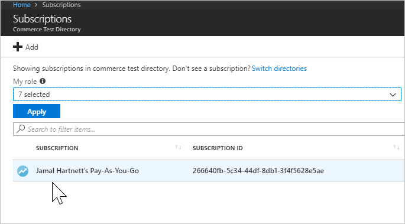
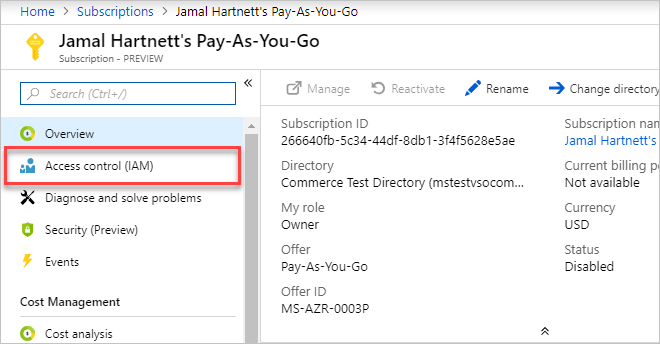
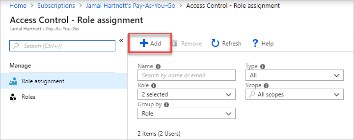

# Add a user who can set up billing for Azure DevOps

[!INCLUDE [version-vsts-only](../../_shared/version-vsts-only.md)]

In this article, learn how to let a user [set up billing](set-up-billing-for-your-organization-vs.md) or [change billing](change-azure-subscription.md) for your organization. Go to the **Subscriptions** tab and
add [**owner**](/azure/role-based-access-control/built-in-roles#owner), [**contributor**](/azure/role-based-access-control/built-in-roles#contributor), [**service admin**](/azure/billing/billing-add-change-azure-subscription-administrator#change-the-service-administrator-for-an-azure-subscription), or [**co-admin**](/azure/billing/billing-add-change-azure-subscription-administrator#add-or-change-co-administrator) roles to users in the Azure subscription that your organization uses for Azure DevOps billing.

1. [Sign in to the Azure portal](https://portal.azure.com/) as the Azure subscription administrator.

2. Enter *subscriptions* in the search box, and then select **Subscriptions** from the drop-down menu. If more than one subscription is listed, choose the subscription to modify.

   

3. Choose **Access control (IAM)**.

   

4. Choose **Add**.

   

5. In the drop-down menus, select the *role* to add members to and select an *assignment* type.

   

6. Select a user or group by entering their *name* or *email alias*. (Select a device by entering its *name*.)

   

7. If your update is complete, choose **Save**.

A user who can [set up](set-up-billing-for-your-organization-vs.md) or [change billing](change-azure-subscription.md) is added to your organization.

>[!Note]
>To give access to a user who's not in your directory, the user must accept the invitation that's received via email before they can access the Azure subscription.

## Related articles

* [Set up billing](set-up-billing-for-your-organization-vs.md)
* [Change the Azure subscription for billing](change-azure-subscription.md)
* [Azure DevOps pricing](https://azure.microsoft.com/pricing/details/visual-studio-team-services/)
* [Azure DevOps billing support](https://azure.microsoft.com/support/devops/)

