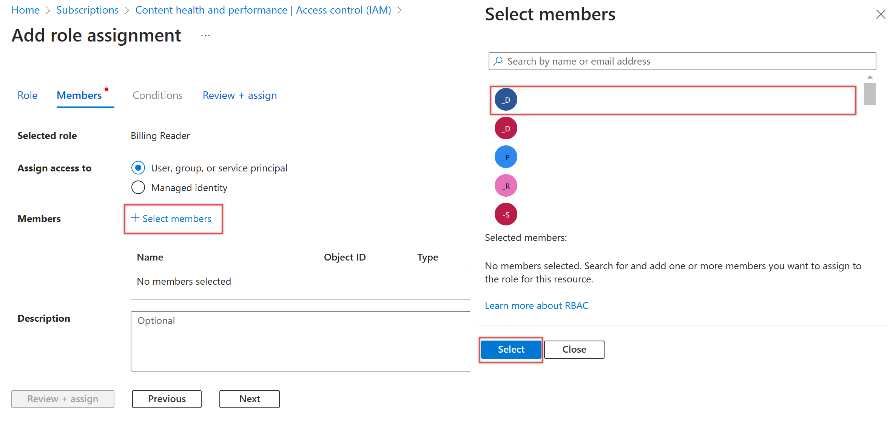

# Add a user to manage billing

[!INCLUDE [version-eq-azure-devops](../../includes/version-eq-azure-devops.md)]

Give another user access, so they can [set up billing](set-up-billing-for-your-organization-vs.md) or [change the Azure subscription used for billing](change-azure-subscription.md) for your Azure DevOps organization. 

Assign any of the following roles to a user under the subscription your organization uses for billing: [Owner](/azure/role-based-access-control/built-in-roles#owner), [Contributor](/azure/role-based-access-control/built-in-roles#contributor), [Service admin](/azure/billing/billing-add-change-azure-subscription-administrator), and [Co-admin](/azure/billing/billing-add-change-azure-subscription-administrator). For more information, see [Azure roles](/azure/role-based-access-control/rbac-and-directory-admin-roles).

[!INCLUDE [pricing-calculator-tip](../../includes/pricing-calculator-tip.md)]

## Prerequisites

- You must be the [Azure Account Administrator](/azure/cost-management-billing/manage/add-change-subscription-administrator) to give another user access to manage billing.

## Give a user access to manage billing

1. [Sign in to the Azure portal](https://portal.azure.com/) as the Azure Account Administrator.

2. Enter *subscriptions* in the search box, and then select **Subscriptions** from the drop-down menu. Choose the subscription to modify, if more that one subscription's listed.

   

3. Select **Access control (IAM)**.

   

4. Select **Add**.

   

5. Choose the user's *role* and *assignment* type from the dropdown menus.

   

6. Select a user or group by entering their *name* or *email alias*. (Select a device by entering its *name*.)

   

7. Choose **Save**, once you're done with your update.

Now you have a user who can [set up](set-up-billing-for-your-organization-vs.md) or [change billing](change-azure-subscription.md) for your organization.

> [!NOTE]
> The user must accept their email invitation before they can access the Azure subscription, if they aren't in your directory.

## Next steps

> [!div class="nextstepaction"]
> [Learn about Azure Cost Management and Billing](/azure/cost-management-billing/cost-management-billing-overview)

## Related articles

* [Pay for Basic access for users](buy-basic-access-add-users.md)
* [Pay for Basic + Test Plans](buy-basic-access-add-users.md)
* [Pay for Azure Pipelines](../../pipelines/licensing/concurrent-jobs.md#how-much-do-parallel-jobs-cost)
* [Set up billing](set-up-billing-for-your-organization-vs.md)
* [Change the Azure subscription used for billing](change-azure-subscription.md)
* [Get Azure DevOps billing support](https://azure.microsoft.com/support/devops/)
