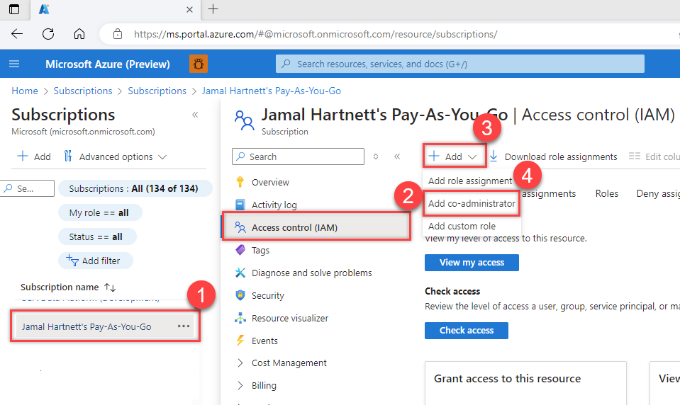
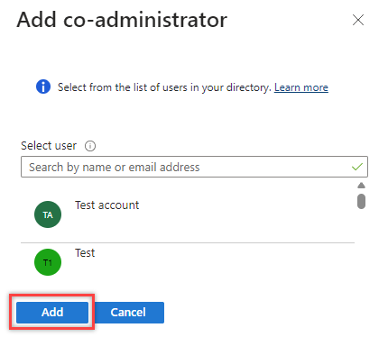

# Add a user to manage billing

[!INCLUDE [version-eq-azure-devops](../../includes/version-eq-azure-devops.md)]

> [!IMPORTANT]
> Classic admins retire August 31, 2024. Starting on February 26, you can't add a new co-administrator using the Access control blade. Remove co-administrators and use Azure RBAC for fine-grained access control. For more information, see [Azure classic subscription administrators](/azure/role-based-access-control/classic-administrators).

Give another user access, so they can [set up billing](set-up-billing-for-your-organization-vs.md) or [change the Azure subscription used for billing](change-azure-subscription.md) for your Azure DevOps organization. 

Assign any of the following roles to a user under the subscription your organization uses for billing: [Owner](/azure/role-based-access-control/built-in-roles#owner), [Contributor](/azure/role-based-access-control/built-in-roles#contributor), [Service admin](/azure/billing/billing-add-change-azure-subscription-administrator), and [Co-admin](/azure/billing/billing-add-change-azure-subscription-administrator). For more information, see [Azure roles](/azure/role-based-access-control/rbac-and-directory-admin-roles).

[!INCLUDE [pricing-calculator-tip](../../includes/pricing-calculator-tip.md)]

## Prerequisites

- You must be the [Azure Account Administrator](/azure/cost-management-billing/manage/add-change-subscription-administrator) to give another user access to manage billing.

## Give a user access to manage billing

1. [Sign in to the Azure portal](https://portal.azure.com/) as the Azure Account Administrator.

2. Enter *subscriptions* in the search box and select **Subscriptions**. 
3. Choose the **subscription** > **Access control (IAM)** > **+ Add**, and then **Add co-administrator** from the dropdown menu.

   > [!div class="mx-imgBorder"]  
   > 

4. Select the **user**, and then select **Add**.

   > [!div class="mx-imgBorder"]  
   > 

> [!NOTE]
> The user must accept their email invitation before they can access the Azure subscription, if they aren't in your directory.

## Next steps

> [!div class="nextstepaction"]
> [Learn about Azure Cost Management and billing](/azure/cost-management-billing/cost-management-billing-overview)

## Related articles

* [Pay for Basic access for users](buy-basic-access-add-users.md)
* [Pay for Basic + Test Plans](buy-basic-access-add-users.md)
* [Pay for Azure Pipelines](../../pipelines/licensing/concurrent-jobs.md#how-much-do-parallel-jobs-cost)
* [Set up billing](set-up-billing-for-your-organization-vs.md)
* [Change the Azure subscription used for billing](change-azure-subscription.md)
* [Get Azure DevOps billing support](https://azure.microsoft.com/support/devops/)
