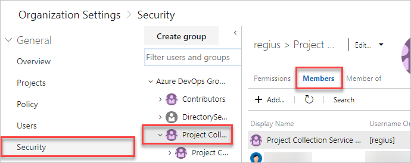
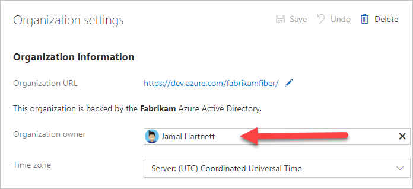

# Billing FAQs

[!INCLUDE [temp](../../_shared/version-vsts-tfs-all-versions.md)]

In this article, you can find answers to frequently asked questions about billing for your organization.

Make sure to review [Azure DevOps pricing](https://azure.microsoft.com/pricing/details/devops/azure-devops-services/) and the [billing overview](overview.md).

You need to set up billing when you need more than the *free tier* of resources in your organization:

[!INCLUDE [free-tier](../../_shared/free-tier.md)]

[!INCLUDE [loadtest-deprecated-include](../../test/_shared/loadtest-deprecated-include.md)]

You also need to [set up billing](set-up-billing-for-your-organization-vs.md) to buy other features (for your users) that are offered by Microsoft or by other companies.

To configure costs for Azure DevOps, see the [pricing calculator](https://azure.microsoft.com/en-us/pricing/calculator/?service=azure-devops).

### Q: Can I buy Azure DevOps by using a purchase order?

A: No. Azure DevOps must be purchased through an Azure subscription. (Think of it as your Azure billing account.)

### Q: What types of Azure subscriptions can be used to buy Azure DevOps?

A: Almost all Azure subscriptions can be used. We support Azure subscriptions connected to your
[Enterprise Agreement (EA)](https://azure.microsoft.com/pricing/enterprise-agreement/), Azure subscriptions set up by
Cloud Solution Providers (CSPs), Azure subscriptions set up through Microsoft Open License resellers, and Pay-As-You-Go Azure subscriptions. You can even buy using Azure subscriptions that Visual Studio subscribers set up as a subscriber benefit. (But no, you can't use your monthly credit to pay for more Visual Studio subscriptions.)

The only notable exclusion is that you can't use the [Azure free trial](https://azure.microsoft.com/pricing/free-trial/), Government, or National clouds.

### Q: Can I use the monthly Azure credits from my Visual Studio subscription to buy Azure DevOps?

A: No, you can't use the monthly Azure credits from [Visual Studio subscriptions](https://visualstudio.microsoft.com/products/subscriber-benefits-vs)
to pay for Azure DevOps. Before you make purchases by using this type of Azure subscription, you must [remove your spending limit](https://azure.microsoft.com/pricing/spending-limits/).


<a name="spending-limit"></a>

> [!NOTE]
> Remove your spending limit indefinitely. This prevents disabling your Azure subscription when your recurring monthly charges are billed the next month.
> Otherwise, all resources billed to this subscription are suspended, including virtual machines and all other workloads.


<a name="monthly-vs-daily-billing"></a>

### Q: What's the difference between daily pro-rated charges instead of monthly committed purchases?

A: With **monthly billing**, purchases are a monthly commitment. With any updates, we charge you for the remainder of the current month. After that, you're charged on the 1st of each month. With **daily billing**, purchases are billed daily on a pro-rated basis. Changes to purchased quantities are reflected in usage billed to your Azure subscription by the following day.

### Q: Am I required to buy other Azure services?

A: Not at all. If you only want to buy Azure DevOps via Azure, you can do that.

### Q: Can tags be applied to organizations from the Azure portal?

A: No, but this feature is in our backlog to add in the future.

### Q: How are paid extensions changing in the Azure DevOps Marketplace in July 2019?

A: Microsoft is ending support for purchasing 3rd party paid Azure DevOps extensions through your Azure bill on July 1st, 2019. Going forward, we're encouraging our publishers to offer paid access to their services directly. We're working closely with publishers to help existing customers transition to the new model and will communicate to specific customers as publishers are ready.

<a name="package-management"></a>

### Q: Do I need to pay to add "Package Management" users in Team Foundation Server 2017 and 2018?

A: As of June 1st, 2019, on-premises Azure Artifacts (ie. Package Management) is now included with the Basic license. For Azure DevOps Server 2019, purchase a Basic license and assign it to the user. For TFS 2017 and 2018, no additional purchase is required, but you still need to [assign users the Package Management extension license](../../artifacts/license-azure-artifacts.md) to use the feature.

## Enterprise Agreement customers

### Q: Can I use an Enterprise Agreement to buy Azure DevOps?

A: Yes, you can. You need to be an owner or contributor for an Azure subscription that was created for your EA.

### Q: How can I tell whether I have the necessary privileges to buy services through my organization's Enterprise Agreement?

A: The easiest approach to determine if you have the right privileges is to select the **Buy** button for a service. You need to select an Azure subscription (which is a billing account) from a presented list of Azure subscriptions that are currently linked to your sign-in. Because the name of the Azure subscription defaults to the type of billing account (for example, "Pay-As-You-Go" or "Enterprise Agreement"), it's often clear if the Azure subscription is part of your Enterprise Agreement.

Another approach is to try to visit the [Azure Enterprise Portal](http://ea.azure.com). If you can reach it successfully, then you already have either the enterprise admin or the organization owner role. Only organization owners can set up new Azure billing in an Enterprise Agreement. 

If you can't access the Azure Enterprise Portal, inquire within your organization to find out who your Enterprise Admin is, and ask that person to add you as an organization owner within the Azure Enterprise Portal. If you can't find this person, you can [submit a support ticket](https://aka.ms/AzureEntSupport) and request the contact information. You need your organization's name and your Enterprise Agreement enrollment number for the support ticket.

### Q: Can I use the Azure Monetary Commitment funds from my Enterprise Agreement to buy Azure DevOps?

A: Yes, you can use these prepaid funds for all Azure DevOps services that Microsoft offers. Make sure to choose an Azure subscription that was created for your EA when you [set up billing for your organization](set-up-billing-for-your-organization-vs.md).

The only exclusion is for extensions offered by partners. These charges appear on your next "overage" invoice. Typically this happens monthly, but due to historical rules for some EA customers, an overage invoice might not be issued for several months. Please consult a licensing specialist for your EA if you need to know what amount of additional purchases (purchases that aren't eligible for Azure Monetary Commitment funds) trigger an overage invoice.

## How charges are processed

### Q: How are user charges (Azure DevOps User/Basic, Basic + Test Plans, and Azure Artifacts) and CI/CD concurrent job charges (for both Microsoft-hosted and self-hosted CI/CD) processed?

A: At the first purchase, we bill a prorated quantity to cover the remaining days in the current month. For instance, if a purchase of 10 Basic + Test Plans users happens on April 15, then we charge 5 units because 50% of the month remains (15 days of a 30-day month). On the first of May, and each month thereafter until you cancel, the full 10 units is billed.

When you increase the paid quantity later, we also prorate the increased units to cover the remaining days in the current month. So if you buy 1 more Basic + Test Plans user on May 10, we would bill roughly 0.677 units (21 days remaining in the 31-day month of May).

### Q: How do reductions or cancellations work?

A: When you reduce or cancel user charges or CI/CD charges, you're canceling automatic renewal. The features and/or CI/CD capacity continue through the end of the current calendar month, taking effect on the first day of the next month.

## Changes in Azure subscription status

### Q: What happens if I cancel my Azure subscription or my credit card expires?

A: When the Azure subscription used for billing on your organization is not in active status - for example, because you cancel it or the credit card used for billing expires - your organization reverts to the free tier of service. But you'll keep any paid users or paid CI/CD concurrent jobs until next month.

>[!NOTE]
>You must keep your Azure subscription in good standing to avoid interruptions in paid services.

### Q: Where can I check my bill or update billing details on my Azure subscription?

A: If you're the owner or contributor for the Azure subscription used for billing your organization, you can view your billing details in the Billing tab of your Organization settings in Azure DevOps.

## Other questions

<a name="why-no-team-projects-in-Azure-portal"></a>

### Q: Why do I no longer see Team Projects in the Azure portal?

A: Starting September 28th, 2018 you can no longer create Team Projects or view them in the Azure portal. You can continue to **access** any Team Projects you have created via the Azure portal through your organization URL (`https://dev.azure.com/{yourorganization}`) and you can always [create new organizations and projects from visualstudio.com](https://app.vsaex.visualstudio.com/me?mkt=en-US&campaign=o~msft~vscom~vssignin). Going forward, the best way for Azure users to get started using Azure DevOps is to [create a project](https://azure.microsoft.com/features/devops-projects/).

### Q: Why is my organization already linked to an Azure subscription?

A: This happens if someone already [set up billing](set-up-billing-for-your-organization-vs.md) for your organization. Each organization can use only one Azure subscription for billing. Charges can't be split across multiple Azure subscriptions.

### Q: Can I use the same Azure subscription for billing across multiple organizations?

A: Yes, you can use the same Azure subscription for billing across multiple organizations. But you can't link a single organization to multiple Azure subscriptions.

<a name="find-owner"></a>

### Q: How do I find a project collection administrator?

A: You can find your [project collection administrator](../security/set-project-collection-level-permissions.md) in your organization's security settings.

1. Sign in to your organization (```https://dev.azure.com/{yourorganization}```).

2. Select  **Organization settings**.

    

3. Select **Security** > **Project Collection Administrators** >  **Members**.

   


### Q: How do I find the organization owner?

A: You can find the current owner in your organization settings.

::: moniker range=">= azure-devops-2019"

1. Sign in to your organization (```https://dev.azure.com/{yourorganization}```).

2. Select  **Organization settings**.

    

3. Find the current organization owner.

   

::: moniker-end

::: moniker range="<= tfs-2018"

1. Go to your organization settings.

    

2. Find the current organization owner.

   

::: moniker-end

### Q: Can I buy Azure DevOps from my software reseller?

A:  Yes you can, if your reseller participates in the Cloud Solution Provider program. Just ask them.

## Buy Azure DevOps now

* [Azure DevOps Users/Basic](buy-basic-access-add-users.md)
* [Microsoft-hosted CI/CD](buy-more-build-vs.md#microsoft-hosted-cicd) (formerly hosted pipelines)
* [Self-hosted CI/CD](buy-more-build-vs.md#self-hosted-cicd) (formerly private pipelines)
* [Azure Test Plans](buy-basic-plus-test-plans.md) (formerly Test Manager)
* [Azure Artifacts](../../artifacts/sign-up-azure-artifacts.md)

## Related articles

* [Set up billing](set-up-billing-for-your-organization-vs.md)
* [Add backup billing managers](add-backup-billing-managers.md)
* [Change the Azure subscription for billing](change-azure-subscription.md)
* [Azure DevOps pricing](https://azure.microsoft.com/pricing/details/devops/azure-devops-services/)
* [Azure DevOps billing support](https://azure.microsoft.com/support/devops/)
