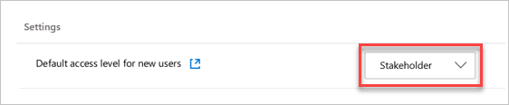

# Paid access for users

[!INCLUDE [temp](../../_shared/version-vsts-tfs-all-versions.md)]

> [!NOTE]
> We’ve recently simplified Azure DevOps billing, so now rather than complete a purchase process, you assign and remove users. You're billed according to these assignments. This article is repurposed to help you take advantage of the tools we have for managing paid access for users. This way you only pay for what you need.

In this article, learn how to manage paid access to [Boards](https://azure.microsoft.com/services/devops/boards/) and [Repos or Test Plans](https://azure.microsoft.com/services/devops/repos/).

Visual Studio subscribers get access included with their subscription, and their subscription is detected when they sign in to Azure DevOps for the first time.

To view costs for Azure DevOps, see the [pricing calculator](https://azure.microsoft.com/pricing/calculator/?service=azure-devops).

## Prerequisites

Ensure the following is true:

* [Billing is set up for your organization](set-up-billing-for-your-organization-vs.md)
* You have [Project Collection Administrator or organization Owner permissions](../accounts/faq-add-delete-users.md#find-owner)

## Assign user Basic or Basic + Test Plans

The simplest way to control paid access is by manually assigning an access level when you [add a new user to your organization](../accounts/add-organization-users.md) and by [removing users](../accounts/delete-organization-users.md) when they leave your organization. 

Keep the following information in mind:

- **Visual Studio subscribers** are detected automatically when they sign in. There's no additional charge for users with a Visual Studio subscription
- **Stakeholder** is a free access level with limited functionality
- **Basic** is free for the first 5 users, and paid for 6 or more users
- **Basic + Test Plans** is significantly more expensive, but all Basic users can try [Basic + Test Plans free for 30 days](https://docs.microsoft.com/en-us/azure/devops/organizations/billing/try-additional-features-vs?view=azure-devops)

## Control the default access level for new users

By default, after you set up billing for your organization, all new users get the free Stakeholder access level if they’re added to a project. That way, you aren't surprised with charges for new users that you didn’t add directly to the organization. 

If you want new users added to projects to get full Basic access, you can set the default access level from Stakeholder to Basic.

## Automate access level assignment with group rules

Larger organizations may want to automate access level assignments, so you don't have to manually do so every time a user is added or removed. To automate how paid access is assigned to users, see [set group rules](../accounts/assign-access-levels-and-extensions-by-group-membership.md).

## Next steps

> [!div class="nextstepaction"]
> [Buy CI/CD](buy-more-build-vs.md#prerequisites)

