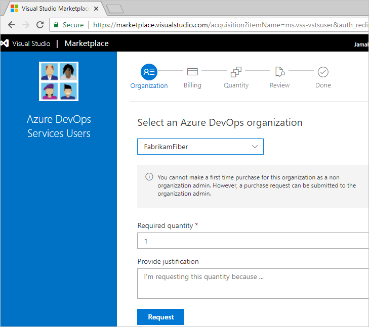

# Quickstart: Pay for more Basic users

[!INCLUDE [temp](../../_shared/version-vsts-tfs-all-versions.md)]

In this quickstart, you learn how to pay for more users in your organization. You only need to pay for users when your team size exceeds the free limits. It's free to add users who have a [Visual Studio subscription](https://visualstudio.microsoft.com/subscriptions/). You also get five free additional users in your organization.

[Pay for additional users](https://marketplace.visualstudio.com/items?itemName=ms.vss-vstsuser) in whatever quantity you need. When you pay for users, the total number of users that you can add as members in your organization increases. This amount is added to the free limits previously mentioned.

For a list of included features, see the [feature comparison](https://visualstudio.microsoft.com/team-services/compare-features/).

If you don't have an Azure subscription, [create a subscription](https://azure.microsoft.com/pricing/purchase-options/) before you begin.

## Prerequisites

The first time that you set up billing for your organization, whether you do the setup up via the Azure portal or as part of making a purchase in the Visual Studio Marketplace, you need:

* [Project collection administrator (PCA) or organization owner permissions](../accounts/faq-add-delete-users.md#find-owner). If you aren't a PCA or organization owner, you're prompted to send a purchase request to the admins for your organization.

   > [!div class="mx-imgBorder"]

* [The **owner** or **contributor** role on your Azure subscription](add-backup-billing-managers.md).

To make subsequent edits to paid quantities in your organization, you need only the owner or contributor role on your Azure subscription.

## Increase number of paid users

1. Sign in to [**Visual Studio Marketplace**](https://marketplace.visualstudio.com/items?itemName=ms.vss-vstsuser), go to the **Azure DevOps** tab, and then find and choose **Azure DevOps Services Users**. Select **Get**.

   

2. Select your organization, and then choose **Buy**.

   > [!div class="mx-imgBorder"]

3. Confirm the Azure subscription where your Azure DevOps charges are billed, and then choose **Continue**.

   If you have multiple Azure subscriptions, select the Azure subscription that you want to use. If you don't have an Azure subscription, you can create a new one.

   > [!div class="mx-imgBorder"]

4. Enter the number of paid users, and then choose **Continue**. You also see the number of free users that are included, which is separate.

   > [!div class="mx-imgBorder"]

5. Review your order, and then choose **Confirm**.

   > [!div class="mx-imgBorder"]

6. Choose **Manage users** to go to your organization and [add new users](../accounts/add-organization-users.md).

The number of users to whom you can assign Basic appears on the right side of your screen.

[!INCLUDE [temp](../../_shared/new-navigation-cloud.md)]

# [New navigation](#tab/new-nav)

::: moniker range=">= azure-devops-2019"

   

::: moniker-end

::: moniker range="<= tfs-2018"  
[!INCLUDE [temp](../../_shared/new-navigation-not-supported.md)]   
::: moniker-end  

# [Previous navigation](#tab/previous-nav)

::: moniker range="<= tfs-2018 || azure-devops"

   > [!div class="mx-imgBorder"]

::: moniker-end

::: moniker range="azure-devops-2019"
[!INCLUDE [temp](../../_shared/previous-navigation-not-supported-azd.md)]
::: moniker-end

---

## Clean up resources

To remove users or make an adjustment, sign in to Azure DevOps. Choose **Manage users**, and then choose **Change quantity**.

## Next steps

> [!div class="nextstepaction"]
> [Buy CI/CD](buy-more-build-vs.md#prerequisites)

## Related articles

* [Reduce or cancel paid users](reduce-cancel-paid-users.md)
