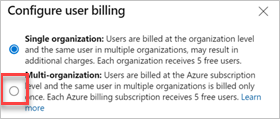

# Manage paid access for users

[!INCLUDE [version-lt-eq-azure-devops](../../includes/version-lt-eq-azure-devops.md)]

You can assign and remove users and get billed according to those assignments, rather than complete a purchase process. This article helps you take advantage of the tools we have for managing paid access for users. This way you only pay for what you need.

For more information, learn how to manage paid access to [Azure Boards](https://azure.microsoft.com/services/devops/boards/), [Azure Repos](https://azure.microsoft.com/services/devops/repos/), and [Azure Test Plans](https://azure.microsoft.com/services/devops/test-plans/).

Visual Studio subscribers get access included with their subscription, and their subscription gets detected when they sign in to Azure DevOps for the first time.

[!INCLUDE [pricing-calculator-tip](../../includes/pricing-calculator-tip.md)]

::: moniker range=" < azure-devops"

## Prerequisites

Ensure you have the following items in place:

* You must have [licensing set up for your organization via Azure](https://azure.microsoft.com/pricing/details/devops/server/)
* You must be a member of the [Project Collection Administrators group](../security/look-up-project-collection-administrators.md). Organization owners are automatically members of this group.

## Pay via Azure

Complete the following steps to pay via Azure.

1. [Create an Azure DevOps organization](../accounts/create-organization.md), even if you don't intend to use it.
2. [Set up billing](set-up-billing-for-your-organization-vs.md) using an Azure subscription and add users or buy CI/CD.
3. Assign licenses to users.

You're entitled to the same number of user licenses to be used in the server.

::: moniker-end

::: moniker range="azure-devops"

## Prerequisites

Ensure you have the following items in place:

* [Billing is set up](set-up-billing-for-your-organization-vs.md) for your organization
* You have permissions allocated as [an organization Owner](../security/look-up-organization-owner.md) or [a member of the Project Collection Administrators group](../security/look-up-project-collection-administrators.md)

<a name="buy-access-vs-marketplace"></a>

## Assign Basic or Basic + Test Plans

The easiest way to control paid access is to manually assign an access level. You can assign the access level when you [add a new user to your organization](../accounts/add-organization-users.md). Also, [remove users](../accounts/delete-organization-users.md) when they leave your organization. 

Keep the following information in mind:

- **Visual Studio subscribers** get detected automatically when they sign in. There's no extra charge for users with a Visual Studio subscription.
- **Stakeholder** is a [free access level with limited functionality](../security/get-started-stakeholder.md).
- **Basic** is free for the first 5 users, and paid for 6 or more users.
- **Basic + Test Plans** is paid only, but is [free to try for 30 days](try-additional-features-vs.md).

## Select default access level for new users

All new users get the free Stakeholder access if they're added directly to a project.

To change the access level for new users added to projects, do the following steps:

1. Sign in to your organization (```https://dev.azure.com/{yourorganization}```).

2. Select  **Organization settings**.

   

3. Select **Billing**.

   :::image type="content" source="media/shared/select-billing-organization-settings.png" alt-text="Screenshot showing highlighted Billing selection in Organization settings.":::

4. Next to **Default access level for new users**, choose **Basic** from the dropdown menu.

   :::image type="content" source="media/shared/default-access-level-basic.png" alt-text="Screenshot showing Access level dropdown menu.":::

## Automate access with group rules

Group rules provide a great way to automate access level assignment for your organization. This way, you don't have to manually assign access each time a user gets added or removed. For more information, see [Group rules](../accounts/assign-access-levels-by-group-membership.md).

> [!NOTE]
> A group rule supersedes the default access level. For instance, if a user's part of a group that's assigned Basic access level, they get Basic, even if the default access level's set to Stakeholder. The default access level applies to users who aren't part of any group rules.

## Reduce charges for users with no access

Billing stops automatically when users get removed from your organization or are assigned the free Stakeholder access level. 
 
To find out if you have users who are no longer using Azure DevOps, do the following steps:

1. Sign in to your organization (```https://dev.azure.com/{yourorganization}```).

2. Select  **Organization settings**.

   

3. Select **Users** and then sort by **Last Access**.

   :::image type="content" source="media/shared/last-access.png" alt-text="Screenshot showing select Users and then sort by Last Access.":::
 
4. If there are users who have never signed in, you can find out how recently they were added by exporting the list of users and checking the **Date Created** column. 

   :::image type="content" source="media/shared/export-users.png" alt-text="Screenshot showing Export users.":::

## Pay for a user once across multiple organizations

If you're a member of more than one Azure DevOps organization, you can turn on multi-organization billing and pay for each **Basic** or **Basic + Test Plans** human user once, for all organizations under the same billing Azure subscription. This does not apply to [service principals](../../integrate/get-started/authentication/service-principal-managed-identity.md), which you must pay for each organization the service principal has been added to where the service principal has **Basic** or **Basic + Test Plans**.

For more information, see [multi-organization billing FAQs](./billing-faq.yml). Complete the following steps.

1. Sign in to your organization (```https://dev.azure.com/{yourorganization}```).

2. Select  **Organization settings**.

   

3. Select **Billing**.

   

4. Select **Configure user billing**.
   
   

5. Select **Multi-organization**, and then select **Save**.

   

::: moniker-end

## Next steps

> [!div class="nextstepaction"]
> [Buy parallel jobs](../../pipelines/licensing/concurrent-jobs.md#how-much-do-parallel-jobs-cost)

## Related articles

* [Set up billing](set-up-billing-for-your-organization-vs.md)
* [Change your Azure subscription for billing](change-azure-subscription.md)
* [Learn about Azure DevOps pricing](https://azure.microsoft.com/pricing/details/visual-studio-team-services/)
* [Get Azure DevOps billing support](https://azure.microsoft.com/support/devops/)
