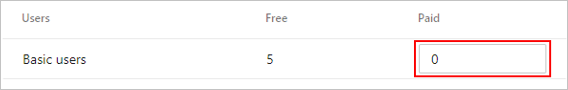
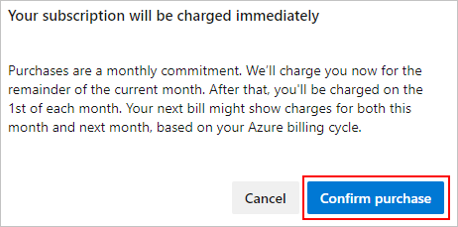
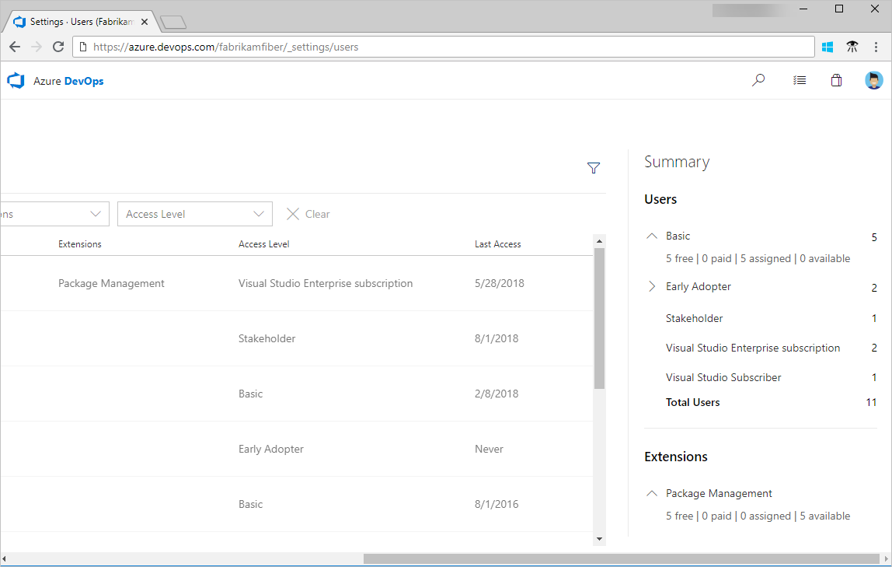
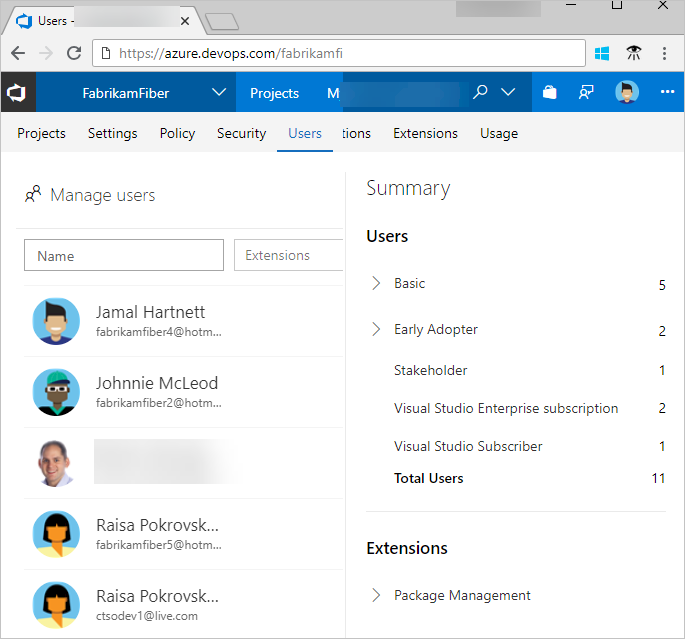
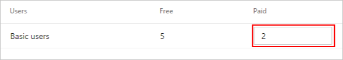

# Buy Basic access for users

[!INCLUDE [temp](../../_shared/version-vsts-tfs-all-versions.md)]

In this quickstart, you'll learn how to pay for more users in your organization. You only need to pay for users when your team size exceeds the free limits. It's free to add users who have a [Visual Studio subscription](https://visualstudio.microsoft.com/subscriptions/). You also get five free additional users in your organization.

[Pay for additional users](https://marketplace.visualstudio.com/items?itemName=ms.vss-vstsuser) in whatever quantity you need. When you pay for users, the total number of users that you can add as members in your organization increases. This amount is added to the free limits previously mentioned.

For a list of included features, see the [feature comparison](https://visualstudio.microsoft.com/team-services/compare-features/).

If you don't have an Azure subscription, [create a subscription](https://azure.microsoft.com/pricing/purchase-options/) before you begin.

## Prerequisites

Ensure the following is true for the user who's making a change:

* User has [project collection administrator or organization owner permissions](../accounts/faq-add-delete-users.md#find-owner)


<a name="buy-access-vs-marketplace"></a>

## Increase amount of paid users

1. Sign in to your organization (```https://dev.azure.com/{yourorganization}```).
2. Select  **Organization settings**.
  
   

3. Select **Billing**.

   

4. Enter the number of **paid users**, and then choose **Save**. You also see the number of free users that are included, which is separate.

   > [!div class="mx-imgBorder"]


5. Select **Confirm purchase**.

   

6. In **Organization settings**, select **Users**.

The number of users to whom you can assign Basic appears on the right side of your screen.


::: moniker range="= azure-devops"

   

::: moniker-end

::: moniker range="<= tfs-2018"

   > [!div class="mx-imgBorder"]


::: moniker-end

## Decrease amount of paid users

As your team contracts, you can decrease the number of paid users in your organization.

> [!NOTE]
> To reduce or cancel users who have paid Basic access for the next month, you must make your changes before the last day of the month.
> Your charges won't change until the next month because paid users are monthly purchases.

1. Sign in to your organization (```https://dev.azure.com/{yourorganization}```).
2. Select  **Organization settings**.
  
   

3. Select **Billing**.

   

4. Enter a lesser quantity of **paid users**, and then choose **Save**.

   

## Next steps

> [!div class="nextstepaction"]
> [Buy CI/CD](buy-more-build-vs.md#prerequisites)

## Related articles

* [Add backup billing managers](add-backup-billing-managers.md)
* [Change the Azure subscription for billing](change-azure-subscription.md)
* [Azure DevOps pricing](https://azure.microsoft.com/pricing/details/visual-studio-team-services/)
* [Azure DevOps billing support](https://azure.microsoft.com/support/devops/)
