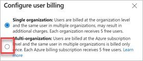

# Manage paid access for users

[!INCLUDE [version-lt-eq-azure-devops](../../includes/version-lt-eq-azure-devops.md)]

You can assign and remove users and get billed according to those assignments, rather than complete a purchase process. This article helps you take advantage of the tools we have for managing paid access for users. This way you only pay for what you need.

For more information, learn how to manage paid access to [Azure Boards](https://azure.microsoft.com/services/devops/boards/), [Azure Repos](https://azure.microsoft.com/services/devops/repos/), and [Azure Test Plans](https://azure.microsoft.com/services/devops/test-plans/).

Visual Studio subscribers get access included with their subscription, and their subscription gets detected when they sign in to Azure DevOps for the first time.

[!INCLUDE [pricing-calculator-tip](../../includes/pricing-calculator-tip.md)]

[!INCLUDE [ai-assistance-mcp-server-tip](../../includes/ai-assistance-mcp-server-tip.md)]

::: moniker range=" azure-devops"

## Prerequisites

Ensure you have the following items in place:

| Category | Requirements |
|--------------|-------------|
|Permissions| Member of the [Project Collection Administrators group](../security/look-up-project-collection-administrators.md). Organization owners are automatically members of this group.  |
|Billing| [Billing is set up](set-up-billing-for-your-organization-vs.md#set-up-billing) for your organization.|

::: moniker-end

::: moniker range=" < azure-devops"

## Prerequisites

| Category | Requirements |
|--------------|-------------|
|Permissions| Member of the [Project Collection Administrators group](../security/look-up-project-collection-administrators.md). Organization owners are automatically members of this group.  |
|Licensing| [Licensing set up for your organization via Azure](https://azure.microsoft.com/pricing/details/devops/server/)|

::: moniker-end

::: moniker range=" azure-devops"

<a name="buy-access-vs-marketplace"></a>

## Assign Basic or Basic + Test Plans

The easiest way to control paid access is to manually assign an access level. You can assign the access level when you [add a new user to your organization](../accounts/add-organization-users.md). Also, [remove users](../accounts/delete-organization-users.md) when they leave your organization. 

Keep the following information in mind:

- Visual Studio subscribers get detected automatically when they sign in. There's no extra charge for users with a Visual Studio subscription.
- GitHub Enterprise users get detected automatically when they sign in. There's no extra charge for users with a GitHub Enterprise license.
- Stakeholder access is a [free access level with limited functionality](../security/get-started-stakeholder.md).
- Basic access is free for the first 5 users and paid for 6 or more users.
- Basic + Test Plans access is paid only, but [free to try for 30 days](try-additional-features-vs.md).

## Select default access level for new users

All new users get the free Stakeholder access if they're added directly to a project.

To change the access level for new users added to projects, do the following steps:

1. Sign in to your organization (```https://dev.azure.com/{Your_Organization}```).

2. Select  Organization settings.

   

3. Select Billing.

   :::image type="content" source="media/shared/select-billing-organization-settings.png" alt-text="Screenshot showing highlighted Billing selection in Organization settings.":::

4. Next to Default access level for new users, choose Basic from the dropdown menu.

   :::image type="content" source="media/shared/default-access-level-basic.png" alt-text="Screenshot showing Access level dropdown menu.":::

## Automate access with group rules

Group rules provide a great way to automate access level assignment for your organization. This way, you don't have to manually assign access each time a user gets added or removed. For more information, see [Group rules](../accounts/assign-access-levels-by-group-membership.md).

> [!NOTE]
> A group rule supersedes the default access level. For instance, if a user's part of a group  assigned the Basic access level, they get Basic access, even if the default access is set to Stakeholder. The default access level applies to users who aren't part of any group rules.

## Reduce charges for users with no access

Billing stops automatically when users get removed from your organization or are assigned the free Stakeholder access level. 
 
To find out if you have users who are no longer using Azure DevOps, do the following steps:

1. Sign in to your organization (```https://dev.azure.com/{yourorganization}```).

2. Select  Organization settings.

   

3. Select Users and then sort by Last Access.

   :::image type="content" source="media/shared/last-access.png" alt-text="Screenshot showing select Users and then sort by Last Access.":::
 
4. If there are users who haven't signed in, you can find out how recently they were added by exporting the list of users and checking the Date Created column. 

   :::image type="content" source="media/shared/export-users.png" alt-text="Screenshot showing Export users.":::

## Pay for a user once across multiple organizations

If you're a member of more than one Azure DevOps organization, you can turn on multi-organization billing and pay for each Basic or Basic + Test Plans human user once, for all organizations under the same billing Azure subscription. Multi-organization billing doesn't apply to [service principals](../../integrate/get-started/authentication/service-principal-managed-identity.md), which you must pay for each organization the service principal was added to where the service principal has Basic or Basic + Test Plans.

For more information, see [multi-organization billing FAQs](./billing-faq.yml). To pay for a user once across multiple organizations, do the following steps:

1. Sign in to your organization (```https://dev.azure.com/{Your_Organization}```).

2. Select  Organization settings.

   

3. Select Billing.

   

4. Select Configure user billing.
   
   

5. Select Multi-organization > Save.

   

::: moniker-end

::: moniker range=" < azure-devops"

## Pay via Azure

To pay via Azure, do the following steps:

1. [Create an Azure DevOps organization](../accounts/create-organization.md), even if you don't intend to use it.
2. [Set up billing](set-up-billing-for-your-organization-vs.md#set-up-billing) using an Azure subscription and add users or buy CI/CD.
3. Assign licenses to users.

You're entitled to the same number of user licenses to be used in the server.

::: moniker-end

<a id="use-ai-assistance"></a>

## Use AI to manage paid access

[!INCLUDE [ai-assistance-mcp-server-tip](../../includes/ai-assistance-mcp-server-tip.md)]

If you use GitHub Copilot, the [Azure DevOps MCP Server](../../mcp-server/mcp-server-overview.md) can help you manage user access levels, optimize license costs, and automate billing tasks through natural language prompts.

### Example prompts for managing paid access

| Task | Example prompt |
|---|---|
| Audit inactive users | `Identify all users in my organization who haven't signed in during the last 90 days and still have Basic or Basic + Test Plans access, so I can reclaim those licenses` |
| Optimize license costs | `Compare the number of Basic licenses I'm paying for against actual usage across my organization and recommend where I can downgrade users to Stakeholder access` |
| Onboard a new team | `A new team of 8 developers and 3 project managers is joining next week. Recommend the most cost-effective access level assignments based on their roles` |
| Set up group-based licensing | `Create a group rule that automatically assigns Basic + Test Plans access to members of our QA team so I don't have to manually manage their access levels` |
| Enable multi-org billing | `I manage three Azure DevOps organizations under the same Azure subscription. Walk me through enabling multi-organization billing so I only pay once per user` |
| Plan for contractor access | `We're bringing on 15 short-term contractors who only need to view work items and dashboards. What's the most cost-effective way to give them access without increasing our paid user count?` |

> [!TIP]
> For the best results, use these prompts in agent mode with the Azure DevOps MCP Server connected. Customize the prompts with your specific organization name, team details, or access level requirements.

## Next step

> [!div class="nextstepaction"]
> [Buy parallel jobs](../../pipelines/licensing/concurrent-jobs.md#how-much-do-parallel-jobs-cost)

## Related content

* [Set up billing](set-up-billing-for-your-organization-vs.md#set-up-billing)
* [Change your Azure subscription for billing](change-azure-subscription.md)
* [Learn about Azure DevOps pricing](https://azure.microsoft.com/pricing/details/visual-studio-team-services/)
* [Get Azure DevOps billing support](https://azure.microsoft.com/support/devops/)
