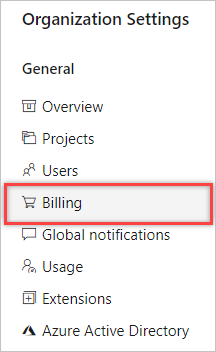

# Quickstart: Buy Basic access for users

[!INCLUDE [temp](../../_shared/version-vsts-tfs-all-versions.md)]

In this quickstart, learn how to pay for more users who need access to [Boards](https://azure.microsoft.com/services/devops/boards/) and [Repos](https://azure.microsoft.com/services/devops/repos/).

Visual Studio subscribers get Basic access included with their subscription, and their subscription is detected when they sign in to Azure DevOps for the first time.

To configure costs for Azure DevOps, see the [pricing calculator](https://azure.microsoft.com/pricing/calculator/?service=azure-devops).

## Prerequisites

Ensure the following is true:

* [Billing is set up for your organization](set-up-billing-for-your-organization-vs.md)
* You have [Project Collection Administrator or organization Owner permissions](../accounts/faq-add-delete-users.md#find-owner)

<a name="buy-access-vs-marketplace"></a>

## Increase amount of paid users

1. Sign in to your organization (```https://dev.azure.com/{yourorganization}```).
2. Select  **Organization settings**.
  
   

3. Select **Billing**.

   

4. Enter the number of **paid users**, and then choose **Save**. You also see the number of free users that are included, which is separate.

   > [!div class="mx-imgBorder"]
   > 

5. Select **Confirm purchase**.

   

6. In **Organization settings**, select **Users**.

The number of users to whom you can assign Basic appears on the right side of your screen.


::: moniker range="= azure-devops"

   

::: moniker-end

::: moniker range="<= tfs-2018"

> [!div class="mx-imgBorder"]
> 

::: moniker-end

## Decrease amount of paid users

As your team contracts, you can decrease the number of paid users in your organization.

> [!NOTE]
> To reduce or cancel users who have paid Basic access for the next month, make your changes before the last day of the month.
> Your charges won't change until the next month because paid users are monthly purchases.

1. Sign in to your organization (```https://dev.azure.com/{yourorganization}```).
2. Select  **Organization settings**.
  
   

3. Select **Billing**.

   

4. Enter a lesser quantity of **paid users**, and then choose **Save**.

   

## Next steps

> [!div class="nextstepaction"]
> [Buy CI/CD](buy-more-build-vs.md#prerequisites)

