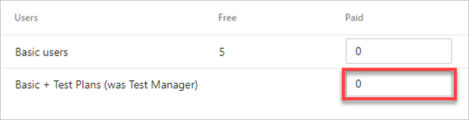

# Quickstart: Buy Basic + Test Plans access for users

[!INCLUDE [temp](../../_shared/version-vsts-tfs-all-versions.md)]

In this quickstart, you learn how to pay for more users who need access to [Azure Repos](https://azure.microsoft.com/en-us/services/devops/repos/), [Azure Boards](https://azure.microsoft.com/en-us/services/devops/boards/), and [Azure Test Plans](https://azure.microsoft.com/en-us/services/devops/test-plans/).
 
[Visual Studio Enterprise](https://visualstudio.microsoft.com/vs/enterprise/), [Visual Studio Test Professional](https://visualstudio.microsoft.com/vs/test-professional/) and [MSDN Platforms](https://visualstudio.microsoft.com/msdn-platforms/) subscribers have Basic + Test Plans included with their subscription, and their subscription is detected when they sign in to Azure DevOps for the first time.

To configure costs for Azure DevOps, see the [pricing calculator](https://azure.microsoft.com/en-us/pricing/calculator/?service=azure-devops).

## Prerequisites

Ensure the following is true:

* [Billing is set up for your organization](set-up-billing-for-your-organization-vs.md)
* You have [Project Collection Administrator or organization Owner permissions](../accounts/faq-add-delete-users.md#find-owner)

## Increase amount of paid users

1. Sign in to your organization (```https://dev.azure.com/{yourorganization}```).
2. Select  **Organization settings**.
  
   

3. Select **Billing**.

   

4. Enter the number of **paid users**, next to Basic + Test Plans, and then choose **Save**. 

   

5. Select **Confirm purchase**.

   


<a name="transitioning-test-manager-to-basic-plus-test-plans"></a>

> [!NOTE]
> We're moving from assignment of the Test Manager extension to assignment of the Basic + Test Plans access level, so you may have one or the other to assign, but the amount you can assign is the same for either. [Learn more](https://devblogs.microsoft.com/devops/a-simpler-way-to-buy-azure-devops/).

## Decrease amount of paid users

As your team contracts, you can decrease the number of paid users in your organization. Follow the same process as increasing the amount, only enter a lesser quantity of **paid users**, and then select **Save**.

> [!IMPORTANT]
> To reduce or cancel users who have paid Basic + Test Plans access for the next month, make your changes before the last day of the month.
> Your charges won't change until the next month because paid users are monthly purchases.

1. Sign in to your organization (```https://dev.azure.com/{yourorganization}```).
2. Select  **Organization settings**.
  
   

3. Select **Billing**.

   

4. Enter a lesser quantity of **Basic + Test Plans users**, and then choose **Save**.

## Next steps

> [!div class="nextstepaction"]
> [Buy CI/CD](buy-more-build-vs.md#prerequisites)

