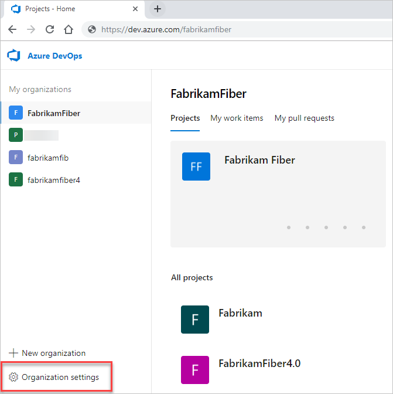

# Buy cloud-based load testing for Azure DevOps

[!INCLUDE [version-vsts-only](../../_shared/version-vsts-only.md)]

[!INCLUDE [loadtest-deprecated-include](../../test/_shared/loadtest-deprecated-include.md)]

In this quickstart, you learn how to enable paid load testing in Azure DevOps.

Azure DevOps offers a cloud-based solution for [load testing your apps](../../test/load-test/index.md). You can create load tests by using Visual Studio Ultimate 2013, Visual Studio Enterprise 2015, or later versions. Then you can run these tests in Azure DevOps.

Load tests are measured and billed in virtual user minutes (VUMs) as described in this Q&A: [What are VUMs? How many minutes will my load test use?](../../test/load-test/reference-qa.md#VUM)

If you don't have an Azure subscription, [create a subscription](https://azure.microsoft.com/pricing/purchase-options/) before you begin.

<a name="buy-load-testing"></a>

## Prerequisites

[Set up billing for your organization](set-up-billing-for-your-organization-vs.md).

## Enable paid load testing

1. Sign in to your organization (```https://dev.azure.com/{yourorganization}```).

2. Select  **Organization settings**.

   

3. Select **Billing**.

   

4. Select the dropdown menu for Cloud-based load testing, and then select **On**.

    You can set a monthly limit on the virtual user minutes that you use by selecting an amount from the **PAID LOAD TESTING LIMIT** drop-down menu. When you're done, choose **Save**.

   

Cloud-based load testing is enabled for your organization.

## Billing and free monthly usage

You're charged for only the virtual user minutes of cloud-based load testing used above the free tier of 20,000 virtual user minutes per month.

* The free tier resets on the first day of the month.

* Visual Studio subscriptions don't include any additional virtual user minutes. The free amounts are per organization, not per user.

* For cloud-based load testing, you're charged for each
   [virtual user minute](../../test/load-test/reference-qa.md#VUM) that exceeds the free monthly usage.

* Graduated discounts for cloud-based load testing are calculated based on your Azure subscription billing cycle.

## Limits on load test runs

There's a limit on the duration for each test run. For cloud-based load testing, the limit depends on where you run your test. For details, see [this Q&A](../../test/load-test/reference-qa.md#test-limits).

## Next steps

> [!div class="nextstepaction"]
> [Load test your app](../../test/load-test/get-started-simple-cloud-load-test.md)

## Related articles

* [Azure DevOps pricing](https://azure.microsoft.com/pricing/details/devops/azure-devops-services/)
* [Azure DevOps billing support](https://azure.microsoft.com/support/devops/)
