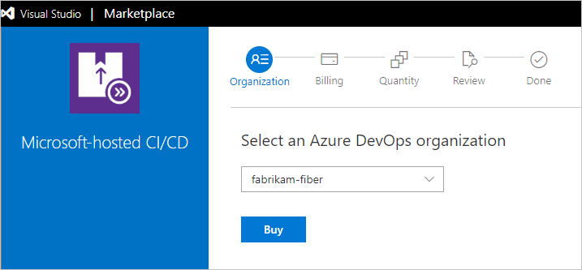
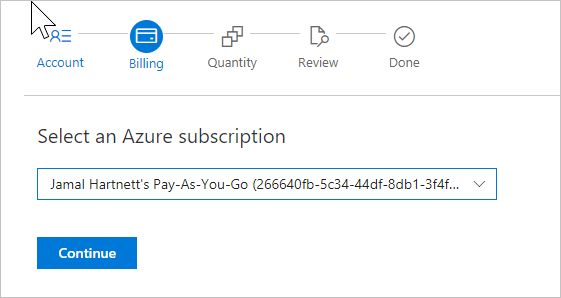
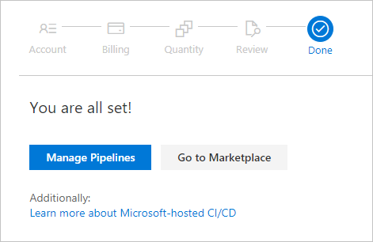
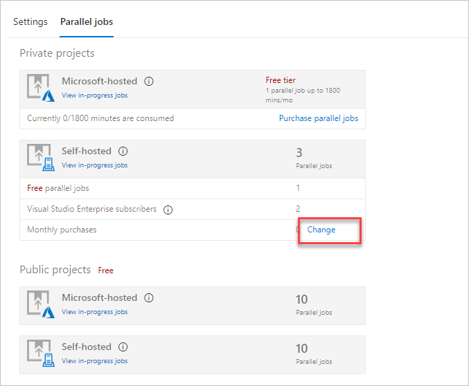

# Buy CI/CD for Azure DevOps

[!INCLUDE [version-vsts-only](../../_shared/version-vsts-only.md)]

In this quickstart, you learn how to buy self-hosted or Microsoft-hosted CI/CD and change your paid Azure Pipelines capacity.

With Azure Pipelines, you can run builds and deploy releases by using the Microsoft-hosted agents, your own machines, or both.
We offer a *free tier* for each.

If you don't have an Azure subscription, [create a subscription](https://azure.microsoft.com/pricing/purchase-options/) before you begin.

## Microsoft-hosted CI/CD

Each organization starts out with the free tier of Microsoft-hosted CI/CD. This tier provides the ability to run one parallel build or release job, for up to 30 hours per month. If you need to run more than 30 hours per month, or you need to run more than one job at a time, you can switch to paid Microsoft-hosted CI/CD.

When you pay per parallel job, there are no monthly time limits for your builds and releases, and the maximum runtime for a single job is increased from 60 minutes to 6 hours. With Microsoft-hosted CI/CD, the price includes all infrastructure that Microsoft runs (virtual machines, databases, storage, and egress) to deliver this service.

### Public projects

If your pipelines are in a [public project](../public/index.md), then you run up to 10 free parallel jobs with unlimited minutes on Microsoft-hosted agents. If you need more, simply [contact us](https://azure.microsoft.com/support/devops/).

### Private projects

[Buy Microsoft-hosted parallel jobs for your organization.](https://marketplace.visualstudio.com/items?itemName=ms.build-release-hosted-pipelines)

## Self-hosted CI/CD

Azure Pipelines also offers you a way to run the agent on machines that you manage, whether your machines are on-premises or in the cloud. Typically, you'll choose this option in either of the following situations:

* Custom software that runs in your build process is not included in the Microsoft-hosted option.
* You already have an Azure DevOps Server build server running, and you aren't ready to move your build definitions to Azure Pipelines.

### Self-hosted public projects

If your pipelines are in a [public project](../public/index.md), then you run up to 10 free parallel jobs with self-hosted agents. If you need more, simply [contact us](https://azure.microsoft.com/support/devops/).

### Self-hosted private projects

The free tier is one parallel job. In addition, you get one free parallel job for each Visual Studio Enterprise subscriber that is a member of your organization. You can get more using paid self-hosted parallel jobs.

[Buy self-hosted parallel jobs](https://marketplace.visualstudio.com/items?itemName=ms.build-release-private-pipelines)

<a name="buy-build-release"></a>

## Prerequisites

Ensure the following is true for the user who's setting up billing for the first time:

* User has [project collection administrator or organization owner permissions](../accounts/faq-add-delete-users.md#find-owner)
* User has [an Azure subscription that you can use to purchase](add-backup-billing-managers.md)

To make subsequent edits to paid quantities in your organization, you need only the owner or contributor role on your Azure subscription.

## Buy CI/CD

1. As a project collection administrator or organization owner, sign in to either of the following:

 * [Visual Studio Marketplace > Pipelines > Microsoft-hosted parallel jobs](https://marketplace.visualstudio.com/items?itemName=ms.build-release-hosted-pipelines)
 * [Visual Studio Marketplace > Pipelines > Self-hosted parallel jobs](https://marketplace.visualstudio.com/items?itemName=ms.build-release-private-pipelines)

2. Select **Get**. (The following images represent Microsoft-hosted CI/CD, rather than Self-hosted, although the process is the same.)

    

3. Select your organization, if you have multiple organizations. Then select **Buy**.

    

4. Confirm the Azure subscription that you'll use for billing. Then select **Continue**.

    If you have multiple Azure subscriptions,
  select the Azure subscription that you want to use.
  If you don't have an Azure subscription,
  create a new subscription now to use for billing.
  [Azure DevOps billing FAQ](billing-faq.md)

    For more information, see the Azure DevOps [billing FAQ](billing-faq.md).

    

5. Select the number of parallel jobs that you want to buy, and then select **Continue**.

    

6. Review your order and select **Confirm**.

    

7. To view your current CI/CD capacity, go to your organization and select **Manage Pipelines**.

    

     

  To return to **Pipelines** in
  your organization at any time,
  go to your organization toolbar, and
  then go to **Pipelines**
  (```https://dev.azure.com/{yourorganization}/_admin/_buildQueue?_a=resourceLimits```).

## XAML build

The hosted XAML build controller is no longer supported.
  Organizations created on or after April 2016 don't have access to it.
  The hosted YAML model is our newest build model, and as a best practice, consider adopting it. Read more about it [here](../../pipelines/get-started-yaml.md).

  > **Important:** If you have an organization where you still need to run [XAML builds](https://msdn.microsoft.com/library/ms181709%28v=vs.120%29.aspx),
  > you should set up an [on-premises build server](https://msdn.microsoft.com/library/ms252495%28v=vs.120%29.aspx)
  > and switch to an [on-premises build controller](https://msdn.microsoft.com/library/ee330987%28v=vs.120%29.aspx) now.

<a name="change-paid-pipelines"></a>

## Clean up resources

When your team's needs for build or release capacity change, you can change the number of paid parallel jobs.

1. Go to your organization toolbar, and then go to **Pipelines** (```https://dev.azure.com/{yourorganization}/_admin/_buildQueue?_a=resourceLimits```).

2. Select **Change** for either Microsoft-hosted or self-hosted parallel jobs, which takes you to the Visual Studio Marketplace.

   

3. In the Visual Studio Marketplace, Azure DevOps tab, select **Get**. Select your organization, and then update your number of paid parallel jobs and confirm.

## Next steps

> [!div class="nextstepaction"]
> [Start free trials](try-additional-features-vs.md)

## Related articles

* [Azure Pipelines: Parallel jobs](../../pipelines/licensing/concurrent-jobs.md)
* [Azure DevOps Server: Pipelines](../../pipelines/licensing/concurrent-pipelines-tfs.md)
* [Pricing for Azure Pipelines](https://visualstudio.microsoft.com/team-services/pricing)
