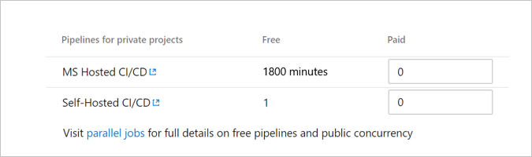
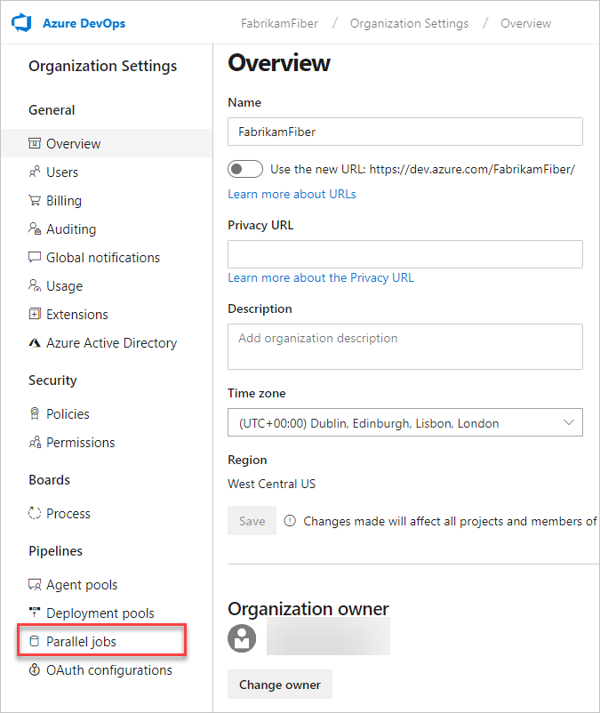

# Quickstart: Buy CI/CD for Azure DevOps

[!INCLUDE [version-vsts-only](../../_shared/version-vsts-only.md)]

In this quickstart, you learn how to buy self-hosted or Microsoft-hosted CI/CD and change your paid Azure Pipelines capacity.

With Azure Pipelines, you can run builds and deploy releases by using the Microsoft-hosted agents, your own machines, or both.
We offer a *free tier* for each. The *free tier* includes:

- Free tier of Microsoft-hosted CI/CD (one concurrent job, up to 30 hours per month)
- One self-hosted CI/CD concurrent job

To estimate costs for Azure DevOps, view the [pricing calculator](https://azure.microsoft.com/pricing/calculator/?service=azure-devops).

## Microsoft-hosted CI/CD

Each organization starts out with the *free tier* of Microsoft-hosted CI/CD. This tier provides the ability to run one parallel build or release job, for up to 30 hours per month. If you need to run more than 30 hours per month, or you need to run more than one job at a time, you can switch to paid Microsoft-hosted CI/CD.

When you pay per parallel job, there are no monthly time limits for your builds and releases, and the maximum runtime for a single job is increased from 60 minutes to 6 hours. With Microsoft-hosted CI/CD, the price includes all infrastructure that Microsoft runs (virtual machines, databases, storage, and egress) to deliver this service.

> [!NOTE]
> When you purchase your first Microsoft-hosted parallel job, the number of parallel jobs you have in the organization still stays at one. This purchase only removes the limits on the free parallel job that you have. To run two jobs concurrently, you need to purchase two parallel jobs.

If your pipelines are in a [public project](../public/index.md), then you run up to 10 free parallel jobs with unlimited minutes on Microsoft-hosted agents. If you need more, simply [contact us](https://azure.microsoft.com/support/devops/).

## Self-hosted CI/CD

Azure Pipelines also offers you a way to run the agent on machines that you manage, whether your machines are on-premises or in the cloud. Typically, you'll choose this option in either of the following situations:

* Custom software that runs in your build process is not included in the Microsoft-hosted option.
* You already have an Azure DevOps Server build server running, and you aren't ready to move your build definitions to Azure Pipelines.

### Self-hosted public projects

If your pipelines are in a [public project](../public/index.md), then you run up to 10 free parallel jobs with self-hosted agents. If you need more, simply [contact us](https://azure.microsoft.com/support/devops/).

### Self-hosted private projects

The *free tier* is one parallel job. In addition, you get one free parallel job for each Visual Studio Enterprise subscriber that is a member of your organization. You can get more using paid self-hosted parallel jobs.

<a name="buy-build-release"></a>

## Prerequisites

Ensure the following is true:

* [Billing is set up for your organization](set-up-billing-for-your-organization-vs.md)
* You have [Project Collection Administrator or organization Owner permissions](../accounts/faq-add-delete-users.md#find-owner)

## Increase quantity of CI/CD

1. Sign in to your organization (```https://dev.azure.com/{yourorganization}```).
2. Select  **Organization settings**.
  
   

3. Select **Billing**.

   

4. Enter the amount of Microsoft-hosted CI/CD or Self-hosted CI/CD, and then select **Save**.

   

5. Select **Confirm purchase**.

## Decrease quantity of CI/CD

1. Sign in to your organization (```https://dev.azure.com/{yourorganization}```).
2. Select  **Organization settings**.
  
   

3. Select **Billing**.

   

4. Enter a lesser quantity of **Microsoft-hosted CI/CD** or **Self-hosted CI/CD**, and then select **Save**.

## View parallel job details

To view your current CI/CD capacity details and consumption, complete the following steps.

1. Sign in to your organization (```https://dev.azure.com/{yourorganization}```).
2. Select  **Organization settings**.
  
   

   go to your organization toolbar, and then go to **Parallel jobs** under **Pipelines**.

   

## XAML build

The hosted XAML build controller is no longer supported.
  Organizations created on or after April 2016 don't have access to it.
  The hosted YAML model is our newest build model, and as a best practice, consider adopting it. Read more about it [here](../../pipelines/get-started-yaml.md).

  > **Important:** If you have an organization where you still need to run [XAML builds](https://msdn.microsoft.com/library/ms181709%28v=vs.120%29.aspx),
  > you should set up an [on-premises build server](https://msdn.microsoft.com/library/ms252495%28v=vs.120%29.aspx)
  > and switch to an [on-premises build controller](https://msdn.microsoft.com/library/ee330987%28v=vs.120%29.aspx) now.

## Next steps

> [!div class="nextstepaction"]
> [Try Azure Test Plans for free](try-additional-features-vs.md)

