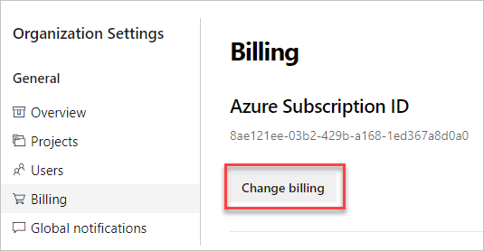
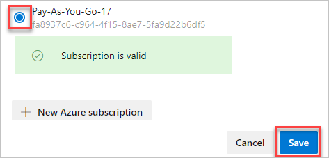
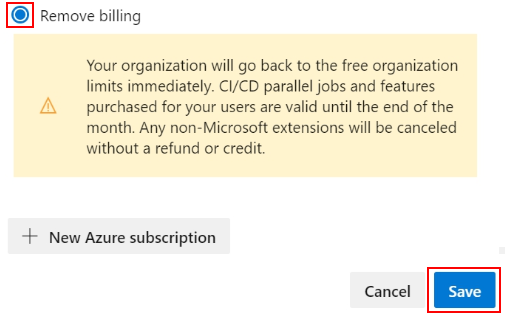

# Change or remove the Azure subscription that your organization uses for billing

[!INCLUDE [version-vsts-only](../../_shared/version-vsts-only.md)]

You can change the Azure subscription that your organization uses for billing or remove your billing subscription at any time.  


## Prerequisites

- To change or remove your billing subscription, you must be a member of the  [Project Collection Administrators group](../security/set-project-collection-level-permissions.md) or be the [organization owner](../security/lookup-organization-owner-admin.md).  
- To change your Azure billing subscription, you must be added [as an Owner or Contributor to an Azure subscription](add-backup-billing-managers.md) that you can use to purchase.  

<a id="change-subscription" />

## Change your subscription

1. Sign in to your organization (```https://dev.azure.com/{yourorganization}```).

2. Select  **Organization settings**.

   

3. Select **Billing**.

   

4. Select **Change Billing**.

   

5. Select your Azure subscription, and then select **Save**.

   

## Remove your billing subscription 


> [!NOTE]
> When you remove the billing subscription from your organization, any paid quantities of Basic, Azure Artifacts users, Test Manager users, Microsoft-hosted CI/CD, and self-hosted CI/CD you've paid for this month continue uninterrupted until the 1st of next month, but your organization reverts immediately to the Free Tier for [cloud-based load testing](../../test/load-test/overview.md). Removing the subscription also cancels any non-Microsoft paid extensions without refund or credit.

1. Sign in to your organization, choose  <strong>Organization settings</strong>, choose <strong>Billing</strong>, and then choose <strong>Change billing</strong> following steps 1 through 4 provided in the [Change the subscription](#change-subscription) section.

2. Choose <strong>Remove billing</strong> and then choose <strong>Save</strong>.

	> [!div class="mx-imgBorder"]  
	>   

## Related articles

- [Azure DevOps users](https://marketplace.visualstudio.com/items?itemName=ms.vss-vstsuser)
- [Microsoft-hosted CI/CD](https://marketplace.visualstudio.com/items?itemName=ms.build-release-hosted-pipelines)
- [Self-hosted CI/CD](https://marketplace.visualstudio.com/items?itemName=ms.build-release-private-pipelines)
- [Test Manager](https://marketplace.visualstudio.com/items?itemName=ms.vss-testmanager-web)
- [Azure Artifacts](https://marketplace.visualstudio.com/items?itemName=ms.feed)
- Any non-Microsoft services you're buying through the [Visual Studio Marketplace](https://marketplace.visualstudio.com/azuredevops)
