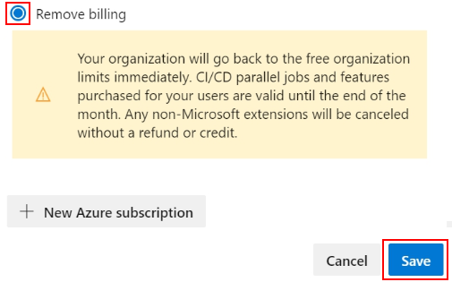

---
title: Change Azure subscription used for billing
titleSuffix: Azure DevOps Services
ms.custom: seodec18
description: Unlink the Azure subscription that your organization uses for billing
ms.technology: devops-billing
ms.assetid: e447adb1-6208-49f6-a488-515aa4b2fdcf
ms.topic: conceptual
ms.author: chcomley
author: chcomley
monikerRange: 'azure-devops'
ms.date: 12/10/2019
---

# Change or remove the Azure subscription that your organization uses for billing

[!INCLUDE [version-vsts-only](../../includes/version-vsts-only.md)]

In this article, learn how to change the Azure subscription that your organization uses for billing or remove your billing subscription at any time.   

[!INCLUDE [pricing-calculator-tip](../../includes/pricing-calculator-tip.md)]

## Prerequisites

- To change or remove your billing subscription, you must be a member of the  [Project Collection Administrators group](../security/set-project-collection-level-permissions.md) or be the [organization Owner](../security/lookup-organization-owner-admin.md).  
- To change your Azure billing subscription, you must be added [as an Owner or Contributor to an Azure subscription](add-backup-billing-managers.md) that you can use to purchase.  

<a id="change-subscription" />

## Change your subscription

1. Sign in to your organization (```https://dev.azure.com/{yourorganization}```).

2. Select  **Organization settings**.

   

3. Select **Billing**.

   

4. Select **Change Billing**.

   

5. Select your Azure subscription, and then select **Save**.

   

> [!NOTE]
> Please note a a user interface limitation prevents the subscription picker from displaying more than 50 subscriptions. If your user account has access to more than 50 subscriptions and the target subscription you want to change the billing to does not show up, you can follow either of the following two workarounds:
> 1. Create a new user account, grant it Owner/Contributor rights to the target subscription and administrative privileges to the Azure DevOps organization. Finally, use this new account to link the organization to the desired target subscription.
> 2. Open a support ticket

## Remove your billing subscription 

> [!NOTE]
> When you remove the billing subscription from your organization, any paid quantities of Basic, Azure Artifacts users, Azure Test Plans users, Microsoft-hosted CI/CD, and self-hosted CI/CD go back to the free organization limits immediately.

1. Sign in to your organization, choose  <strong>Organization settings</strong>, choose <strong>Billing</strong>, and then choose <strong>Change billing</strong> following steps 1 through 4 provided in the [Change the subscription](#change-subscription) section.

2. Choose <strong>Remove billing</strong> and then choose <strong>Save</strong>.

	> [!div class="mx-imgBorder"]  
	>   

## Related articles

- [Buy Basic access for users](buy-basic-access-add-users.md)
- [Buy Azure Test Plans](buy-basic-access-add-users.md)
- [Buy CI/CD](buy-more-build-vs.md)
- [Sign up for Azure Artifacts](../../artifacts/start-using-azure-artifacts.md)
