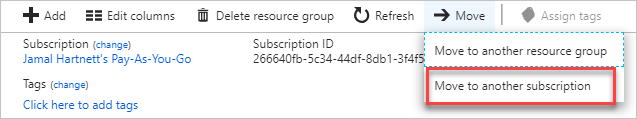
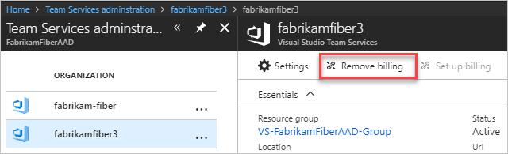

# Change the Azure subscription that your organization uses for billing

[!INCLUDE [version-vsts-only](../../_shared/version-vsts-only.md)]

If you want to use a different Azure subscription to bill purchases for your organization, you can do either of the following:

- Move it to a different Azure subscription that you have access to
- Remove the current Azure subscription, and then buy again using a new subscription

## Move to a different subscription

If the target subscription is in the same Azure Active Directory as the destination subscription and you have access to both, complete the following steps or learn more about [moving resources to new resource groups or subscriptions](/azure/azure-resource-manager/resource-group-move-resources).

1. Sign in to the [Azure portal](https://portal.azure.com).
2. Select **Resource groups**.

   

3. Select the resource group containing your organization.
4. Select **Move** > **Move to another subscription**.

   

5. Select your target subscription and resource group.
6. Select **OK**.

## Remove the billing subscription and purchase again

### Prerequisites

- [Project collection administrator or organization owner permissions](../accounts/faq-add-delete-users.md#find-owner)
- [The **owner** or **contributor** role on your Azure subscription](add-backup-billing-managers.md)

>[!NOTE]
> When you remove the billing subscription from your organization, any paid quantities of Basic, Azure Artifacts users, Test Manager users, Microsoft-hosted CI/CD, and self-hosted CI/CD you’ve paid for this month continue uninterrupted until the 1st of next month, but your organization reverts immediately to the Free Tier for cloud-based load testing. Removing the subscription also cancels any non-Microsoft paid extensions without refund or credit.

[Remove billing subscription](#remove-billing-subscription)

### Remove billing subscription

1. [Sign in to the Azure portal](https://portal.azure.com/) as organization owner and as Azure subscription co-administrator or greater.

    If you experience browser problems with Azure,
    make sure that you use a [supported browser](https://azure.microsoft.com/documentation/articles/azure-preview-portal-supported-browsers-devices/).

2. Go to **All services** > **Azure DevOps organizations**.

   

3. Select your organization and **Remove billing**.

   

### Purchase again by using the new subscription

1. Make your purchases again in the [Visual Studio Marketplace](https://marketplace.visualstudio.com/azuredevops), Azure DevOps tab. During your first purchase, select the new Azure subscription to use for billing going forward.

>[!NOTE]
> You only incur incremental charges only if the quantities of Microsoft resources that you select exceed what you've already paid for the current month. Purchases of non-Microsoft extensions are treated as new purchases and billed immediately to your new Azure subscription.
If you wait until the first of next month to make your purchases again, your organization reverts to the free tier and users in excess of the free limits appear as expired.

## Related articles

- [Azure DevOps users](https://marketplace.visualstudio.com/items?itemName=ms.vss-vstsuser)
- [Microsoft-hosted CI/CD](https://marketplace.visualstudio.com/items?itemName=ms.build-release-hosted-pipelines)
- [Self-hosted CI/CD](https://marketplace.visualstudio.com/items?itemName=ms.build-release-private-pipelines)
- [Test Manager](https://marketplace.visualstudio.com/items?itemName=ms.vss-testmanager-web)
- [Azure Artifacts](https://marketplace.visualstudio.com/items?itemName=ms.feed)
- Any non-Microsoft services you're buying through the [Visual Studio Marketplace](https://marketplace.visualstudio.com/azuredevops).
