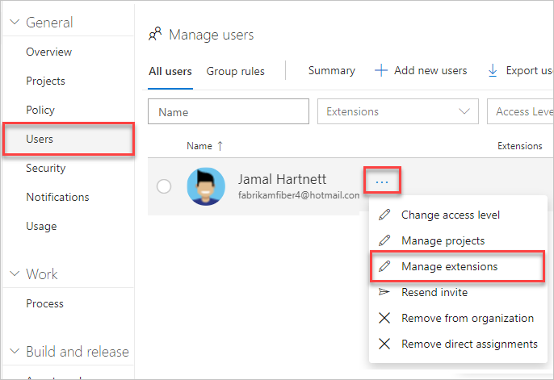
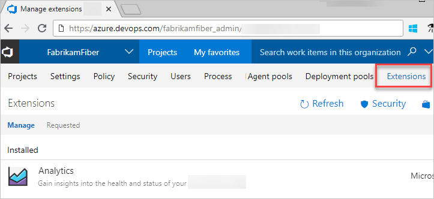

# Change the number of paid users for an Azure DevOps Services extension

[!INCLUDE [version-vsts-tfs-all-versions](../../_shared/version-vsts-tfs-all-versions.md)]

To scale with your team's needs, you can increase or decrease the number of paid users for a feature or extension.  

## Prerequisites 

You must have [access to billing](add-backup-billing-managers.md) for your organization Azure subscription.

[!INCLUDE [temp](../../boards/_shared/new-agile-hubs-feature.md)]

# [New navigation](#tab/new-nav)

1. Sign in to your Azure DevOps Services organization, ```https://dev.azure.com/{yourorganization}```.

2. Select  **Admin settings**.

    

3. Select **Users** > **...** > **Manage extensions**.

   


# [Previous navigation](#tab/prev-nav)

1. Sign in to your Azure DevOps Services organization, ```https://dev.azure.com/{yourorganization}```.

2. Go to **Extensions**. Then select the extension you want to update.

   

3. Select **Get**. You might be prompted to enter your credentials for the Marketplace.

   

4. Update the total number of paid users. Then select **Update**.

    

The number of paid extension users is updated.

> [!NOTE]
> To stop paying for an extension, [reduce the number of paid users to zero (0)](#change-the-number-of-paid-users-for-a-vsts-extension). [Change the number of paid users for an Azure DevOps Services extension](#change-the-number-of-paid-users-for-a-vsts-extension).

## Next steps

- [Assign features or extensions to users](../../marketplace/assign-paid-extensions.md)
- [Uninstall or disable extensions](../../marketplace/uninstall-disable-extensions.md?toc=%2Fvsts%2Fbilling%2Ftoc.json&bc=%2Fvsts%2Fbilling%2Fbreadcrumb%2Ftoc.json&view=vsts)

## Related articles

- [Change the Azure subscription for billing](change-azure-subscription.md)
- [Azure DevOps Services pricing](https://azure.microsoft.com/pricing/details/visual-studio-team-services/)
