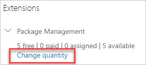

# Change the number of paid extension users for Azure DevOps

[!INCLUDE [version-vsts-tfs-all-versions](../../_shared/version-vsts-tfs-all-versions.md)]

You can increase or decrease the number of paid users for a feature or extension, to scale with your team's needs.  

## Prerequisites

You must have [access to billing](add-backup-billing-managers.md) for your organization's Azure subscription.

## Change number of paid users

1. Sign in to your organization (```https://dev.azure.com/{yourorganization}```).

2. Select  **Organization settings**.

    

3. Select **Users**.

   

4. Select **Change quantity** under the paid extension you want to change.

   

5. Update the total number of paid users, and then select **Continue**.

   

6. Review, and then select Confirm.

   

The number of paid extension users is updated.

## Next steps

- [Assign features or extensions to users](../../marketplace/assign-paid-extensions.md)
- [Uninstall or disable extensions](../../marketplace/uninstall-disable-extensions.md?toc=%2Fvsts%2Fbilling%2Ftoc.json&bc=%2Fvsts%2Fbilling%2Fbreadcrumb%2Ftoc.json&view=azure-devops)

## Related articles

- [Change the Azure subscription for billing](change-azure-subscription.md)
- [Azure DevOps pricing](https://azure.microsoft.com/pricing/details/devops/azure-devops-services/)
