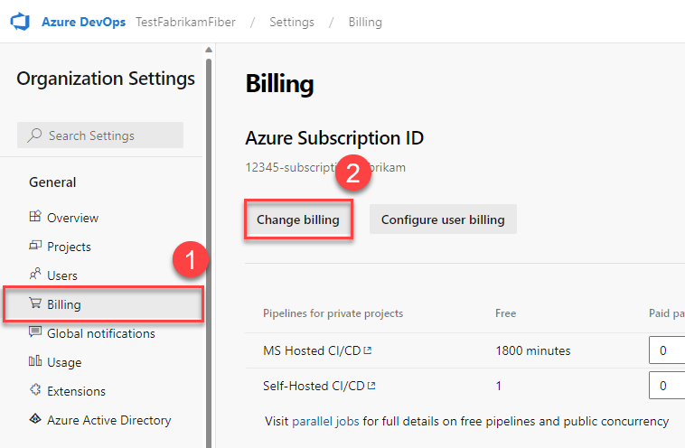

# Cloud Solution Providers: Buy Azure DevOps

[!INCLUDE [version-eq-azure-devops](../../../includes/version-eq-azure-devops.md)]

If you're a partner in the Cloud Solution Provider (CSP) program, you can enable your customers to [pay for Azure DevOps](https://azure.microsoft.com/pricing/details/devops/azure-devops-services/) by using a CSP-based Azure subscription.

## Prerequisites

Before you enable your customer to purchase Azure DevOps by using a CSP-based Azure subscription, confirm the following statements are true:

- The customer is a member of the [**Project Collection Administrators** group](../../security/look-up-project-collection-administrators.md) or the [**organization Owner**](../../security/look-up-organization-owner.md).
- The customer has [Contributor or Owner role permissions](../add-backup-billing-managers.md) to the CSP-based Azure subscription.

When your customer gains access to the CSP-based Azure subscription, they can [set up billing,](../set-up-billing-for-your-organization-vs.md) or [change billing](../change-azure-subscription.md) for their Azure DevOps organization. Any further charges are applied to your CSP subscription.

## Change billing to CSP Azure subscription

### CSP steps

1. Sign in to the [Azure portal](https://ms.portal.azure.com/#home) as CSP.
2. Assign your selected user Contributor access to the CSP Azure subscription. 

### Customer steps

1. Sign in to your organization (```https://dev.azure.com/{yourorganization}```).
2. Select  **Organization settings**.

   

3. Select **Billing** > **Change billing**.

   

4. Select your CSP Azure subscription for billing, and then select **Save**.

Now, you're paying for Azure DevOps with your CSP-based Azure subscription. The CSP can't make purchases on a customer's behalf.

## Related articles

- [Buy and manage Visual Studio cloud subscriptions for your customers](/visualstudio/subscriptions/vscloud-csp)
- [Buy Visual Studio App Center resources](https://visualstudio.microsoft.com/app-center/)
- [Azure DevOps pricing calculator](https://azure.microsoft.com/pricing/calculator/?service=azure-devops)
- [Azure DevOps pricing page](https://azure.microsoft.com/pricing/details/devops/azure-devops-services/)
