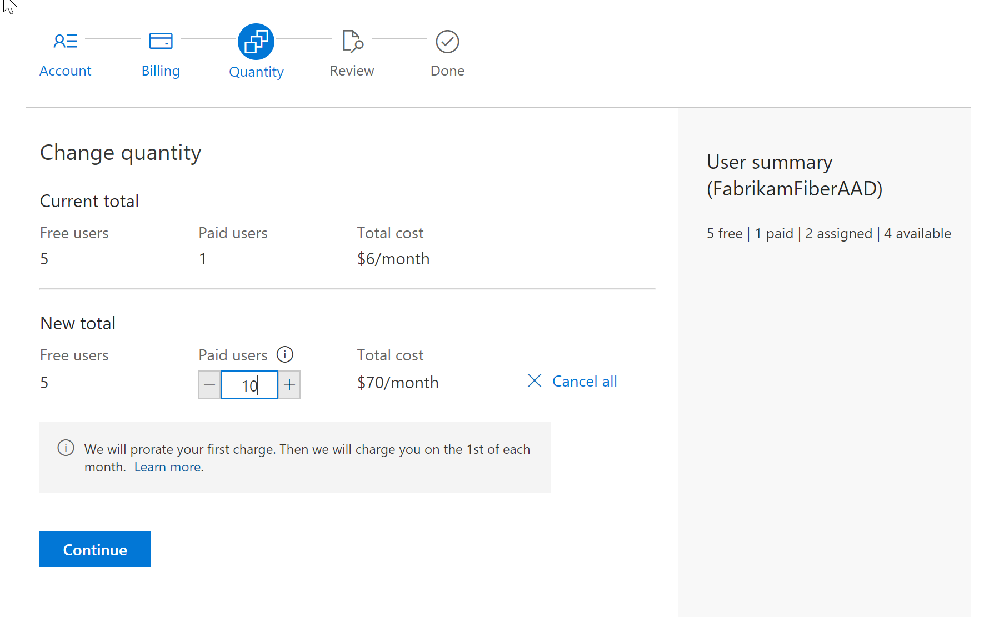
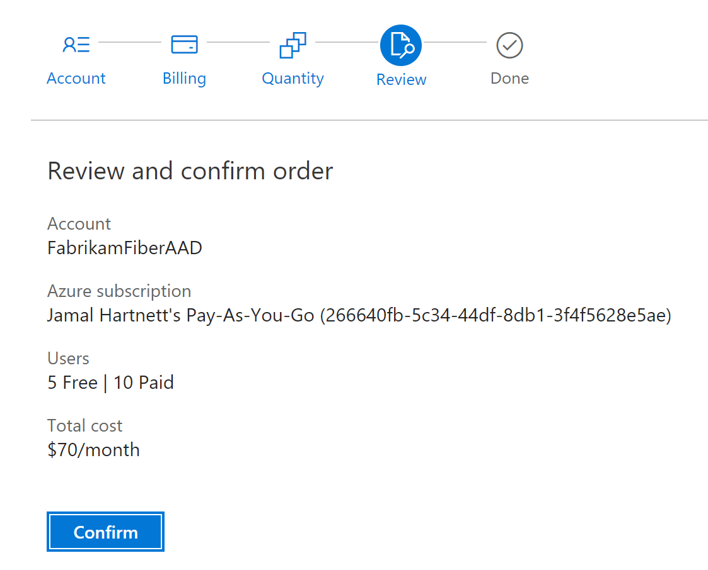

# Change the number of paid users in your organization

[!INCLUDE [version-vsts-only](../../_shared/version-vsts-only.md)]

As your team grows and contracts, you can increase or decrease the number of paid users in your organization.

> [!NOTE]
> To reduce or cancel users who have paid Basic access for the next month, you must make your changes before the last day of the month.
> Your charges won't change until the next month because paid users are monthly purchases.

## Prerequisites

Whether you do the setup via the Azure portal or as part of making a purchase in the Visual Studio Marketplace, you need the following:

* [Project collection administrator or organization owner permissions](billing-faq.md#find-owner).
* [The **owner** or **contributor** role on your Azure subscription](add-backup-billing-managers.md). To make subsequent edits to paid quantities in your organization, you need only the owner or contributor role on your Azure subscription.

## Update the number of paid users for your organization

1. As project collection administrator or organization owner, sign in to [**Visual Studio Marketplace** > **Other** > **Azure DevOps Users**](https://marketplace.visualstudio.com/items?itemName=ms.vss-vstsuser), and then choose **Get**.

   

2. Select your organization, and then select **Buy**.

   > [!div class="mx-imgBorder"]

3. Update the number of paid users, and then choose **Continue**. To cancel all your paid users, reduce this number to zero (0).

    For example, to increase our total paid users from one to 10:

   > [!div class="mx-imgBorder"]

    > If you [pay for client access licenses (CALs) through Azure DevOps](buy-access-tfs-test-hub.md), make sure that you still have enough CALs for the users who need them.

1. Review your changes, and then select **Confirm**.

   > [!div class="mx-imgBorder"]

5. Go back to your organization to [reassign access levels for your users, if necessary](../accounts/add-organization-users.md).

## Next steps

* [Add backup billing managers](add-backup-billing-managers.md)
* [Change the Azure subscription for billing](change-azure-subscription.md)

## Related articles

* [Azure DevOps pricing](https://azure.microsoft.com/pricing/details/visual-studio-team-services/)
* [Azure DevOps billing support](https://azure.microsoft.com/support/devops/)