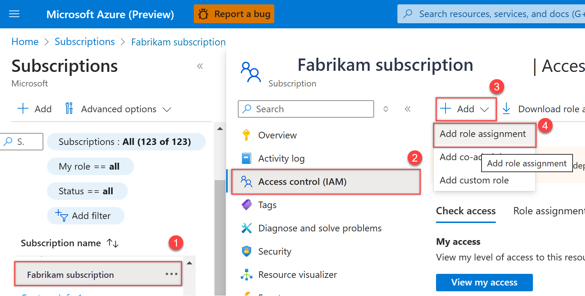

# Manage billing

[!INCLUDE [version-eq-azure-devops](../../includes/version-eq-azure-devops.md)]

Setting up billing in Azure DevOps is essential for managing costs associated with users, CI/CD concurrency, and extensions. This article guides you through the process to [set up billing](#set-up-billing-for-your-organization), [change your Azure subscription](#change-your-billing-subscription), [remove your billing subscription](#remove-your-billing-subscription), and [give a user access to manage billing](#give-a-user-access-to-manage-billing).

*All services are billed via Azure*. You're not required to use any other Azure services.

[!INCLUDE [pricing-calculator-tip](../../includes/pricing-calculator-tip.md)]

## Prerequisites

* **Subscription:** Have an [Azure subscription](https://azure.microsoft.com/pricing/purchase-options/).
- **Permissions:**
  * Be a member of the [Project Collection Administrators group](../security/look-up-project-collection-administrators.md). Organization owners are automatically members of this group.
  * To give another user access to manage billing, be the [Azure Account Administrator](/azure/cost-management-billing/manage/add-change-subscription-administrator) to give another user access to manage billing.
  * To change your organization's billing subscription, have the following permissions:
    - [Project Collection Administrators group](../security/look-up-project-collection-administrators.md). Organization owners are automatically members of this group.
    - [Owner or Contributor permission for the Azure subscription](set-up-billing-for-your-organization-vs#add-backup-billing-managers), which you can use to purchase.

> [!NOTE]
> Azure DevOps doesn't support the [Azure Free Trial](https://azure.microsoft.com/offers/ms-azr-0044p/).

<a name="set-up-billing"></a>

## Set up billing for your organization

Set up billing in Azure DevOps before making purchases. You only need to do this once per organization. After selecting an Azure subscription for billing, you can add users and assign licenses.

1. Sign in to your organization (```https://dev.azure.com/{yourorganization}```).

2. Select  **Organization settings**.

   

3. Select **Billing**.

   

4. Select **Set up billing**.

   

5. Select your Azure subscription, and then select **Save**.

   

   > [!TIP]
   > If you can't see an Azure Subscription associated with a different tenant ID, it’s likely due to authentication issues. Here’s how you can address this situation:<br>
   >**Tenant context:**
   > - Your organization might be connected to 'Tenant A,' where your user account is registered.
   > - But, the Azure subscription you’re trying to access is associated with 'Tenant B,' a different Microsoft Entra ID tenant.<br>
   >**Authentication steps:**
   > - To access the subscription in 'Tenant B,' you must authenticate with that specific tenant.
   > 1. Go to aex.dev.azure.com directly.
   > 2. In the dropdown menu, select the desired Microsoft Entra ID tenant, 'Tenant B.'
   > 3. Retry the operation, and you should see the subscription.

Billing is set up for your Azure DevOps organization. You can [review your individual Azure subscription bill](/azure/cost-management-billing/understand/review-individual-bill) at any time.

<a id="change-subscription"></a>

## Change your billing subscription

You might need to change the Azure subscription for your Azure DevOps organization's billing if the subscription is linked to a former user. Consider switching to a shared subscription or removing the billing arrangement. You can [remove your billing subscription](#remove-your-billing-subscription) anytime. [Migrating between resource groups isn't supported](billing-faq.yml).

Before you change your billing subscription, keep the following considerations in mind:
- **Reverting to Free Tier:** When you remove the billing subscription, any paid quantities of services like Basic, Azure Artifacts users, Azure Test Plans users, Microsoft-hosted CI/CD, and self-hosted CI/CD revert to the free tier immediately.
- **Resource groups:** When billing is cancelled or changed, a resouce group might be left behind in the old Azure subscription. These resource groups can be safely deleted if they're empty.

1. Sign in to your organization (```https://dev.azure.com/{yourorganization}```).

2. Select  **Organization settings**.

   :::image type="content" source="../../media/settings/open-admin-settings-vert.png" alt-text="Screenshot showing highlighted Organization settings button.":::

3. Select **Billing** > **Change billing**. If you don't see the **Change billing** button, you don't have the [right permissions for access](#prerequisites).

   :::image type="content" source="media/shared/select-change-billing.png" alt-text="Screenshot showing highlighted Billing and Change billing buttons.":::

4. Choose your Azure subscription, and then select **Save**.

   :::image type="content" source="media/shared/select-azure-subscription.png" alt-text="Screenshot showing Azure subscription selection.":::

Azure DevOps bills the newly saved subscription for your organization.

## Remove your billing subscription 

> [!IMPORTANT]
> - When you remove the billing subscription from your organization, any paid quantities of Basic, Azure Artifacts users, Azure Test Plans users, Microsoft-hosted CI/CD, and self-hosted CI/CD go back to the [free tier](billing-faq.yml) of service immediately.
> - If you delete your organization resource in the Azure Portal, do so *after* you change the billing subscription in Azure DevOps and not before, to avoid your organization reverting to the free tier of service. For more information, see [Billing FAQs](billing-faq.yml#azure-portal-integration).
> - When billing gets canceled or changed, a resource group gets left behind in the old Azure subscription. It's safe to delete these resource groups if empty. These resource groups take the naming format, `VisualStudioOnline-<DEVOPS-ORG-HOSTID-WITHOUT-DASHES>`.

1. Sign in to your organization, choose  **Organization settings** > **Billing**, and then **Change billing**, following steps 1 through 4 of the [Change the subscription](#change-subscription) section.

2. Choose **Remove billing**, and then choose **Save**. 

Azure DevOps removes your billing subscription from your organization.

<a name="add-backup-billing-managers"></a>

## Give a user access to manage billing

> [!IMPORTANT]
> Classic admins retired August 31, 2024. Starting on February 26, you can't add a new co-administrator using the Access control blade. Remove co-administrators and use Azure RBAC for fine-grained access control. For more information, see [Azure classic subscription administrators](/azure/role-based-access-control/classic-administrators).

Assign any of the following roles to a user under the subscription your organization uses for billing: [Owner](/azure/role-based-access-control/built-in-roles#owner), [Contributor](/azure/role-based-access-control/built-in-roles#contributor), or [Service admin](/azure/billing/billing-add-change-azure-subscription-administrator). For more information, see [Azure roles](/azure/role-based-access-control/rbac-and-directory-admin-roles).

1. [Sign in to the Azure portal](https://portal.azure.com/) as the Azure Account Administrator.
2. Enter *subscriptions* in the search box and select **Subscriptions**. 
3. Select the **subscription** > **Access control (IAM)** > **+ Add**.
4. Select the appropriate role from the dropdown menu.

   > [!div class="mx-imgBorder"]  
   > 

5. Choose **+ Select members**, search for a user by name or email address, highlight the user, and then choose **Select**.

   > [!div class="mx-imgBorder"]  
   > 

6. Select **Review + assign**.

> [!NOTE]
> The user must accept their email invitation before they can access the Azure subscription, if they aren't in your directory.

## Next steps

> [!div class="nextstepaction"]
> [Pay for users](buy-basic-access-add-users.md)

## Related articles

* [Get started with Azure Artifacts](../../artifacts/start-using-azure-artifacts.md#artifacts-free-tier-and-upgrade)
* [Buy Azure Test Plans](buy-basic-access-add-users.md)
* [Learn about cost management and billing](/azure/cost-management-billing/cost-management-billing-overview)
