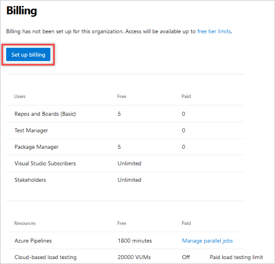

# Set up billing for your organization

[!INCLUDE [version-vsts-only](../../_shared/version-vsts-only.md)]

In this quickstart, you learn to set up billing for your organization in advance of making purchases, so that you'll have this in place once you're ready to buy. You can also make a purchase in the [Visual Studio Marketplace](https://marketplace.visualstudio.com/azuredevops) to set up billing for your organization. During that process we'll prompt you for an Azure subscription where charges should apply and allow you to create a new Azure subscription if you don't have one already.

*All services are billed via Azure*, and you're not required to use any other Azure services.

If you don't have an Azure subscription, [create one](https://azure.microsoft.com/pricing/purchase-options/) before you begin. Please note that the Azure Free Trial is not supported.

## Prerequisites

Ensure the following is true for the user who's setting up billing for the first time:

* User has [project collection administrator or organization owner permissions](../accounts/faq-add-delete-users.md#find-owner)
* User has [an Azure subscription that you can use to purchase](add-backup-billing-managers.md)

## Set up billing

1. Sign in to your organization (```https://dev.azure.com/{yourorganization}```).

2. Select  **Organization settings**.

   

3. Select **Billing**.

    

4. Select **Set up billing**.

   

5. Select your Azure subscription, and then select **Save**.

   

Billing is set up.

## Next steps

> [!div class="nextstepaction"]
> [Pay for users](buy-basic-access-add-users.md)

## Related articles

* [Billing FAQ](../billing/billing-faq.md)
* [Add a backup billing manager](add-backup-billing-managers.md)
* [Change the subscription for billing](../billing/change-azure-subscription.md)
