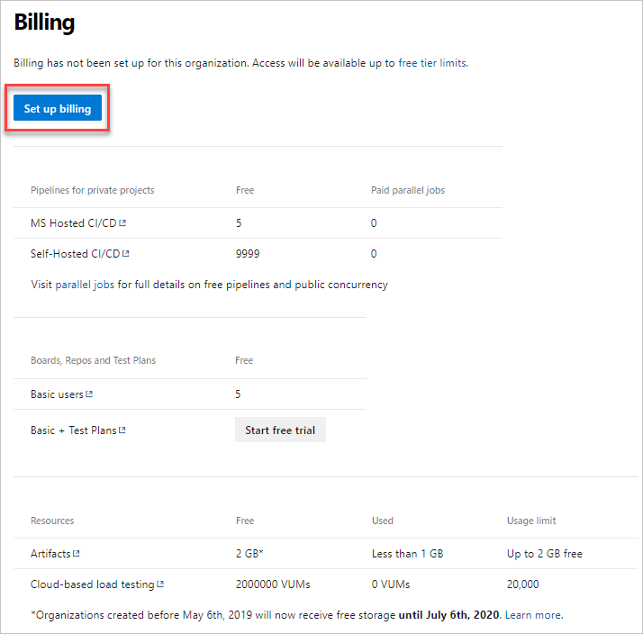
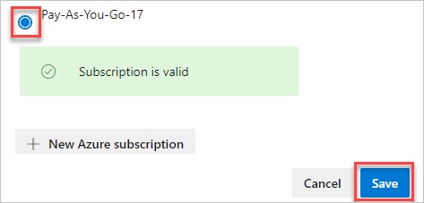

# Set up billing

[!INCLUDE [version-vsts-only](../../includes/version-vsts-only.md)]

Set up billing in Azure DevOps before you make purchases. That way, you have it in place once you're ready to buy. You only need to set up billing once for your organization. 

*All services are billed via Azure*. You're not required to use any other Azure services.

[!INCLUDE [pricing-calculator-tip](../../includes/pricing-calculator-tip.md)]

## Prerequisites

* If you don't have an Azure subscription, [create one](https://azure.microsoft.com/pricing/purchase-options/).
* To set up billing, you must have [Project Collection Administrator or organization Owner permissions](../security/lookup-organization-owner-admin.md) in Azure DevOps.

> [!NOTE]
> The [Azure Free Trial](https://azure.microsoft.com/offers/ms-azr-0044p/) isn't supported.

## Set up billing for your organization

> [!NOTE]
> A user interface limitation prevents the subscription picker from displaying more than 50 subscriptions. If your user account has access to more than 50 subscriptions and the target subscription you want to change the billing for isn't visible, you can create a new user account. Grant the account Owner/Contributor rights to the target subscription and administrative privileges to the Azure DevOps organization. Use the new account to link the organization to the target subscription.


1. Sign in to your organization (```https://dev.azure.com/{yourorganization}```).

2. Select  **Organization settings**.

   

3. Select **Billing**.

    

4. Select **Set up billing**.

   

5. Select your Azure subscription, and then select **Save**.

   

Billing is set up for your Azure DevOps organization.

## Next steps

> [!div class="nextstepaction"]
> [Pay for users](buy-basic-access-add-users.md)

## Related articles

* [Buy Azure Test Plans](buy-basic-access-add-users.md)
* [Buy parallel jobs](../../pipelines/licensing/concurrent-jobs.md#how-much-do-parallel-jobs-cost)
* [Sign up for Azure Artifacts](../../artifacts/start-using-azure-artifacts.md)
* [Azure cost management and billing](/azure/cost-management-billing/cost-management-billing-overview)
* [Azure DevOps billing overview](overview.md)
