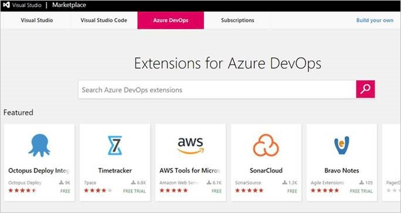
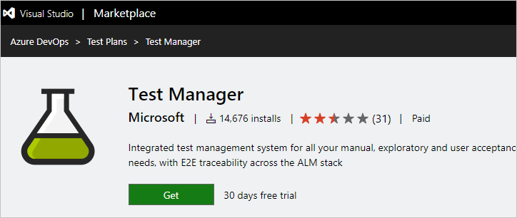
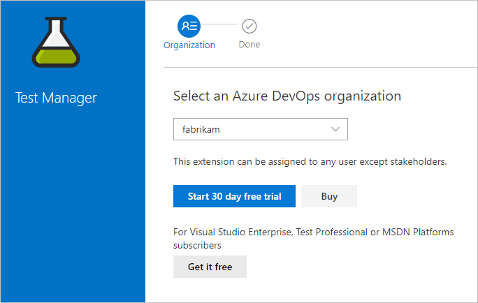
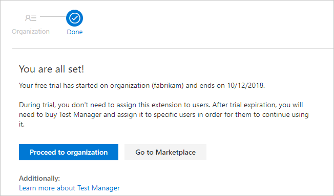
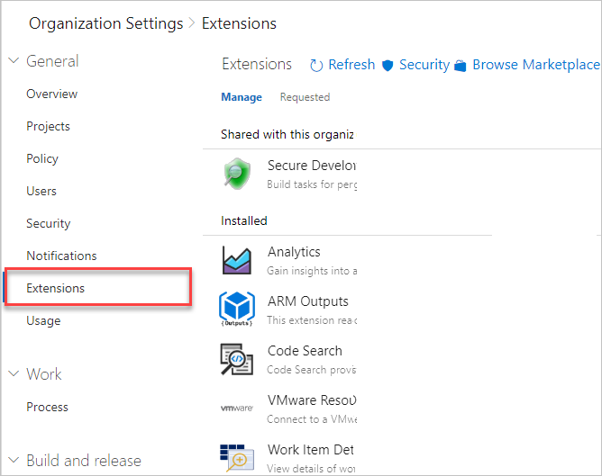

# Quickstart: Start free trials for paid features and extensions

[!INCLUDE [version-vsts-only](../../_shared/version-vsts-only.md)]

In this quickstart, you learn how to start a free trial for your organization, as well as how to keep using your extension after the trial ends.

There are two paid features in Azure DevOps that are offered by Microsoft that you can use free for a 30-day trial:

- [Test Manager](https://marketplace.visualstudio.com/items/ms.vss-testmanager-web) (which is included on an ongoing basis for Visual Studio Enterprise, Visual Studio Test Professional, and MSDN Platforms subscribers).

- [Azure Artifacts](https://marketplace.visualstudio.com/items?itemName=ms.feed) (which is included on an ongoing basis for Visual Studio Enterprise subscribers, plus another five users in your organization).

During the trial, any user in your organization whose access level is Basic (including Visual Studio subscribers) can use these features. When the trial ends, you can choose to pay for a certain number of users on an ongoing basis and you assign the feature to users on the User page.

This same process applies to paid extensions that are offered by other publishers within the Visual Studio Marketplace, including the following extensions:

- [Timetracker](https://marketplace.visualstudio.com/items?itemName=Berichthaus.TfsTimetracker)
- [Enhanced Export PRO](https://marketplace.visualstudio.com/items?itemName=mskold.mskold-PRO-EnhancedExport)
- [Backlog Essentials](https://marketplace.visualstudio.com/items?itemName=agile-extensions.backlog-essentials)

If you don't have an Azure subscription, [create a subscription](https://azure.microsoft.com/pricing/purchase-options/) before you begin.

## Prerequisites

As the [organization owner or project collection administrator](billing-faq.md#find-owner), you can start trials for your organization.
All other users can [request extensions](../../marketplace/install-extension.md).

## Start a trial for your organization

1. Sign in to the [Visual Studio Marketplace](https://marketplace.visualstudio.com/azuredevops), go to the **Azure DevOps** tab.

    

2. Find and select a paid extension that you want to try.

    

3. Select your organization to install this extension.

    

4. After your extension finishes installing, go to your organization to use your extension.

    Let your team know that they also have access.

   

<a name="after-trial"></a>

## Keep your extension after the trial ends

Make sure to buy and assign the extension *before* the trial ends so that your users can continue using it without disruption. Otherwise, your users lose access when the trial expires.
There's no penalty for buying early. Charges don't start until the trial ends.

If you lose access because the trial expired before you could purchase, buy and assign the extension like you would if you weren't doing a trial.

1. Sign in to your organization (```https://dev.azure.com/{yourorganization}```).

2. Select  **Organization settings**.

   
3. Select **Extensions**, and then select your extension or **Browse Marketplace**.

   

## Clean up resources

To [cancel a paid extension](../../marketplace/uninstall-disable-extensions.md), you must have access to the Azure subscription that was used to buy it.

## Next steps

> [!div class="nextstepaction"]
> [Buy CI/CD for Azure DevOps](buy-more-build-vs.md)

## Related articles

- [Change the Azure subscription for billing](change-azure-subscription.md)
- [Azure DevOps pricing](https://azure.microsoft.com/pricing/details/devops/azure-devops-services/)
