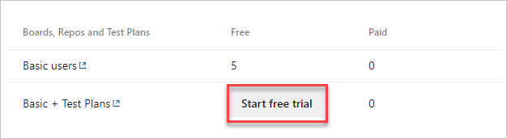
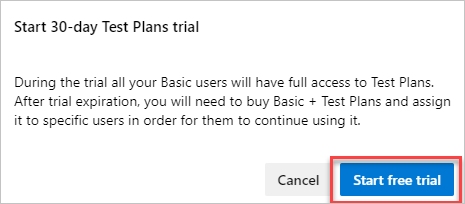

# Try Azure Test Plans for free

[!INCLUDE [version-azure-devops](../../includes/version-azure-devops.md)]

Learn how to try Azure Test Plans for free for 30 days.

[!INCLUDE [pricing-calculator-tip](../../includes/pricing-calculator-tip.md)]

## Prerequisites

You must have [Project Collection Administrator or organization Owner permissions](../security/lookup-organization-owner-admin.md).

## Try Azure Test Plans 

1. Sign in to your organization (```https://dev.azure.com/{yourorganization}```). 
2. Select  **Organization settings**.

   

3. Select **Billing**.

   

4. Select **Start free trial**.

   

5. Select **Start free trial**.

    

6. (Optional) Assign users **Basic** or **Basic + Test Plans**, and they can access Test Plans during the trial. Assigning **Basic + Test Plans** requires that you [set up billing](set-up-billing-for-your-organization-vs.md) first. But, charges for those users don't start until the trial expires.

## Next steps

> [!div class="nextstepaction"]
> [Create a test plan](../../test/create-a-test-plan.md)

## Related articles

- [Manage paid access for users](buy-basic-access-add-users.md)
- [Buy parallel jobs for Azure DevOps](../../pipelines/licensing/concurrent-jobs.md#how-much-do-parallel-jobs-cost)
- [Azure DevOps billing overview](overview.md)
