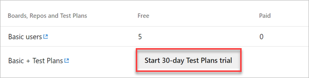
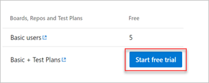

# Quickstart: Try Azure Test Plans for free

[!INCLUDE [version-vsts-only](../../_shared/version-vsts-only.md)]

In this quickstart, you learn how to try [Azure Test Plans ](https://azure.microsoft.com/en-us/services/devops/test-plans/) for 30 days free.

## Prerequisites

Ensure you have [Project Collection Administrator or organization Owner](../security/lookup-organization-owner-admin.md) permissions.

## Try Azure Test Plans

1. Sign in to your organization (```https://dev.azure.com/{yourorganization}```).

2. Select  **Organization settings**.

   

3. Select **Billing**.

    
4. Select **Start 30-day Test Plans trial**.

   

5. Select **Start free trial**.

   

## Next steps

> [!div class="nextstepaction"]
> [Create a test plan](../../test/create-a-test-plan.md)
