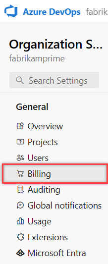
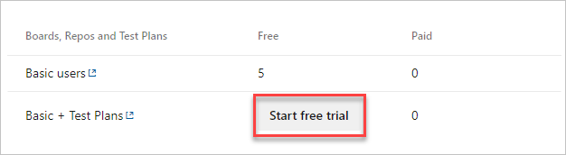

# Try Azure Test Plans for free

[!INCLUDE [version-eq-azure-devops](../../includes/version-eq-azure-devops.md)]

Start a Test Plans trial and assign any of your users Basic + Test Plans for 30 days. For more information about Azure Test Plans, see [What is Azure Test Plans](../../test/overview.md).

[!INCLUDE [pricing-calculator-tip](../../includes/pricing-calculator-tip.md)]

## Prerequisites

[!INCLUDE [prerequisites-pca-only](../../includes/prerequisites-pca-only.md)]

## Try Azure Test Plans

1. Sign in to your organization (`https://dev.azure.com/{yourorganization}`).
1. Select  **Organization settings**.

   

1. Select **Billing**.

   

1. Select **Start free trial**.

   

1. Select **Start free trial** again in the resulting window. Your Azure DevOps organization now has a 30-day trial of Azure Test Plans. However, each user must be explicitly assigned a **Basic + Test Plans** license to access the trial. Proceed with step 6.

1. Assign users the **Basic + Test Plans** license so they can access Test Plans during the trial. 

   > [!IMPORTANT]
   > During the trial, users assigned **Basic + Test Plans** have full access. After trial expiration, you start **getting charged** for users assigned **Basic + Test Plans**. If you didn't [set up billing](set-up-billing-for-your-organization-vs.md), those users receive **Stakeholder** access.

## Next steps

> [!div class="nextstepaction"]
> [Create a test plan](../../test/create-a-test-plan.md)

## Related content

- [Tour Test Plans](../../test/navigate-test-plans.md)
- [Find answers in Billing FAQs](billing-faq.yml)
- [Manage paid access for users](buy-basic-access-add-users.md)
- [Buy parallel jobs for Azure DevOps](../../pipelines/licensing/concurrent-jobs.md#how-much-do-parallel-jobs-cost)
- [Understand Azure DevOps billing](overview.md)
