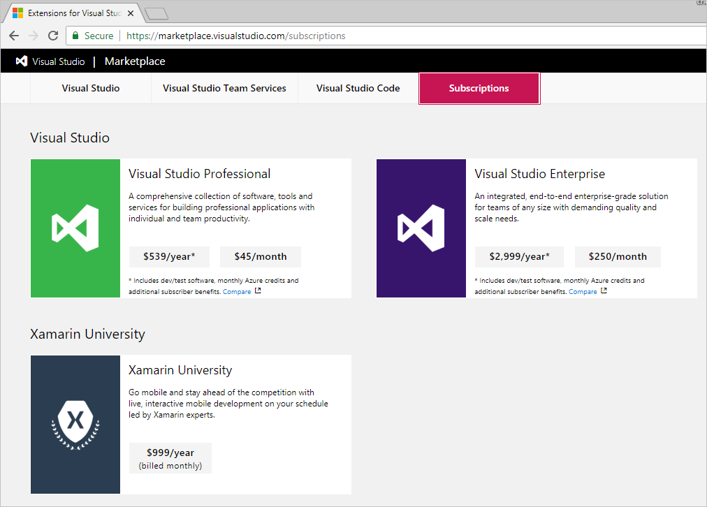
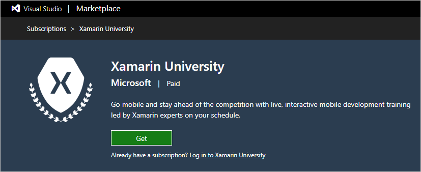
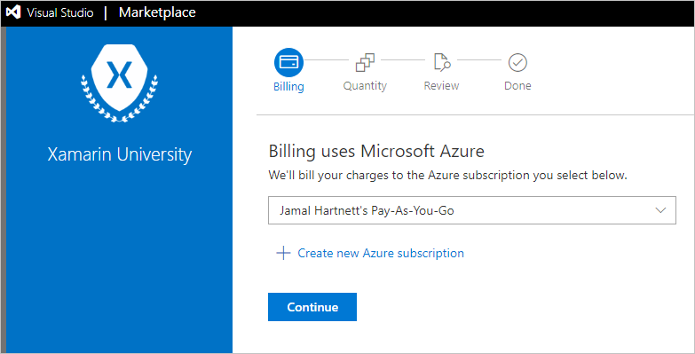
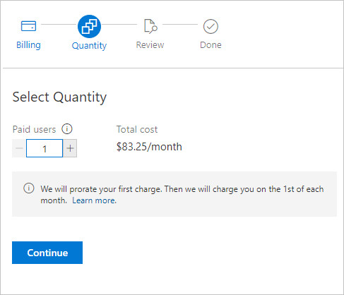
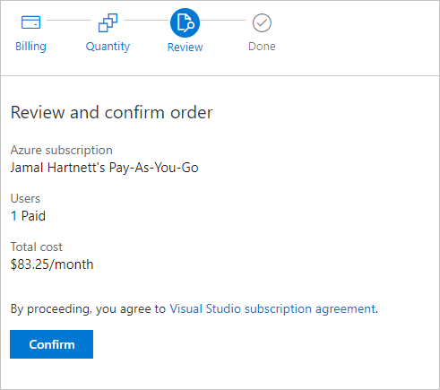
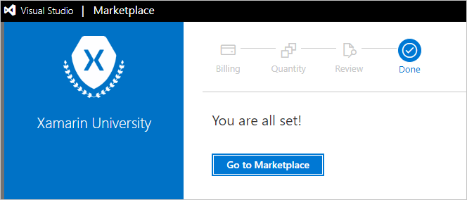
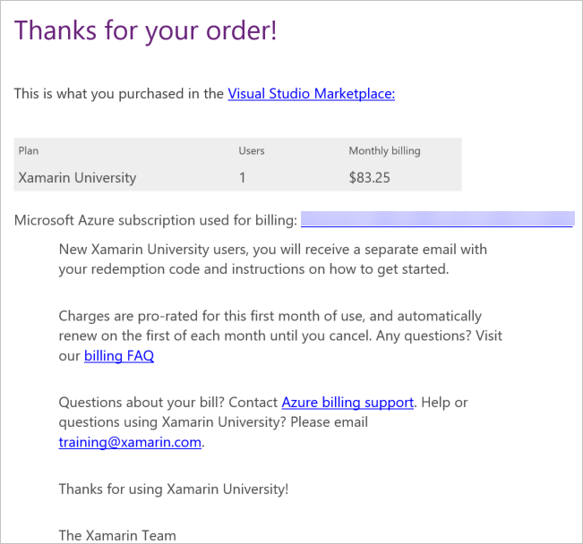
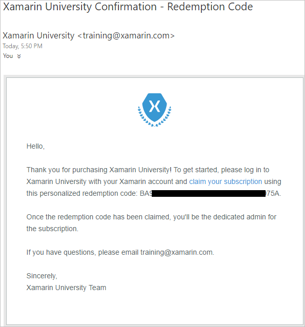

# Subscribe to the Xamarin University for continued learning

[!INCLUDE [version-vsts-tfs-all-versions](../../_shared/version-vsts-tfs-all-versions.md)]

[Xamarin University](https://www.xamarin.com/university) offers live, online, and office hours classes with self-guided learning and guest lectures.

In this article, you learn:

* [Steps to buy Xamarin University from the Visual Studio Marketplace](#buy-it)
* [Answers to frequently asked questions](#q-n-a)

To subscribe to Xamarin University, you need:

* A [Microsoft account](https://www.microsoft.com/account) like an outlook.com or hotmail.com address, or a work or school account, such as someone@fabrikam.com.

* A [Microsoft Azure subscription](https://azure.microsoft.com/pricing/purchase-options/) to use for billing. There's no cost to create an Azure subscription, which essentially is a billing account that gets charged when you buy something.

   You might already have an Azure subscription if you use Azure, or you pay for Azure DevOps Services or other services through Visual Studio Marketplace. If you don't have an Azure subscription, you can [sign up for Azure](https://portal.azure.com) before or during your first Marketplace purchase. Learn more about [how to use Azure subscriptions to bill Marketplace purchases](#azure-billing).

##	Steps to buy Xamarin University from the Marketplace

1. Sign in to [Visual Studio Marketplace > Subscriptions](https://marketplace.visualstudio.com/subscriptions) with your Microsoft account, or with your work or school account.

1. Choose **Xamarin University**:

   

1. On the next screen, select **Get**:

   

1. Choose the Azure subscription that you want to use for billing. The name of the subscription defaults to its account type. You can change the name in the [Azure Account portal](https://portal.azure.com). You can also create a new Azure subscription to use instead:

   

1. Choose the number of users:

   

1. Confirm your purchase:

   

   Your purchase is complete. Now you can get started:

   

1. The information on the following screen explains that Xamarin University sends you a redemption code to use on the Xamarin site:

   
   
   The email that you receive looks like the following example:

   

## FAQ

### Q:  Where can I manage the Xamarin University subscriptions that I've purchased?

A: If you're the Xamarin University team admin, use the [Xamarin University Subscription Administration](https://university.xamarin.com/subscriptions) to assign Xamarin University subscriptions to your users.

### Q:	Can I buy Xamarin University through the Visual Studio Marketplace now?

A: Yes. Previously, Xamarin University was available for sale through Xamarin.com. We moved purchasing to the Visual Studio Marketplace so customers can buy Xamarin University along with other services on the same Azure bill.

Learn about [billing Marketplace purchases with Azure](#azure-billing).

### Q:	I'm an existing Xamarin University customer. How do I switch from paying through xamarin.com to paying through Azure?

A: Here's how:

1. Wait until your existing Xamarin University subscription expires.

1. Sign in to [Visual Studio Marketplace > Subscriptions](https://marketplace.visualstudio.com/subscriptions).

1. Buy Xamarin University for the number of users who need it.

   If you need additional Xamarin University subscriptions before your current annual subscription expires, make the new purchases in the Visual Studio Marketplace. All of your Xamarin University subscriptions, wherever you purchased them, are managed in the [Xamarin University Subscription Administration](https://university.xamarin.com/subscriptions) portal.

### Q:	How do I cancel or change the number of Xamarin University subscriptions I'm buying?

A: Follow these steps:

1. Sign in to [Visual Studio Marketplace > Subscriptions](https://marketplace.visualstudio.com/subscriptions) with the credentials that you used to purchase Xamarin University.

1. Select **Xamarin University**.

1. Select **Buy** (the same as to buy a new Xamarin University subscription).

1. Change the number of subscriptions. To cancel, enter zero. Confirm and finish.

   The increases take effect immediately. Your charges are prorated based on the number of days remaining in the current calendar month. The reduction in the number of Xamarin University subscribers takes effect the first day of the following calendar month. At this time, return to the Xamarin University portal to delete the users who should no longer have Xamarin University subscriptions.

[!INCLUDE [azure-billing](_shared/qa-azure-billing.md)]

[!INCLUDE [marketplace-support](_shared/qa-marketplace-support.md)]
