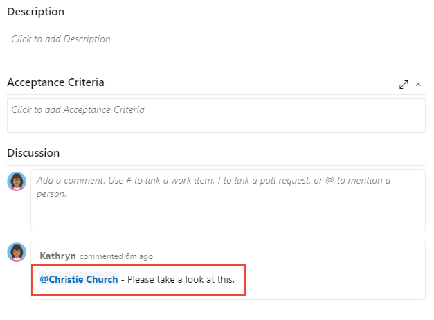
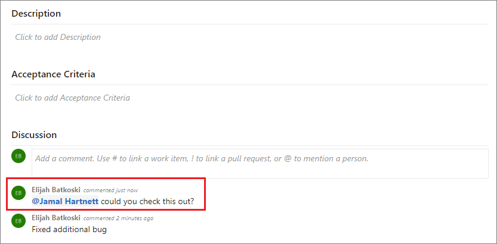
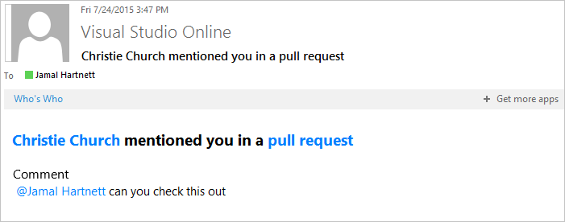

---
title: Use @mentions in work items and pull requests 
titleSuffix: Azure DevOps 
description: Alert team members using the @mention control in work items and pull requests. 
ms.subservice: azure-devops-notifications
ms.custom: quarterly-update
toc: show
ms.author: chcomley
author: chcomley
ms.topic: conceptual
monikerRange: '<= azure-devops'
ms.date: 03/23/2023
--- 

# Use &#64;mentions in work items and pull requests

[!INCLUDE [version-lt-eq-azure-devops](../../includes/version-lt-eq-azure-devops.md)]

::: moniker range="azure-devops"

The **@mention** control allows you to quickly add a user or group to a work item or pull request discussion. Using the people picker of the **@mention** control, you can select a project member or group from the search list, and they receive an email notifying them of your comment. 

For organizations that manage their users and groups using Azure Active Directory (Azure AD), people pickers support searching all users and groups added to Azure AD, not only those users and groups added to your project. To limit the set to project members and groups, see [Manage your organization, Limit  identity search and selection](../../user-guide/manage-organization-collection.md#limit-identity-selection).  

> [!NOTE]
> You can post an @mention via API. [Get the Azure DevOps User Id](/rest/api/azure/devops/graph/users/get?&preserve-view=true/view=azure-devops-rest-6.0), and then add the following html code:
> `
<a href="#" data-vss-mention="version:2.0,{user id}">@John Doe</a> Testing mentioning
`
> For more information, see the [Microsoft Power Automate Community forum post](https://powerusers.microsoft.com/t5/Building-Flows/Mention-person-in-azure-devops-work-item/td-p/922467#:~:text=https%3A%2F%2Fdocs.microsoft.com%2Fen-us%2Frest%2Fapi%2Fazure%2Fdevops%2Fwit%2Fcomments%2Fadd%3Fview%3Dazure-devops-rest-6.0%20You%20can%20use%20a%20html%20in%20the,of%20the%20devops%20user%20you%20want%20to%20mention.).

::: moniker-end

::: moniker range="< azure-devops"

The **@mention** control allows you to quickly add a user to a work item or pull request discussion. Using the people picker of the **@mention** control, you can select a project member from the search list, and they receive an email notifying them of your comment. 

For organizations that manage their users using Active Directory, people pickers provide support for searching all users added to the Active Directory, not only those users added to your project.  

::: moniker-end

Use the **@mention** control to start or continue a discussion within the following areas:

::: moniker range=">= azure-devops-2020"

- A work item discussion or any rich-text field
- A pull request discussion
- Commit comments
- Changeset or shelveset comments

::: moniker-end

::: moniker range=" < azure-devops-2020"

- A work item discussion 
- A pull request discussion
- Commit comments
- Changeset or shelveset comments

::: moniker-end

::: moniker range=" < azure-devops"

[!INCLUDE [note-smtp-server](includes/note-smtp-server.md)]

::: moniker-end

## Identity search selection

When you leave a code comment in a pull request, enter **\@** to trigger the **\@mention** people picker. From the people picker, you see a list of users you've recently mentioned. To do a directory search, choose a name or enter the name of the user you're looking for. 

::: moniker range="azure-devops"

> [!WARNING]
> If you have permission to invite users to the organization, regardless of whether the **Restrict invitations** policy is disabled, you can **@mention** a user who isn't part of your organization. This action invites that user to your organization. For more information, see [Restrict new user invitations from project and team administrators](../../organizations/security/restrict-invitations.md). 

To filter the list, enter the user name or alias until you've found a match.
 
> [!div class="mx-imgBorder"]  
>   

::: moniker-end

::: moniker range=">= azure-devops-2020"

You can also use group mentions. Enter the name of a team or a security group, choose :::image type="icon" source="../../media/icons/search-icon.png" border="false"::: **Search**, and then select from the options listed.

::: moniker-end

To **\@mention** a user you've never selected previously, continue to enter the entire name to do your search against the full directory.  

Names of mentioned users appear in blue text. Choose the **\@mention link name** to open the user's contact information. The contact information provides more context for why they were added to the conversation.  

::: moniker range=">= azure-devops-2019"
> [!div class="mx-imgBorder"]  
>   
::: moniker-end

::: moniker range="< azure-devops-2019"
  
::: moniker-end

> [!NOTE]
> Don't copy/paste **\@mention** users from a previous comment. While the resulting formatting looks identical to a properly entered mention, it doesn't register as a true mention nor send an email notification.

Upon completion of your selection and text entry, your **@mention** user receives an email alerting them about the mention.  

::: moniker range=">= azure-devops-2019"
> [!div class="mx-imgBorder"]  
>   
::: moniker-end

::: moniker range="< azure-devops-2019"

::: moniker-end

Use the **\@mention** control in pull request discussions, commit comments, changeset comments, and shelveset comments.

::: moniker range="azure-devops"

## Limited identities in search selection  

In general, people pickers search and select any user or group added to an organization's Azure AD. 

For organizations that manage their users and groups using Azure Active Directory (Azure AD), people pickers provide support for searching users and groups added to the Azure AD. For organizations that want to limit the search and selection to only those users and groups added to a specific project, they can do so by enabling the **Limit user visibility and collaboration to specific projects** preview feature for their organization. 

[!INCLUDE [project-scoped-users-important-note](../../includes/project-scoped-users-important-note.md)]

When the **Limit user visibility and collaboration to specific projects** preview feature is enabled for an organization, the list of identities you can select from a people picker is limited in one of the following ways: 

- Users added to the **Project-Scoped Users** group are only able to select from an identity list that contains users and groups added explicitly to the project they're connected to. 
- If all project members are added to the **Project-Scoped Users** group, then people pickers are limited to only those users and groups added to the project. All project members can only select identities that match users and groups added explicitly to the project they're connected to. 
  
[!INCLUDE [project-scoped-users-warning](../../includes/project-scoped-users-warning.md)]

::: moniker-end

## Related articles

- [Work item form controls](../../boards/work-items/about-work-items.md#work-item-form-controls)  
- [Pull requests](../../repos/git/pull-requests.md)
