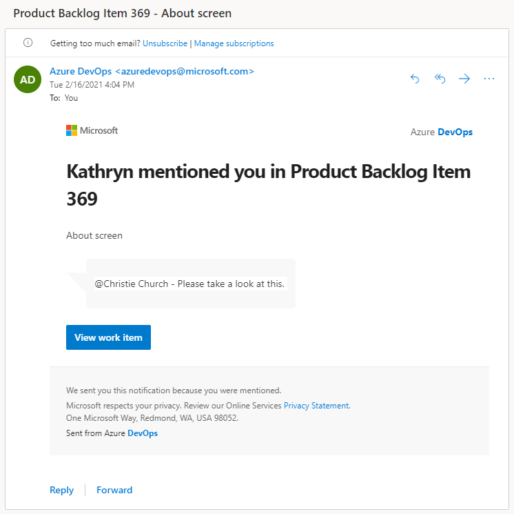

 
# Use @mentions in work items and pull requests

[!INCLUDE [version-lt-eq-azure-devops](../../includes/version-lt-eq-azure-devops.md)]

::: moniker range="azure-devops"

The **@mention** control allows you to quickly add a user or group to a work item or pull request discussion. Using the people picker within the **@mention** control, you can select a project member or group from the search list. The mentioned user or group receives an email notification about your comment.

For organizations that manage their users and groups using Microsoft Entra ID, people pickers support searching all users and groups within Microsoft Entra ID. You can search for users and groups beyond those users added to your project. For more information, see [Limit user visibility for projects and more](../../user-guide/manage-organization-collection.md#limit-user-visibility-for-projects-and-more).

> [!NOTE]
> You can post an @mention via API. To get the Azure DevOps User ID, see [Get the Azure DevOps User ID](/rest/api/azure/devops/graph/users/get?&preserve-view=true/view=azure-devops-rest-6.0).
>
> - If your organization is using the existing HTML editor, add the following HTML code:
>   ```html
>   <div><a href="#" data-vss-mention="version:2.0,{user id}">@John Doe</a> Testing mentioning</div>
>   ```
> - If your organization is using the new Markdown editor for comments, use the following code:
>   ```markdown
>   @<UserID>
>   ```

::: moniker-end

::: moniker range="< azure-devops"

The **@mention** control allows you to quickly add a user to a work item or pull request discussion. Using the people picker within the **@mention** control, you can select a project member from the search list. The mentioned user receives an email notification about your comment.

For organizations that manage their users using Active Directory, people pickers support searching all users within the Active Directory, not just those users added to your project. 

::: moniker-end

Use the **@mention** control to start or continue a discussion in the following areas:

::: moniker range=">= azure-devops-2020"

- Work item discussions or any rich-text fields
- Pull request discussions
- Commit comments
- Changeset or shelveset comments

::: moniker-end

::: moniker range=" < azure-devops-2020"

- Work item discussions
- Pull request discussions
- Commit comments
- Changeset or shelveset comments

::: moniker-end

<a id="mention-person-id">  </a>

::: moniker range=" < azure-devops"

[!INCLUDE [note-smtp-server](includes/note-smtp-server.md)]

::: moniker-end

## Prerequisites

[!INCLUDE [prerequisites-project-member-only](../../boards/includes/prerequisites-project-member-only.md)]

## Identity search selection

1. Enter **@** in a code comment in a pull request to trigger the **@mention** people picker.
2. View the list of users you recently mentioned.
3. Search the directory by selecting a name from the list or entering the name of the user you're looking for.

::: moniker range="azure-devops"

> [!WARNING]
> If you have permission to invite users to the organization, regardless of whether the **Restrict invitations** policy is disabled, you can **@mention** a user who isn't part of your organization. This action invites that user to your organization. For more information, see [Restrict new user invitations from project and team administrators](../../organizations/security/restrict-invitations.md).

To filter the list, enter the user name or alias until you find a match.

> [!div class="mx-imgBorder"]
> 

Names of mentioned users appear in blue text. Choose the **@mention link name** to open the user's contact information, providing more context for why they were added to the conversation.

::: moniker-end

::: moniker range=">= azure-devops-2020"

You can also use group mentions. Enter the name of a team or a security group, choose :::image type="icon" source="../../media/icons/search-icon.png" border="false"::: **Search**, and then select from the options listed.

::: moniker-end

> [!div class="mx-imgBorder"]
> 

> [!NOTE]
> Don't copy and paste **@mention** users from a previous comment. Although the formatting may look identical to a properly entered mention, it doesn't register as a true mention and doesn't send an email notification.

Upon completion of your selection and text entry, your **@mention** user receives an email alerting them about the mention.

> [!div class="mx-imgBorder"]
> 

Use the **@mention** control in pull request discussions, commit comments, changeset comments, and shelveset comments.

> [!TIP]
> Since there's no direct `@CreatedBy` macro, you can use the `@Me` macro in combination with the "Created By" field to filter work items created by you. For example, to tag the creator of items with blank descriptions, you can run a query to identify such items and then manually tag the creators in the comments section of each work item, asking them to update the description.

::: moniker range="azure-devops"

## Limited identities in search selection  

People pickers generally search and select any user or group added to an organization's Microsoft Entra ID.

For organizations using Microsoft Entra ID to manage users and groups, people pickers support searching all users and groups within the directory. To limit the search and selection to only those users and groups added to a specific project, enable the **Limit user visibility and collaboration to specific projects** preview feature for your organization.

When the **Limit user visibility and collaboration to specific projects** preview feature is enabled for an organization, the list of identities you can select from a people picker is limited in the following ways:

- Users added to the **Project-Scoped Users** group can only select from an identity list that contains users and groups explicitly added to the project they're connected to.
- If all project members are added to the **Project-Scoped Users** group, people pickers are limited to only those users and groups added to the project. All project members can only select identities that match users and groups explicitly added to the project they're connected to.

[!INCLUDE [project-scoped-users-warning](../../includes/project-scoped-users-warning.md)]

::: moniker-end

## Related articles

- [Work item form controls](../../boards/work-items/about-work-items.md#work-item-form-controls)  
- [Pull requests](../../repos/git/pull-requests.md)
