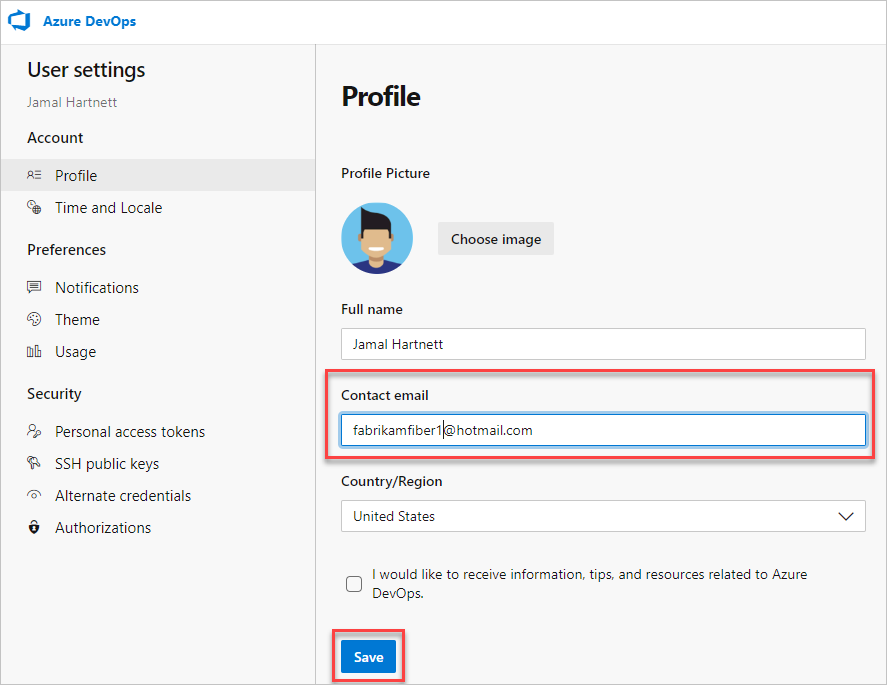
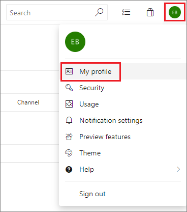
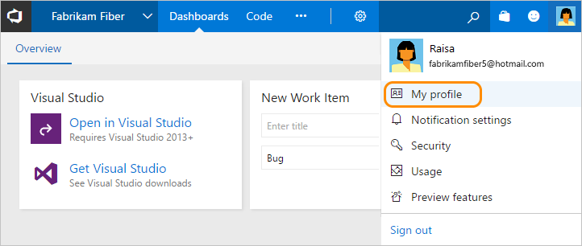

# Change your preferred email address for notifications

[!INCLUDE [version-lt-eq-azure-devops](../../includes/version-lt-eq-azure-devops.md)]

You can change your preferred email address for notifications from your organization preferences profile page. Notifications get sent by default to the preferred email address for your organization profile. This email address is typically the one you used to sign into Azure DevOps.

::: moniker range="azure-devops"

> [!NOTE]
> - Your preferred email address applies across all of your organizations and can't be changed on a per-organization basis.
> - It may take some time for the settings to take effect.
> - To enable the new user interface for the New account manager, see [Manage or enable features](../../project/navigation/preview-features.md).

#### [Preview page](#tab/preview-page) 

1. From your home page, open user settings :::image type="icon" source="../../media/icons/user-settings-gear.png" border="false":::, and then select **Profile**.

   

2. Change your contact information, and then select **Save**.

   

#### [Current page](#tab/current-page) 

1. To change your user preferences, open your profile menu, and then select **User settings**.

   

2. From the **About** page, you can change your profile picture, change your display name, contact information, and country/region. Select **Save**.

   

* * *

::: moniker-end

::: moniker range=">= azure-devops-2019 < azure-devops"

1. To change your preferred email address, open your profile menu and select **My profile**.  

	:::image type="content" source="../settings/media/user-preferences/open-profile-menu-2020.png" alt-text="Select your profile menu, and then My profile":::

2. Update your Preferred email and choose Save changes.  

	:::image type="content" source="../settings/media/user-preferences/user-profile-dialog-general-tab.png" alt-text="User Profile dialog, General tab":::

For other settings, see [Set your preferences](../../organizations/settings/set-your-preferences.md).

::: moniker-end

::: moniker range="tfs-2018"

1. To change your preferred email address, open your organization menu and select **My profile**.

   

2. From your profile and information page, select **Edit profile**.

3. Update the address and select **Save changes**.

For other settings, see [Set your preferences](../../organizations/settings/set-your-preferences.md).

::: moniker-end

## Related articles

- [Set your preferences](../../organizations/settings/set-your-preferences.md)
- [Manage personal notifications](./manage-your-personal-notifications.md)
- [Manage team and organization notifications](manage-team-group-global-organization-notifications.md)
