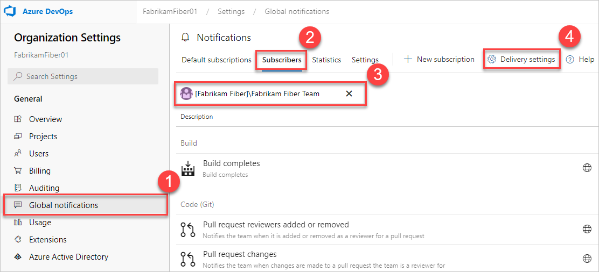
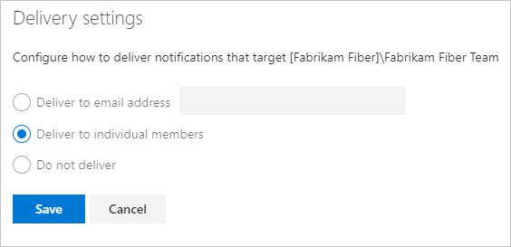
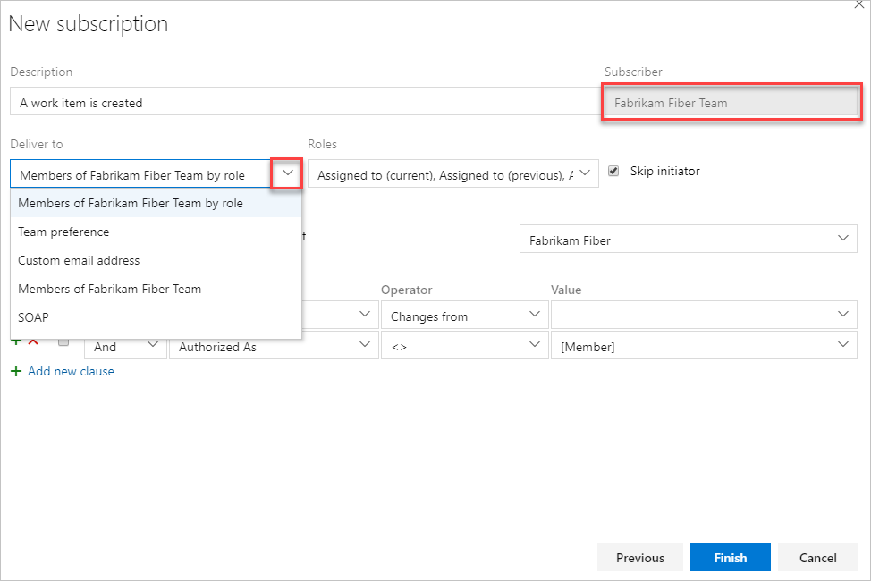
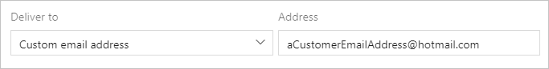

# Determine recipients of notification emails

[!INCLUDE [version-lt-eq-azure-devops](../../includes/version-lt-eq-azure-devops.md)]

Many factors determine the recipients of an email notification when an event matches a subscription. If you're unaware, these factors can result in your inbox receiving too many or too few emails. Learn about how the type of subscription, its delivery settings, delivery preferences, and other factors determine the set of recipients.

[!INCLUDE [note-ui-changes](includes/note-ui-changes.md)]

## Custom personal subscriptions

With custom personal subscription, emails get delivered to the _preferred email address_ of the user who owns the subscription, or to the email address configured on the subscription.

[!INCLUDE [note-smtp-server](includes/note-smtp-server.md)]

### Preferred email address on a personal subscription (default)

> [!div class="mx-imgBorder"]  
>

### Custom email address on a personal subscription

> [!div class="mx-imgBorder"]  
>

## Delivery settings for teams and groups

Delivery settings control the default delivery behavior when the team or group is the recipient of a notification. The subscription's configured with a delivery option that looks at the recipients' delivery settings.

You can manage subscriptions and delivery settings at the team-level or organization-level.

### Organization-level settings

::: moniker range=">= azure-devops-2019"

1. In **Organization settings**, select **Global notifications** > **Subscribers** > your **Team** > **Delivery settings**.

   

::: moniker-end

::: moniker range="tfs-2018"

1. In Organization settings, select your **Team** > **Subscribers** > **Delivery settings**.

   

::: moniker-end

2. Select from the following settings:

* **Deliver to email address:** notifications get delivered to a specific email address.
* **Deliver to individual members:** notifications get delivered to each member of the group or team. This setting is usually the default option. For more information about the default option, see [Team expansion](#team-and-group-expansion-for-email-recipients).
* **Do not deliver:** notifications aren't delivered by default.

    

If you don't explicitly choose delivery settings for a team or group, it gets determined from the [organization-level delivery setting](manage-team-group-global-organization-notifications.md). The default is either _Deliver to individual members_ or _Do not deliver_. 

> [!TIP]
> The delivery settings dialog doesn't indicate whether the current selection was explicitly set or if it was inherited.

## Custom team and group subscription recipients

The recipients for a custom team or group subscription get determined by the subscription. But, with certain delivery options, the team's default delivery setting is used to determine the set of recipients.

::: moniker range=">= azure-devops-2019"

The following delivery options are available for a group or team subscription:

* **Members of team by role:** recipients are members of the team or group that have one of the selected roles (for example, work item assignee)
* **Team preference:** recipients are determined by the delivery setting of the team or group (_Do not deliver_, _preferred email address_, or _members of team_) 
* **Custom email address:** recipient is the specified email address
* **Members of team:** recipients are all members of the team or group, except members who have opted out of the subscription. 
* **SOAP:** similar to API Management, recipients are specified by adding their email addresses (subscribing) to the SOAP service.

> [!NOTE]
> The default delivery setting of each member is honored, including groups that are members of the team or group.

::: moniker-end

::: moniker range="tfs-2018"

You can choose from the following delivery options for a group or team subscription:

|Option  |Recipients  |
|---------|---------|
|**[Member of team by role](#member-of-team-by-role)**   | Members of the team or group who have one of the selected roles, for example, work item assignee.        |
|**[Team preference](#team-preference)**     | Determined by the delivery setting of the team or group (_Do not deliver_, _preferred email address_, or _members of team_).          |
|**[Custom email address](#custom-email-address)**      | Specified email address.        |
|**[Members of team](#members-of-team)**    | Members of the team or group, except members who have opted out of the subscription.     |

> [!NOTE]
> The default delivery setting of each member is honored, including groups that are members of the team or group.

::: moniker-end
### Member of team by role

The email recipient list is determined by members that had a role in the event. For example, the user assigned the work item has the role _Assigned to (new)_ while the identity that was assigned the work item has the role _Assigned to (previous)_. The full list of roles for each event type is shown in the [supported event types](oob-supported-event-types.md).

The option _Skip initiator_, which appears for most event types, controls whether the user or group that started the event should be explicitly excluded from the set of recipients. In general, this option should be "on" since most users don't want to receive a notification about something they did.

### Team preference

The delivery option is taken from the team's delivery setting and can be one of the following options:

* **Deliver to email address:** The email is delivered to the team's preferred email address.
* **Deliver to individual members:** See the following option, [Members of team_](#members-of-team).
* **Do not deliver:** No email is delivered.

The team's delivery setting value is displayed after the _Address_ label and can't be changed.

### Custom email address

The notification gets sent to multiple custom email addresses, which are separated by semicolons.

### Members of team

The team or group membership is expanded to determine the email recipients. In the simple case, a team or group expands to a list of individuals and each is included on the **To:** line of the resulting email. However, the results of this expansion can be complicated and are explained in more detail in the [team and group expansion](#team-and-group-expansion-for-email-recipients) section.

## Default subscription recipients

The delivery option for a default subscription is usually one or more roles. You can't change these values. The roles and the _Skip initiator_ option vary depending on the event type. For more information and a list of roles available for each event type, see [Supported event types](oob-supported-event-types.md).

> [!NOTE]
> The _Skip initiator_ option isn't available for all event types.
## Team and group expansion for email recipients

When a team or group receives a notification, and either the subscription or delivery preference is for all members, the team must be "expanded" to determine the actual set of email recipients. This is a potentially recursive process that starts by looking at the team's direct members.

Only members who have **not** opted out of the subscription get considered for the final recipient list. Any member who's an individual user gets added to the recipient list. 

Only Azure DevOps Services groups remain. For each group, the group's delivery preferences get examined:

* "Do not deliver": no further evaluation is done on this group and the next member group is evaluated
* "Deliver to email address": the email address is added to the final recipient list
* "Deliver to individual members": the group is expanded (like its parent group) and the same rules for evaluating its members are followed

### Scenarios

Let's look at a few scenarios. We use the following symbols to denote the types of members:

* `I`: individual user
* `T`: nested team or group
* `A`: mail-enabled Azure Active Directory (Azure AD) group.

| Scenario | Example |
|--|--|
| A member with _Do not deliver_ preference | The team has members `I1`, `I2`, and `T1`. `T1`'s delivery preference is _Do not deliver_. What happens: only `I1` and `I2` get notified via their preferred email addresses. Members of `T1` aren't notified. |
| A member with _Deliver to individual members_ preference | The team has members `I1`, `I2`, and `T1`. `T1`'s delivery preference is _Deliver to individual members_. `T1` has members `I2` and `I3`. What happens: `T1` is expanded (because of its delivery preference) and so `I1`, `I2`, and `I3` get notified via their preferred email addresses. |
| A nested group | The team has members `I1`, `I2`, and `T1`. `T1` has members `I2`, `I3`, and `T2`. `T1`'s delivery preference is _Do not deliver_. `T2` has members `I4` and `I5`. `T2`'s delivery preference is _Deliver to individual members_. What happens: because `T1` isn't expanded (because its delivery preference is "do not deliver"), only `I1` and `I2` get notified via their preferred email addresses. |
| A member that's an Azure AD group | The team has members `I1`, `I2`, and `A1`. What happens: only `I1` and `I2` get notified via their preferred email addresses. Members of `A1` don't get notified, as Azure DevOps doesn't expand AD groups when delivering notifications. |

## Related articles

- [Manage notifications for a team, group, global organization](manage-team-group-global-organization-notifications.md)
- [Default and supported notifications](oob-built-in-notifications.md)
- [Permissions, security groups, and service accounts reference](../../organizations/security/permissions.md)
