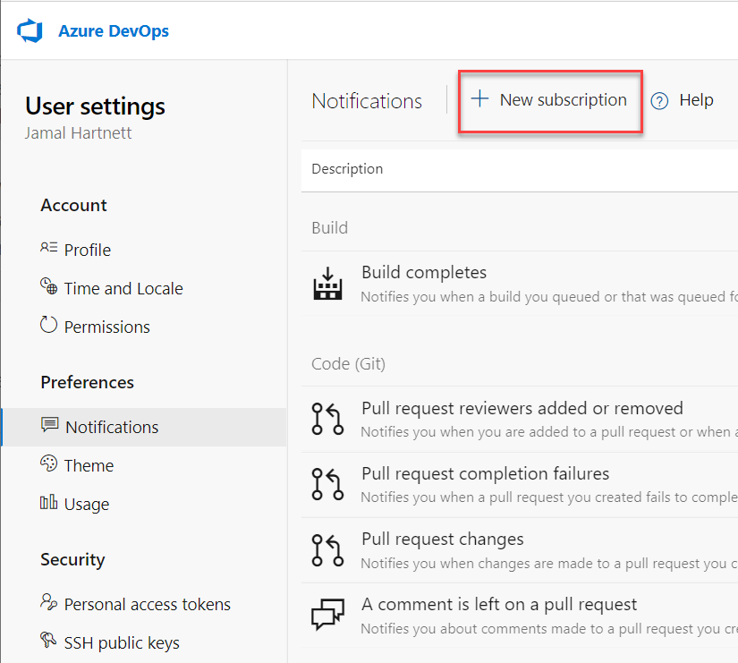

# Manage your personal notifications

[!INCLUDE [version-lt-eq-azure-devops](../../includes/version-lt-eq-azure-devops.md)]

You can manage your personal notifications in the following ways:

- View your notifications
- Set notifications only for yourself
- View and edit all notification subscriptions
- Add a custom notification subscription
- Unsubscribe or opt out of a team or project notification subscription

Personal notifications get sent to you in the form of an email as changes occur to builds, code, pipelines, work, artifacts, extensions, releases, and more.

For information about team and project-level notifications, see [Team and project-level notifications](about-notifications.md#team-and-project-level-notifications) and [Manage team or group notifications](manage-team-group-global-organization-notifications.md).

[!INCLUDE [note-smtp-server](includes/note-smtp-server.md)]

## Prerequisites

- Every user can manage their personal notifications
- See [about notifications](about-notifications.md)

## View your personal notifications

The following table shows notification event examples. For more information, see a full representation in [About notifications](about-notifications.md#team-and-project-level-notifications).

| Item                | Notification event examples |
|---------------------|---------------------------------------------------------|
| Work item           | assigned, unassigned, comments                          |
| Code reviews        | updated, completed                                      |
| Pull request        | added or removed reviewer, completion failure, comments |
| Source control file | created, updated                                        |
| Build               | completion success, completion failure                  |


::: moniker range="azure-devops"

To access the Preview features options, open your profile menu. The profile menu appears, as shown, based on whether the **New account manager** feature is enabled.

#### [New Account Manager enabled](#tab/new-account-enabled)

1. Sign in to your organization (```https://dev.azure.com/{yourorganization}```).

1. Select :::image type="icon" source="../../media/icons/user-settings-gear.png" border="false":::  **User settings**, and then select **Notifications** from the resulting list.

   :::image type="content" source="media/personal-notifications-preview.png" alt-text="Preview page of personal notifications.":::

#### [New Account Manager not enabled](#tab/new-account-not-enabled)

1. Sign in to your organization (```https://dev.azure.com/{yourorganization}```).

2. Open **User settings**, and then select **Notification settings** from the resulting list.

     

***

::: moniker-end  

::: moniker range=">= azure-devops-2019 < azure-devops"

1. Sign in to your organization (```https://dev.azure.com/{yourorganization}```).

2. Open **User settings**, and then select **Notification settings** from the resulting list.

     

::: moniker-end

::: moniker range=" tfs-2018"

Open **User settings**, and then select **Notification settings** from the resulting list.

  

::: moniker-end

::: moniker range="tfs-2018"

## View and edit all notification subscriptions

This view shows all notification subscriptions that you've created or that were created by an administrator. Notification subscriptions let you control what you get notified about. Subscribed notifications are indicated with the State as **On**.

::: moniker-end  

::: moniker range="azure-devops"

To access the Preview features options, open your profile menu. The profile menu appears, as shown, based on whether the **New account manager** feature is enabled.

#### [New Account Manager enabled](#tab/new-account-enabled) 

> [!div class="mx-imgBorder"]  
> 

#### [New Account Manager not enabled](#tab/new-account-not-enabled)

> [!div class="mx-imgBorder"]  
> 

::: moniker-end  

::: moniker range=" < azure-devops"

:::image type="content" source="media/unsubscribe-personal-notifications.png" alt-text="Screenshot of unsubscribe from notification subscriptions.":::

::: moniker-end
***
::: moniker range=">= tfs-2018"

A notification subscription can be only for you. Or, if you're a team administrator you can ensure that it's shared by everyone on the team.

::: moniker-end
## Add a custom notification subscription

With custom personal notification subscriptions, you can define precise criteria for the events that you want to receive notifications. A custom notification subscription can notify you about any event. Default notification subscriptions differ, as they only notify users or groups directly associated with an event.


::: moniker range="azure-devops"

#### [New Account Manager enabled](#tab/new-account-enabled)


1. From your **Notifications** page, select **New subscription**.

   

1. Choose the category and template that you want to use, and then select **Next**. For a list of supported templates, see [Default and supported notifications](oob-built-in-notifications.md).

   Here we choose to get notified when a pull request is created within a specific project, Fabrikam Fiber.

   :::image type="content" source="media/manage-personal-notifications-new-subscription-dialog-preview.png" alt-text="Screenshot of new notification subscription-selected category and template.":::

1. Modify the description to help you identify the notification subscription later. Also, choose an email address for the notifications to be delivered to. By default, your preferred email address is used. Optionally, include one or more fields to further specify the event criteria. Select **Finish** when you're done.

   :::image type="content" source="media/manage-personal-notifications-complete-pull-request-subscription-preview.png" alt-text="Screenshot of updated notification subscription dialog with field criteria.":::

   > [!NOTE]
   > The fields available for filtering event criteria differ depending on the category and template that you select. For more information about event types, see [Supported event types](oob-supported-event-types.md).

   The new notification subscription appears in the list under the category that you selected.

   :::image type="content" source="media/manage-personal-notifications-subscription-added-preview.png" alt-text="Screenshot of confirmation of new subscription added.":::

#### [New Account Manager not enabled](#tab/new-account-not-enabled)

1. From your **Notifications** page, select **New subscription**.

   :::image type="content" source="media/manage-personal-notifications-new-subscription-newnav.png" alt-text="Screenshot of the personal new notification subscription dialog, current page.":::

1. Choose the category and template you want to use. For a list of supported templates, see [Default and supported notifications](oob-built-in-notifications.md).

   Here we choose to get notified when a pull request is created within a specific project, Fabrikam Fiber.

    :::image type="content" source="media/manage-personal-notifications-new-subscription-dialog.png" alt-text="Screenshot of personal notifications new notification subscription dialog.":::

1. Modify the description to help you identify the notification subscription later. Also, choose an email address for the notifications to be delivered to. By default, your preferred email address is used. Optionally, include one or more fields to further specify the event criteria.

   :::image type="content" source="media/manage-personal-notifications-complete-pull-request-subscription.png" alt-text="Screenshot of new notification subscription event criteria.":::

   > [!NOTE]
   > The fields available for filtering event criteria differ depending on the category and template that you select. For more information about event types, see [Supported event types](oob-supported-event-types.md).  

1. Select **Finish** when you're done. The notification subscription appears on the list under the category that you selected.

   :::image type="content" source="media/manage-personal-notifications-subscription-added.png" alt-text="Screenshot showing the notification subscription on the list under its category.":::

::: moniker-end  

::: moniker range="> tfs-2018 < azure-devops"

1. From your **Notifications** page, select **New subscription**.

   :::image type="content" source="media/manage-personal-notifications-new-subscription-newnav.png" alt-text="Screenshot of the personal new notification subscription dialog, current page.":::

1. Choose the category and template you want to use. For a list of supported templates, see [Default and supported notifications](oob-built-in-notifications.md).

   Here we choose to get notified when a pull request is created within a specific project, Fabrikam Fiber.

    :::image type="content" source="media/manage-personal-notifications-new-subscription-dialog.png" alt-text="Screenshot of personal notifications new notification subscription dialog.":::

1. Modify the description to help you identify the notification subscription later. Also, choose an email address for the notifications to be delivered to. By default, your preferred email address is used. Optionally, include one or more fields to further specify the event criteria.

   :::image type="content" source="media/manage-personal-notifications-complete-pull-request-subscription.png" alt-text="Screenshot of new notification subscription event criteria.":::

   > [!NOTE]
   > The fields available for filtering event criteria differ depending on the category and template that you select. For more information about event types, see [Supported event types](oob-supported-event-types.md).  

1. Select **Finish** when you're done. The notification subscription appears on the list under the category that you selected.

   :::image type="content" source="media/manage-personal-notifications-subscription-added.png" alt-text="Screenshot showing the notification subscription on the list under its category.":::

::: moniker-end  

::: moniker range="tfs-2018"

   :::image type="content" source="media/manage-personal-notifications-new-subscription.png" alt-text="Screenshot of the new notification subscription.":::

1. Choose the category and template that you want to use. For a list of supported templates, see [Default and supported notifications](oob-built-in-notifications.md).

   Here we choose to get notified when a pull request is created within a specific project, Fabrikam Fiber.

   :::image type="content" source="media/manage-personal-notifications-new-subscription-dialog.png" alt-text="New notification subscription dialog.":::

2. Modify the description to help you identify the notification subscription later. Also, choose an email address for notifications to be delivered to. By default, your preferred email address is used. Optionally, include one or more fields to further specify the event criteria.

   :::image type="content" source="media/manage-personal-notifications-complete-pull-request-subscription.png" alt-text="Updated notification subscription dialog with field criteria.":::

   > [!NOTE]
   > The fields available for filtering event criteria differ depending on the category and template that you select.

3. Select **Finish** when you're done. The notification subscription appears in the list under the category that you selected.

   :::image type="content" source="media/manage-personal-notifications-subscription-added.png" alt-text="New subscription added.":::

::: moniker-end

***

[!INCLUDE [opt-out-notification](includes/opt-out-notification.md)]

## Next steps

> [!div class="nextstepaction"]
> [Use @ mentions in work items and pull requests](at-mentions.md)

## Related articles

- [Manage your personal notifications](manage-your-personal-notifications.md)
- [Set your preferences](../../organizations/settings/set-your-preferences.md)
- [Default and supported notifications](oob-built-in-notifications.md)
- [Follow a specific work item](../../boards/work-items/follow-work-items.md)  
- [Change your preferred email address](change-email-address.md)

### Limitations

The user interface no longer supports creating plain text email notification subscriptions.
