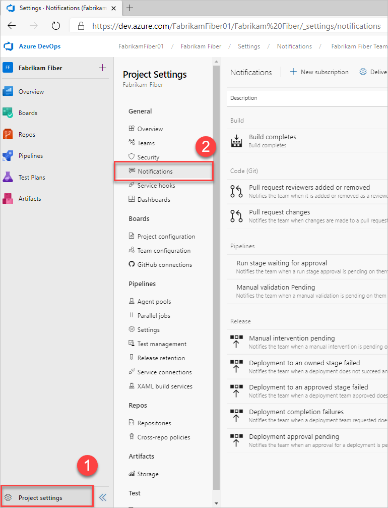

# Access notification settings

[!INCLUDE [version-lt-eq-azure-devops](../../includes/version-lt-eq-azure-devops.md)]

Learn about navigating the notifications user interface.

> [!NOTE]  
> This article applies to Azure DevOps, TFS 2017 Update 1 and later versions. For information on TFS 2017 and earlier versions, see [Manage personal notifications](manage-your-personal-notifications.md) and select the TFS 2015 content version. 

## Notifications settings

You can set notifications at the following levels:

* Personal
* Team
* Project
* Organization or collection (organization for the cloud and project collection for on-premises)

[!INCLUDE [note-smtp-server](includes/note-smtp-server.md)]

## Prerequisites

* Each user can manage their personal notifications
* To manage team notifications, you must be added as a [team administrator](../../organizations/settings/add-team-administrator.md) or be a member of [**Project Administrators** group](../../organizations/security/change-project-level-permissions.md)
* To manage project-level notifications, you must be a member of the [**Project Administrators** group](../../organizations/security/change-project-level-permissions.md)
* To manage organization or collection-level notifications, you must be a member of the [**Project Collection Administrators** group](../../organizations/security/change-organization-collection-level-permissions.md). 

For more permission settings regarding notifications, see [Permissions and groups, Notifications or alerts](../../organizations/security/permissions.md#notifications-or-alerts).

<a id="open-person-level" />

## Open your personal notifications 

::: moniker range="azure-devops"

Open your :::image type="icon" source="../../media/icons/user-settings-gear.png" border="false"::: profile menu, and then choose **Notifications** or **Notification settings**.

:::image type="content" source="media/personal/user-notifications.png" alt-text="View your personal notifications page":::

::: moniker-end

::: moniker range="< azure-devops"
Open your profile menu and choose **Notification settings**. 
::: moniker-end
::: moniker range=">= azure-devops-2019 < azure-devops"
:::image type="content" source="media/personal/open-profile-menu-notifications-2020.png" alt-text="Select your profile menu, and Notification settings":::
::: moniker-end
::: moniker range="tfs-2018"
> [!div class="mx-imgBorder"] 
> 
::: moniker-end
::: moniker range=">= azure-devops-2019 < azure-devops"
:::image type="content" source="media/personal/user-notifications.png" alt-text="View personal notifications page":::
::: moniker-end

For more information, see [Manage your notifications](manage-your-personal-notifications.md)

<a id="project" />

## Open team or project level notifications

Enter the following URL to reach a team or project-level notifications page, replacing {organization} and {project} with your organization's and project's name. 

```URL
https://dev.azure.com/{organization}/{project}/_settings/notifications
```

> [!div class="mx-imgBorder"]  
>   

For more information, see [Manage notifications for a team or group](manage-team-group-global-organization-notifications.md)

<a id="open-org-level" />

## Open Global notifications

::: moniker range="azure-devops" 

1. Enter the following URL to reach the organization-level notifications page, replacing *OrganizationName* with your organization's name. 

	```URL
	https://dev.azure.com/OrganizationName/_settings/notifications
	```

	Or, choose :::image type="icon" source="../../media/icons/project-icon.png" border="false"::: **Azure DevOps**,  and then choose **Organization settings**. 

	:::image type="content" source="../../media/settings/open-org-settings-s172.png" alt-text="Open Organization settings":::

2. Choose **Global notifications**.  

	:::image type="content" source="media/nav-ui/organization-notifications-s172.png" alt-text="Open Global Notifications":::

::: moniker-end

::: moniker range=">= azure-devops-2019 < azure-devops" 

Enter the following URL to reach the organization-level notifications page, replacing *ServerName* and *CollectionName* with your instance name. 

1. Enter the following URL to reach the organization-level notifications page, replacing *OrganizationName* with your organization's name. 

	```URL
	http://ServerName/CollectionName/_settings/notifications?view=defaultSubscriptions
	```

	Or, choose :::image type="icon" source="../../media/icons/project-icon.png" border="false"::: **Azure DevOps**, and then choose **Collection settings**. 

	:::image type="content" source="../../media/settings/open-collection-settings-2020.png" alt-text="Open Collection settings":::

2. Choose **Global Notifications**.  

	:::image type="content" source="media/nav-ui/collection-notifications-2020.png" alt-text="Select to open Global Notifications":::

::: moniker-end

::: moniker range="tfs-2018" 

```URL
https://dev.azure.com/{organization}/_admin/_notifications
```

:::image type="content" source="media/nav-organization-notifications-hub.png" alt-text="Screenshot showing notifications selection.":::
 
:::image type="content" source="media/view-organization-notification-hub.png" alt-text="Screenshot showing notifications hub.":::

::: moniker-end

For more information, see [Manage team and Global notifications](manage-team-group-global-organization-notifications.md)

## Related articles

- [Manage personal notification settings](manage-your-personal-notifications.md)
- [Follow a specific work item](../../boards/work-items/follow-work-items.md)  
- [Manage notifications for a team](./manage-team-group-global-organization-notifications.md)  
- [Change your preferred email address](change-email-address.md)