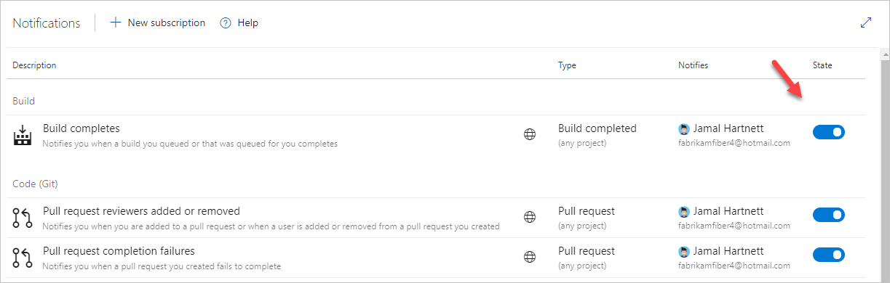
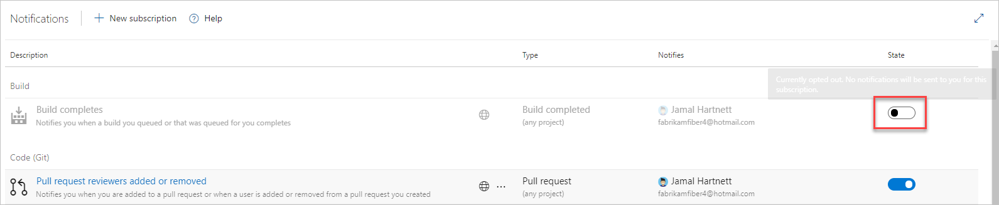

# View your subscriptions, opt out as needed

[!INCLUDE [version-lt-eq-azure-devops](../../includes/version-lt-eq-azure-devops.md)]

If you want to stop receiving select email notifications, you can do so by unsubscribing from them. For a description of each default subscription, see [Default notifications](oob-built-in-notifications.md).  

## View subscriptions

1. From your home page, select :::image type="icon" source="../../media/icons/user-settings-gear.png" border="false"::: **Settings**, and then select **Profile**.

   

2. Select **Notifications**.

   Your subscribed notifications show the State as **On**.

   

   The following image indicates a subscription is a default or out-of-the-box (OOB) subscription:

   

   You can't modify an OOB subscription, but you can view its definition from its context menu.

3. To unsubscribe, slide the toggle to the *Off* position.

   In the following image, the "Build completes" subscription is turned off.

   

## Related articles

- [Manage personal notifications](manage-your-personal-notifications.md)
- [Manage notifications for a team, project, or organization](manage-team-group-global-organization-notifications.md)
- [Use @mentions in work items and pull requests](at-mentions.md)
- [Learn about notifications](about-notifications.md)
