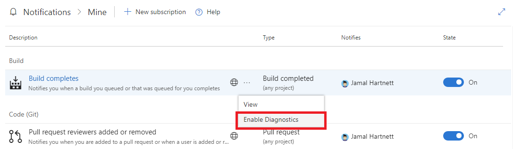

# Use subscription logging to troubleshoot notifications

[!INCLUDE [version-lt-eq-azure-devops](../../includes/version-lt-eq-azure-devops.md)] 

[!INCLUDE [note-smtp-server](includes/note-smtp-server.md)]

Subscription logging helps you troubleshoot notification issues by providing diagnostic information from the notifications pipeline. This feature is disabled by default. When enabled, Azure DevOps collects up to 25 logs or one hour's worth of diagnostic data for the subscription, whichever limit is reached first.

## Prerequisites

[!INCLUDE [prerequisites-project-member-only](../../includes/prerequisites-project-member-only.md)]

## Enable subscription logging

1. Go to the notifications page with diagnostics enabled by entering this URL in your browser:

    `https://dev.azure.com/{Your_Organization}/_notifications?diagnostics=true`

    Replace `{Your_Organization}` with your organization name (for example, `https://dev.azure.com/contoso/_notifications?diagnostics=true`).

2. On the notifications page, locate the subscription you want to debug and select its context menu (three dots).

3. Select **Enable Diagnostics** from the menu to start collecting logs for that subscription.

> [!div class="mx-imgBorder"] 
>

## View subscription diagnostic logs

Access subscription diagnostic logs directly using API calls. Enter the following URL in your browser:

`https://dev.azure.com/{Your_Organization}/_apis/notification/DiagnosticLogs/{eventID}/entries?startTime={date}&endTime={date}`

**Parameters:**
* `{Your_Organization}` - Your organization name (for example, `contoso`)
* `{date}` - Date and time in format `YYYY-MM-DD` or `YYYY-MM-DD HH:MM` (for example, `2025-07-02` or `2025-07-02 14:30`)
* `{eventID}` - Use the appropriate event ID based on the type of logs you need:

**Event matching logs:**
* `915f48f2-1b64-40d9-a43f-fe2528b4f296` for work item events
* `9a688110-9e33-4cdc-affd-75d16303e7f1` for Git events  
* `a4804dcf-4bb6-4109-b61c-e59c2e8a9ff7` for other event types

**Notification delivery logs:**
* `631f49b3-46e1-42ec-8fff-081bd176c18a` for work item events
* `8833fc71-42ca-441b-ab12-25314877772d` for Git events
* `a96d6177-beef-477a-a2ee-2c31433214d0` for other event types

Returns JSON-formatted diagnostic information.

## Related articles

- [Manage personal notifications](manage-your-personal-notifications.md)
- [Manage notifications for a team, project, or organization](manage-team-group-global-organization-notifications.md)
- [Use @mentions in work items and pull requests](at-mentions.md)
- [Learn about notifications](about-notifications.md)
