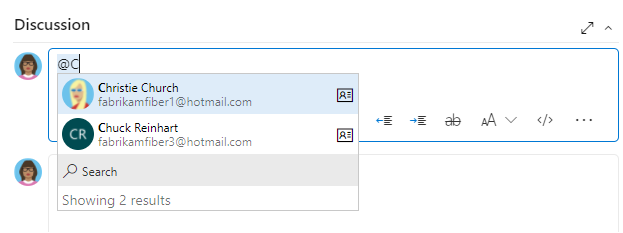

:::row:::
   :::column span="2":::
      **One project + team**
   :::column-end:::
   :::column span="2":::
      **Multiple projects + teams**
   :::column-end:::
:::row-end:::
---
:::row:::
   :::column span="2":::
      :::image type="content" source="media/about-projects/project-concept.png" alt-text="Conceptual image, Single collection-project-team.":::
   :::column-end:::
   :::column span="2":::
      :::image type="content" source="media/about-projects/multiple-projects-concept.png" alt-text="Conceptual image, Scaled collection-project-team.":::
   :::column-end:::
:::row-end:::
---

For more information, see [Work tracking, process, and project limits](../settings/work/object-limits.md) and [Plan your organizational structure](../../user-guide/plan-your-azure-devops-org-structure.md).

## Manage work across your organization

When you connect to Azure DevOps, you connect to an organization or project collection. Within that container, one or more projects may be defined. At least one project must be created to use the system.

::: moniker range="azure-devops"
You can scale your organization in the following ways:

- To support different business units, you can add projects
- Within a project, you can add teams
- Add repositories and branches
- To support continuous integration and deployment, you can add agents, agent pools, and deployment pools
- To manage a large number of users, you can manage access through Azure Active Directory
::: moniker-end

::: moniker range="< azure-devops"
You can scale your on-premises Azure DevOps deployment in the following ways:

- To increase performance, you can add server instances
- To support different business units, you can add project collections and projects
- Within a project, you can add teams
- Add repositories and branches
- To support continuous integration and deployment, you can add agents, agent pools, and deployment pools
- To manage a large number of users, you can manage access through Active Directory
::: moniker-end

## View projects in your organization 

View the projects defined for your organization by opening the **Projects** page.

::: moniker range=">= azure-devops-2019"
1. Select :::image type="icon" source="../../media/icons/project-icon.png" border="false"::: **Azure DevOps** to open **Projects**.

    > [!div class="mx-imgBorder"]  
    >   

2. Choose a project from the list of projects. 

For more information, see [Create a project](create-project.md).  
::: moniker-end

::: moniker range="tfs-2018"
1. Select :::image type="icon" source="../../media/icons/project-icon.png" border="false"::: **Azure DevOps** to open **Projects**.

    > [!div class="mx-imgBorder"]  
    > 

2. Choose a project from the projects list.

    > [!div class="mx-imgBorder"]  
    > 

::: moniker-end

<a id="project-scoped-user-group" /> 

::: moniker range="azure-devops"

## Limit user visibility of projects

By default, users added to an organization can view all organization and project information and settings.  

[!INCLUDE [project-scoped-users-important-note](../../includes/project-scoped-users-important-note.md)]

The **Limit user visibility and collaboration to specific projects** preview feature for the organization limits user access in the following ways.
- Restricts views that display a list of users, list of projects, billing details, usage data, and more information accessed through **Organization settings**.
- Limits the set of users or groups that appear through people-picker search selections and the ability to @mention users. 

[!INCLUDE [project-scoped-users-warning](../../includes/project-scoped-users-warning.md)]

### Limit access to organization settings 

To limit access to organization settings, [enable the **Limit user visibility and collaboration to specific projects** preview feature](../../project/navigation/preview-features.md#account-level). Users and groups in the "Project-scoped users group" can't access organization settings. They can only see the **Overview** and **Projects** pages and those projects to which they've been added. 

[!INCLUDE [version-all](../security/includes/hidden-security-groups.md)]

### Limit user visibility within people pickers

Organizations that are connected to Azure Active Directory (Azure AD) can use people pickers. People pickers support searching all users and groups added to Azure AD, not just those users and groups added to your project. People pickers support the following Azure DevOps functions: 
- Select a user identity from a work tracking field, such as "Assigned to" 
- Select a user or group with *@mention* in a work item discussion or field, pull request discussion, commit comments, or changeset or shelveset comments
- Select a user or group using *@mention* from a wiki page 

As shown in the following image, start to enter a user in the people picker box until you find a match to the user name or security group.
 
> [!div class="mx-imgBorder"]  
> 

Users and groups within the **Project-scoped users** group can only see and select users and groups in the project they're connected to from a people picker. To scope people pickers for all project members, see [Limit identity search and selection](../../user-guide/manage-organization-collection.md#limit-identity-selection). 

### View historical data

All project members can view identities that were added to a comment, discussion, or assignment. For example, everyone in the project (even users with the new restriction) can still see a user's name assigned to a work item when the user's no longer part of the project. The same is true for @mentions in PRs, comments, discussions, and more.  

::: moniker-end

## Use a single project

We recommend that you use a single project to support your organization or enterprise. A single project minimizes the maintenance of administrative tasks and supports the most optimized and full-flexibility [cross-link object](../../boards/queries/link-work-items-support-traceability.md) experience.  

Even if you have many teams working on hundreds of different applications and software projects, you can easily manage them within a single project. A project serves to isolate data stored within it and you can't easily move data from one project to another. When you move data from one project to another, you typically lose the history associated with that data.

For more information, see [How many projects do you need?](../../user-guide/plan-your-azure-devops-org-structure.md#how-many-projects-do-you-need).

### Add another project

::: moniker range="azure-devops"
You may want to add another project in the following instances:

- To prohibit or manage access to the information contained within a project to select groups
- To support custom work tracking processes for specific business units within your organization  
- To support entirely separate business units that have their own administrative policies and administrators  
- To support testing customization activities or adding extensions before rolling out changes to the working project
- To support an open-source software (OSS) project
::: moniker-end

::: moniker range="< azure-devops"
You may want to add another project in following instances:
- To prohibit or manage access to the information contained within a project
- To support custom work tracking processes for specific business units within your organization  
- To support entirely separate business units that have their own administrative policies and administrators
- To support testing customization activities or adding extensions before rolling out changes to the working project
::: moniker-end

::: moniker range="azure-devops"

## Use private and public projects

You can have both private and public projects. You can also [change the visibility of a project from private to public](make-project-public.md).

**Private projects** require that you add and manage user access. Users must sign in to gain access to a project, even if it's read-only access. All project members have access to the project and organization information. For more information, see [Resources granted to project members](resources-granted-to-project-members.md).

**Public projects** don't require users to sign in to gain read-only access to many of the following services. Public projects provide support to share code with others and to support continuous integration/continuous deployment (CI/CD) of open-source software.

For more information about features and access levels for public projects, see [Make a private project public.](make-project-public.md)

## Version control support

Git repositories can be browsed and cloned, but only via HTTPS.
SSH and GVFS endpoints are unavailable.
Clients like Visual Studio and IntelliJ work with the HTTPS clone URL but don't offer the connected experience linking to work items and other collateral.

<a id="dashboard-widget-support" />

## Dashboard widget support

The following dashboard widgets don't display any useful information for nonmembers.

[!INCLUDE [temp](includes/unavailable-widgets.md)]

::: moniker-end

## Structure your project

Use the following elements to structure your project to support your business needs.

- [Create a Git repository](../../repos/git/creatingrepo.md) for each subproject or application, or [create root folders within a TFVC repository](../../repos/tfvc/branch-folders-files.md) for each subproject. If you're using TFVC and heading toward a combined project model, create root folders for different teams and projects, just as you would create separate repos in Git. Secure folders as needed and control which segments of the repo you're actively using with workplace mappings. 
- [Define area paths](../settings/set-area-paths.md) to support different subprojects, products, features, or teams.
- [Define iteration paths (also known as sprints)](../settings/set-iteration-paths-sprints.md) that can be shared across teams.
- [Add a team](../../organizations/settings/add-teams.md) for each product team that develops a set of features for a product. Each team you create automatically creates a security group for that team, which you can use to manage permissions for a team. For more information, see [Portfolio management](../../boards/plans/portfolio-management.md).
- [Grant or restrict access to select features and functions](../security/restrict-access.md) using custom security groups.
- [Create query folders](../../boards/queries/organize-queries.md) to organize queries for teams or product areas into folders.
- [Define or modify notifications](../../organizations/notifications/about-notifications.md) set at the project level.

## Customize and configure your project

You can configure and customize most services and applications to support your business needs or the way your teams work. Within each project, you can do the following tasks. For a comprehensive view of which resources can be configured, see [About team, project, and organizational-level settings](../settings/about-settings.md).

::: moniker range=">= azure-devops-2019"
- **Dashboards**: Each team can [configure their set of dashboards](../../report/dashboards/dashboards.md) to share information and monitor progress.
- **Source control**: For each [Git repository](../../repos/git/index.yml), you can apply branch policies and define branch permissions. For TFVC repositories, you can [set check-in policies](../../repos/tfvc/add-check-policies.md).
- **Work tracking**: You can add fields, change the workflow, add custom rules, and add custom pages to the work item form of most work item types. You can also add custom work item types. For more information, see [Customize an inheritance process](../settings/work/inheritance-process-model.md).
- **Azure Pipelines**: You can fully customize your build and release pipelines, and define build steps, release environments, and deployment schedule. For more information, see [Build and release](../../pipelines/index.yml).  
- **Azure Test Plans**: You can define and configure test plans, test suites, test cases, and test environments. You can also add test steps within your build pipelines. For more information, see [Exploratory and manual testing](../../test/index.yml) and [continuous testing for your builds](../../pipelines/ecosystems/dotnet-core.md#run-your-tests).

::: moniker-end

::: moniker range="tfs-2018"
- **Dashboards**: Each team can [configure their set of dashboards](../../report/dashboards/dashboards.md) to share information and monitor progress.
- **Source control**: For each [Git repository](../../repos/git/index.yml), you can apply branch policies and define branch permissions. For TFVC repositories, you can [set check-in policies](../../repos/tfvc/add-check-policies.md).
- **Work tracking**: You can add fields, change the workflow, add custom rules, and add custom pages to the work item form of most work item types. You can also add custom work item types. For more information, see [Customize the on-premises XML process model](../../reference/on-premises-xml-process-model.md).
- **Build and release**: You can fully customize your build and release pipelines, and define build steps, release environments, and deployment schedule. For more information, see [Build and release](../../pipelines/index.yml).  
- **Test**: You can define and configure test plans, test suites, test cases, and test environments. You can also add test steps within your build pipelines. For more information, see [Exploratory and manual testing](../../test/index.yml) and [continuous testing for your builds](../../pipelines/ecosystems/dotnet-core.md#run-your-tests).
::: moniker-end

<a id="add-team" />

## Add a team

As your organization grows, you can add teams equipped with configurable Agile tools to meet each team's workflow. For more information, see the following articles.  

- [Scale Agile to large teams](/devops/plan/scaling-agile)
- [About teams and Agile tools](../settings/about-teams-and-settings.md)
- [Manage a portfolio of backlogs](../../boards/plans/portfolio-management.md) and see progress.  
- [Use delivery plans](../../boards/plans/review-team-plans.md) to scheduled work items by sprint (iteration path) of selected teams against a calendar view.
- [Incrementally adopt practices that scale](../../boards/plans/practices-that-scale.md) to create greater rhythm and flow within your organization, engage customers, improve project visibility, and develop a productive workforce.
- [Structure projects to gain visibility across teams](../../boards/plans/visibility-across-teams.md) or to support [epics, release trains, and multiple backlogs to support the Scaled Agile Framework](../../boards/plans/scaled-agile-framework.md).

## Connect to a project with other clients

Aside from connecting via a web browser, you can connect to a project from the following clients:

- [Visual Studio (Professional, Enterprise, Test Professional)](https://visualstudio.microsoft.com/vs/compare/)
- [Visual Studio Code](https://code.visualstudio.com/Docs)
- [Visual Studio Community](https://www.visualstudio.com/products/visual-studio-community-vs.aspx)
- [Office Excel](../../boards/backlogs/office/bulk-add-modify-work-items-excel.md) 
- [Test & Feedback extension](../../test/request-stakeholder-feedback.md)
- [Microsoft Feedback Client](/previous-versions/azure/devops/project/feedback/give-feedback)

For more information, see [Compatibility with Azure DevOps Server versions](/azure/devops/server/compatibility).

## Frequently asked questions (FAQs)

### Q: Can I move or transfer a project to another organization or collection? 

**A:** Yes, but not without losing data. You can manually copy resources and leave some behind, or use a third-party tool, such as [OpsHub Visual Studio Migration Utility](https://www.opshub.com/products/opshub-visual-studio-migration-utility/), which copies data using the REST APIs. 

### Q: What programmatic tools support projects?

**A.** See [Projects REST API](/rest/api/azure/devops/core/projects). 

::: moniker range="azure-devops"
You can also use the [**az devops project** CLI](/cli/azure/devops/project).  
::: moniker-end

## Related articles

- [Get started as an administrator](../../user-guide/project-admin-tutorial.md)
- [Web portal navigation](../../project/navigation/index.md)
- [What do I get with a project?](../../user-guide/services.md?toc=/azure/devops/organizations/projects/toc.json&bc=/azure/devops/organizations/projects/breadcrumb/toc.json)
- [Understand differences between Azure DevOps](../../user-guide/about-azure-devops-services-tfs.md?toc=/azure/devops/organizations/projects/toc.json&bc=/azure/devops/organizations/projects/breadcrumb/toc.json)
