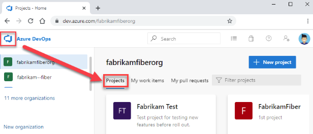
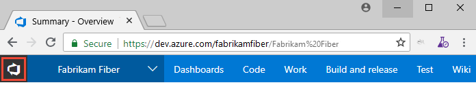
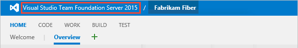

:::row:::
   :::column span="2":::
      **Single project and team defined within an organization or collection**
   :::column-end:::
   :::column span="2":::
      **Multiple projects and teams defined within an organization or collection**
   :::column-end:::
:::row-end:::
---
:::row:::
   :::column span="2":::
      :::image type="content" source="media/about-projects/project-concept.png" alt-text="Conceptual image, Single collection-project-team.":::
   :::column-end:::
   :::column span="2":::
      :::image type="content" source="media/about-projects/multiple-projects-concept.png" alt-text="Conceptual image, Scaled collection-project-team.":::
   :::column-end:::
:::row-end:::
---

The collection-project-team structure provides teams a high level of autonomy to configure their tools in ways that work for them. It also supports administrative tasks to occur at the appropriate level. As your organization grows, your tools can grow to support a [culture of team autonomy and organizational alignment](../../boards/plans/agile-culture.md).

## How do you manage work across the enterprise?

*How do you scale your DevOps and Agile tools to support your growing enterprise?*  

When you connect to Azure DevOps, you connect to an organization or project collection. Within that container, one or more projects may be defined. At least one project must be created to use the system.

::: moniker range="azure-devops"
You can scale your organization in the following ways:

- To support different business units, you can add projects
- Within a project, you can add teams
- Add repositories and branches
- To support continuous integration and deployment, you can add agents, agent pools, and deployment pools
- To manage a large number of users, you can manage access through Azure Active Directory

::: moniker-end

::: moniker range="< azure-devops"
You can scale your on-premises Azure DevOps deployment in the following ways:

- To increase performance, you can add server instances
- To support different business units, you can add project collections and projects
- Within a project, you can add teams
- Add repositories and branches
- To support continuous integration and deployment, you can add agents, agent pools, and deployment pools
- To manage a large number of users, you can manage access through Active Directory

::: moniker-end

Azure DevOps Services and Azure DevOps Server are enterprise-ready platforms. These platforms support teams of any size, from tens to thousands. Azure DevOps Services, our cloud service, provides a scalable, reliable, and globally available hosted service. It's backed by a 99.9% SLA, monitored by our 24x7 operations team, and available in local data centers around the world.

## How to view projects 

You can view the projects defined for your organization by opening the **Projects** page.

::: moniker range=">= azure-devops-2019"

1. Select :::image type="icon" source="../../media/icons/project-icon.png" border="false"::: **Azure DevOps** to open **Projects**.

    > [!div class="mx-imgBorder"]  
    >   

2. From there, you can choose a project from the set of projects listed. 

To create or list projects, see [Create a project](create-project.md)  

::: moniker-end

::: moniker range=">= tfs-2015 <= tfs-2018"

1. Select :::image type="icon" source="../../media/icons/project-icon.png" border="false"::: **Azure DevOps** to open **Projects**.

    > [!div class="mx-imgBorder"]  
    > 

2. From there, you can choose a project from the set of projects listed.

    > [!div class="mx-imgBorder"]  
    > 

::: moniker-end

::: moniker range=">= tfs-2013 <= tfs-2015"

1. Choose the name of the server.

    > [!div class="mx-imgBorder"]  
    > 

2. From there, you can choose a project from the set of projects listed.

::: moniker-end

::: moniker range="azure-devops"

<a id="project-scoped-user-group" /> 

## Limit user visibility for projects using the Project-Scoped Users group 

By default, users added to an organization can view all organization and project information and settings.  

The **Limit user visibility for projects** preview feature for the organization limits user access in two ways:
- Restricting views that display list of users, list of projects, billing details, usage data, and more that is accessed through **Organization Settings**.
- Limiting the set of people or groups that appear through people-picker search selections and the ability to @mention people. 

> [!IMPORTANT]
> The limited visibility features described in this section apply only to interactions through the web portal. With the REST APIs or **azure devops** CLI commands, project members can access the restricted data. 

### Limit access to Organization settings 

To restrict select users, such as Stakeholders, Azure Active Directory guest users, or members of a particular security group, you can enable the **Limit user visibility for projects** preview feature for the organization. Once that is enabled, any user or group added to the **Project-Scoped Users** group, are restricted from accessing the **Organization Settings** pages, except for **Overview** and **Projects**; and are restricted to accessing only those projects to which they've been added to. 

To enable this feature, see [Manage or enable features](../../project/navigation/preview-features.md#account-level). 

[!INCLUDE [version-all](../security/includes/hidden-security-groups.md)]

 
### Limit visibility within people pickers

For organizations that manage users and groups using Azure Active Directory (Azure AD), people pickers provide support for searching all users and groups added to Azure AD, not just those users and groups added to your project. people pickers support the following Azure DevOps functions: 
- Selection of a user identity from a work tracking identity field such as **Assigned To**  
- Selection of a user or group using **@mention** in a work item discussion or rich-text field, a pull request discussion, commit comments, or changeset or shelveset comments
- Selection of a user or group using **@mention** from a wiki page 

As shown in the following image, you simply start typing into a people picker box until you find a match to a user name or security group.
 
> [!div class="mx-imgBorder"]  
>   

> [!WARNING]   
> When the **Limit user visibility for projects** preview feature is enabled for the organization, project-scoped users are unable to search for users who were added to the organization through Azure Active Directory group membership, rather than through an explicit user invitation. This is an unexpected behavior and a resolution is being worked on. To self-resolve this issue, disable the **Limit user visibility for projects** preview feature for the organization.  

Users and groups who are added to the **Project-Scoped Users** group can only see and select users and groups in the project they are connected to from a people picker. To scope people pickers for all project members, see [Manage your project, Limit identity search and selection](../../user-guide/project-admin-tutorial.md#limit-identity-selection). 

### Historical data remains visible 

Identities that have been added to a comment, discussion, or assignment continue to be visible to all project members. For example, work items that were assigned to a user who has since left a project, the user’s name on that work item remains visible to everyone in the project, even to users with the new restriction. The same is true for @mentions in PRs, comments, discussions, and more.  

::: moniker-end

## When to add another project

In general, we recommend that you use a single project to support your organization or enterprise. A single project minimizes the maintenance of administrative tasks and supports the most optimized / full-flexibility [cross-link object](../../boards/queries/link-work-items-support-traceability.md) experience.  

Even if you have many teams working on hundreds of different applications and software projects, you can most easily manage them within a single project. A project serves to isolate data stored within it. You can't easily move data from one project to another. When you move data from one project to another, you typically lose the history associated with that data.

For more information about when to add another project, see [How many projects do you need?](../../user-guide/plan-your-azure-devops-org-structure.md#how-many-projects-do-you-need).

### Reasons to add another project

::: moniker range="azure-devops"
You may want to add another project in following instances:

- To prohibit or manage access to the information contained within a project to select groups
- To support custom work tracking processes for specific business units within your organization  
- To support entirely separate business units that have their own administrative policies and administrators  
- To support testing customization activities or adding extensions before rolling out changes to the working project
- To support an Open Source Software (OSS) project

::: moniker-end

::: moniker range="< azure-devops"
You may want to add another project in following instances:

- To prohibit or manage access to the information contained within a project
- To support custom work tracking processes for specific business units within your organization  
- To support entirely separate business units that have their own administrative policies and administrators
- To support testing customization activities or adding extensions before rolling out changes to the working project

::: moniker-end

::: moniker range="azure-devops"

## Private and public projects

You can add public and private projects to your organization. You can also [change the visibility of a project from private to public](../public/make-project-public.md).

Private projects require that you add and manage user access. Users must sign in to gain access to a project, even if it's read-only access. All users added to a project have access to the project and organization information. For details, see [Resources granted to project members](resources-granted-to-project-members.md).

A public project, doesn't require users  to sign in to gain read-only access to many of the services. Public projects provide support to share code with others and to support continuous integration/continuous deployment (CI/CD) of open-source software. To learn more about public projects, see [What is a public project?](../public/about-public-projects.md).

::: moniker-end

## Structure your project

When you add a project, look at using the following elements to structure it to support your business needs:

- [Create a Git repository](../../repos/git/creatingrepo.md) for each subproject or application, or [create root folders within a TFVC repository](../../repos/tfvc/branch-folders-files.md) for each subproject. If you're using TFVC and heading toward a combined project model, create root folders for different teams and projects, just as you would create separate repos in Git. Folders can be secured as needed and workspace mappings can control what segments of the repo you're actively using. 
- [Define area paths](../settings/set-area-paths.md) to support different subprojects, products, features, or teams.
- [Define iteration paths (also known as sprints)](../settings/set-iteration-paths-sprints.md) that can be shared across teams.
- [Add a team](../../organizations/settings/add-teams.md) for each product team that develops a set of features for a product. Each team you create automatically creates a security group for that team, which you can use to manage permissions for a team. See also, [Portfolio management](../../boards/plans/portfolio-management.md).
- [Grant or restrict access to select features and functions](../security/restrict-access.md) using custom security groups.
- [Create query folders](../../boards/queries/organize-queries.md) to organize queries for teams or product areas into folders.
- [Define or modify notifications](../../notifications/about-notifications.md) set at the project level.

## Customizing and configuring projects

You can configure and customize most services and applications to support your business needs or the way your teams work. Within each project, you can do the following tasks. For a comprehensive view of what resources can be configured, see [About team, project, and organizational-level settings](../settings/about-settings.md).

::: moniker range=">= azure-devops-2019"

- **Dashboards**: Each team can [configure their set of dashboards](../../report/dashboards/dashboards.md) to share information and monitor their progress.
- **Source control**: For each [Git repository](../../repos/git/index.yml), you can apply branch policies and define branch permissions. For TFVC repositories, you can [set check-in policies](../../repos/tfvc/add-check-policies.md).
- **Work tracking**: You can add fields, change the workflow, add custom rules, and add custom pages to the work item form of most work item types. You can also add custom work item types. For details, see [Customize an inheritance process](../settings/work/inheritance-process-model.md).
- **Azure Pipelines**: You can fully customize your build and release pipelines, define build steps, release environments, and deployment schedule. For details, see [Build and Release](../../pipelines/index.yml).  
- **Azure Test Plans**: You can define and configure test plans, test suites, test cases, and test environments. You can also add test steps within your build pipelines. For details, see [Exploratory & Manual Testing](../../test/index.yml) and [continuous testing for your builds](../../pipelines/ecosystems/dotnet-core.md#run-your-tests).

::: moniker-end

::: moniker range=">= tfs-2013 <= tfs-2018"

- **Dashboards**: Each team can [configure their set of dashboards](../../report/dashboards/dashboards.md) to share information and monitor their progress.
- **Source control**: For each [Git repository](../../repos/git/index.yml), you can apply branch policies and define branch permissions. For TFVC repositories, you can [set check-in policies](../../repos/tfvc/add-check-policies.md).
- **Work tracking**: You can add fields, change the workflow, add custom rules, and add custom pages to the work item form of most work item types. You can also add custom work item types. For details, see [Customize the On-premises XML process model](../../reference/on-premises-xml-process-model.md).
- **Build and Release**: You can fully customize your build and release pipelines, define build steps, release environments, and deployment schedule. For details, see [Build and Release](../../pipelines/index.yml).  
- **Test**: You can define and configure test plans, test suites, test cases, and test environments. You can also add test steps within your build pipelines. For details, see [Exploratory & Manual Testing](../../test/index.yml) and [continuous testing for your builds](../../pipelines/ecosystems/dotnet-core.md#run-your-tests).

::: moniker-end

<a id="add-team" />

## When to add a team, scaling Agile tools across the enterprise

As your organization grows, add teams to provide them the Agile tools that each team can configure to meet their workflow. To learn more, see the following articles.  

- [Scale Agile to large teams](/devops/plan/scaling-agile)
- [About teams and Agile tools](../settings/about-teams-and-settings.md)
- Manage a [portfolio of backlogs](../../boards/plans/portfolio-management.md) and gain insight into each team's progress and the progress of all programs.  
- Use [Delivery plans](../../boards/plans/review-team-plans.md) to review the schedule of stories or features your teams plan to deliver. Delivery plans show the scheduled work items by sprint (iteration path) of selected teams against a calendar view.
- Incrementally adopt [practices that scale](../../boards/plans/practices-that-scale.md) to create greater rhythm and flow within your organization, engage customers, improve project visibility, and develop a productive workforce.
- Structure projects to gain [visibility across teams](../../boards/plans/visibility-across-teams.md) or to support [epics, release trains, and multiple backlogs to support the Scaled Agile Framework](../../boards/plans/scaled-agile-framework.md).

To review  stories and short videos on how Microsoft transitioned from waterfall to Agile, see Scaling Agile Across the Enterprise.

## Clients that support connection to a project

In addition to connecting through a web browser, you can connect to a project from the following clients:

::: moniker range=">= azure-devops-2019"

- [Visual Studio (Professional, Enterprise, Test Professional)](https://www.visualstudio.com/products/compare-visual-studio-2015-products-vs)
- [Visual Studio Code](https://code.visualstudio.com/Docs)
- [Visual Studio Community](https://www.visualstudio.com/products/visual-studio-community-vs.aspx)
- [Eclipse: Team Explorer Everywhere](/previous-versions/azure/devops/java/download-eclipse-plug-in)
- [Office Excel](../../boards/backlogs/office/bulk-add-modify-work-items-excel.md)
- [Azure Test Plans](/previous-versions/jj635157(v=vs.140)) (formerly Test Manager)
- [Microsoft Feedback Client](../../project/feedback/give-feedback.md)

::: moniker-end

::: moniker range="<= tfs-2018"

- [Visual Studio (Professional, Enterprise, Test Professional)](https://www.visualstudio.com/products/compare-visual-studio-2015-products-vs)
- [Visual Studio Code](https://code.visualstudio.com/Docs)
- [Visual Studio Community](https://www.visualstudio.com/products/visual-studio-community-vs.aspx)
- [Eclipse: Team Explorer Everywhere](/previous-versions/azure/devops/java/download-eclipse-plug-in)
- [Office Excel](../../boards/backlogs/office/bulk-add-modify-work-items-excel.md)
- [Azure Test Plans](/previous-versions/jj635157(v=vs.140)) (formerly Test Manager)
- [Microsoft Feedback Client](../../project/feedback/give-feedback.md)

::: moniker-end

See also, [Compatibility with Azure DevOps Server versions](/azure/devops/server/compatibility).

## Q & A

### Q: Can I move or transfer a project to another organization or collection? 

**A:** Not without losing data. You can't move a project from one collection/organization to another collection/organization without losing data. You can manually copy resources and leave some behind, or use a third-party tool, such as [OpsHub Visual Studio Migration Utility](https://www.opshub.com/products/opshub-visual-studio-migration-utility/), that copies data using the REST APIs. 
### Q: What programmatic tools support projects?

**A.** See [Projects REST API](/rest/api/azure/devops/core/projects). 

::: moniker range=">= azure-devops-2020"
Also, you can use the [**az devops project** commands](/cli/azure/devops/project).  
::: moniker-end

## Related articles

- [Get started as an administrator](../../user-guide/project-admin-tutorial.md)
- [Web portal navigation](../../project/navigation/index.md)
- [What do I get with a project?](../../user-guide/services.md?toc=/azure/devops/organizations/projects/toc.json&bc=/azure/devops/organizations/projects/breadcrumb/toc.json)
- [Understand differences between Azure DevOps](../../user-guide/about-azure-devops-services-tfs.md?toc=/azure/devops/organizations/projects/toc.json&bc=/azure/devops/organizations/projects/breadcrumb/toc.json)

<!--- Various blog resources 

-   
- [One project to rule them out](https://nkdagility.com/one-team-project/)  
- [Working within a single Project with Team Foundation Server 2012](https://nkdagility.com/working-within-a-single-team-project-with-team-foundation-server-2012/)

-->
