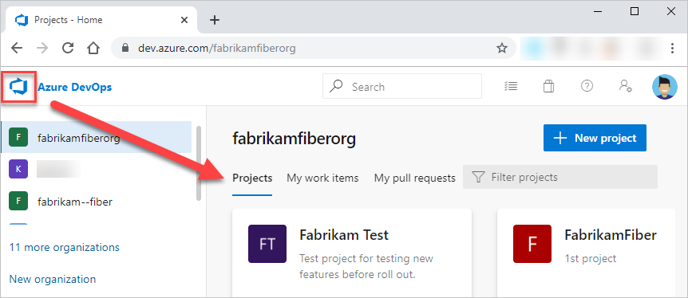

# About projects and scaling your organization

[!INCLUDE [temp](../../_shared/version-vsts-tfs-all-versions.md)]

A project provides a repository for source code and a place for a group of people to plan, track progress, and collaborate on building software solutions. It represents a fundamental container where data is stored when added to Azure DevOps.

When you create your project, a team of the same name is automatically created. For small teams, this is sufficient. However, for enterprise-level organizations, it may be necessary to scale up, to create additional teams and/or projects. These can be created within the single account or collection.

<table width="100%">
<tbody valign="top">
<tr>
<td width="40%">

**Single project and team defined within an organization or collection**  
  
</td>

<td width="60%">

**Multiple projects and teams defined within organization or collection**
  

</td>
</tr>
</tbody>
</table>

The collection-project-team structure provides teams a high-level of autonomy to configure their tools in ways that work for them. It also supports administrative tasks to occur at the appropriate level. As your organization grows, your tools can grow to support a [culture of team autonomy as well as organizational alignment](../../boards/plans/agile-culture.md).

## How do you manage work across the enterprise?

*How do you scale your DevOps and Agile tools to support your growing enterprise?*  

When you connect to Azure DevOps, you connect to an organization or project collection. Within that container, one or more projects may be defined. At a minimum, at least one project must be created in order to use the system.

::: moniker range=">= azure-devops-2019"
You can scale your organization in the following ways:

- To support different business units, you can add projects
- Within a project, you can add teams
- Add repositories and branches
- To support continuous integration and deployment, you can add agents, agent pools, and deployment pools
- To manage a large number of users, you can manage access through Azure Active Directory

::: moniker-end

::: moniker range=">= tfs-2013 <= tfs-2018"
You can scale your on-premises TFS deployment in the following ways:

- To increase performance, you can add server instances
- To support different business units, you can add project collections and projects
- Within a project, you can add teams
- Add repositories and branches
- To support continuous integration and deployment, you can add agents, agent pools, and deployment pools
- To manage a large number of users, you can manage access through Active Directory

::: moniker-end

Both Azure DevOps Services and Azure DevOps Server are enterprise-ready platforms that support teams of any size, from tens to thousands. Azure DevOps Services, our cloud service, provides a scalable, reliable, and globally available hosted service. It is backed by a 99.9% SLA, monitored by our 24x7 operations team, and available in local data centers around the world.

## How to view projects defined for your organization or collection

You can view the projects defined for your organization by opening the **Projects** page.

::: moniker range=">= azure-devops-2019"

1. Choose the  Azure DevOps logo to open **Projects**.

	> [!div class="mx-imgBorder"]  
	>   

2. From there, you can choose a project from the set of projects listed.

::: moniker-end

::: moniker range=">= tfs-2015 <= tfs-2018"

1. Choose the  Azure DevOps logo to open **Projects**.

	> [!div class="mx-imgBorder"]  
	> 

2. From there, you can choose a project from the set of projects listed.

	> [!div class="mx-imgBorder"]  
	> 

::: moniker-end

::: moniker range=">= tfs-2013 <= tfs-2015"

1. Choose the name of the server.

	> [!div class="mx-imgBorder"]  
	> 

2. From there, you can choose a project from the set of projects listed.

::: moniker-end

## When to add another project

In general, we recommend that you use a single project to support your organization or enterprise. A single project minimizes the maintenance of administrative tasks and supports the most optimized / full-flexibility [cross-link object](../../boards/queries/link-work-items-support-traceability.md) experience.  

Even if you have many teams working on hundreds of different applications and software projects, you can most easily manage them within a single project. A project serves to isolate data stored within it; you can't easily move data from one project to another. When you move data from one project to another, you typically lose the history associated with that data.

### Reasons to add another project

::: moniker range=">= azure-devops-2019"
Instances where you may want to add another project include the following:

- To prohibit or manage access to the information contained within a project to select groups
- To support custom work tracking processes for specific business units within your organization  
- To support entirely separate business units that have their own administrative policies and administrators  
- To support testing customization activities or adding extensions prior to rolling out changes to the working project
- To support an Open Source Software (OSS) project

::: moniker-end

::: moniker range=">= tfs-2013 <= tfs-2018"
Instances where you may want to add another project include the following:

- To prohibit or manage access to the information contained within a project
- To support custom work tracking processes for specific business units within your organization  
- To support entirely separate business units that have their own administrative policies and administrators
- To support testing customization activities or adding extensions prior to rolling out changes to the working project

::: moniker-end

::: moniker range=">= azure-devops-2019"

## Private and public projects

You can add either public or private projects to your organization. You can also [change the visibility of a project from private to public](../public/make-project-public.md).

Private projects require that you add and manage user access. Users must sign-in to gain access to a project, even if it is read-only access. All users added to a project gain access to information contained with the project and organization. For details, see [Resources granted to project members](resources-granted-to-project-members.md).

A public project, on the other hand, doesn't require users  to sign in to gain read-only access to many of the services. Public projects provide support to share code with others and to support continuous integration/continuous deployment (CI/CD) of open source software. To learn more about public projects, see [What is a public project?](../public/about-public-projects.md).

::: moniker-end

## Structure your project

When you add a project, look at using the following elements to structure it to support your business needs:

- [Create a Git repository](../../repos/git/creatingrepo.md) for each sub-project or application, or [create root folders within a TFVC repository](../../repos/tfvc/branch-folders-files.md) for each sub-project.  
- [Define area paths](../settings/set-area-paths.md) to support different sub-projects, products, features, or teams.
- [Define iteration paths (aka sprints)](../settings/set-iteration-paths-sprints.md) that can be shared across teams.
- [Add a team](../../organizations/settings/add-teams.md) for each product team that develops a set of features for a product. Note that each team you create automatically creates a security group for that team which you can use to manage permissions for a team. See also, [Portfolio management](../../boards/plans/portfolio-management.md).
- [Grant or restrict access to select features and functions](../security/restrict-access.md) using custom security groups.
- [Create query folders](../../boards/queries/organize-queries.md) to organize queries for teams or product areas into folders.
- [Define or modify notifications](../../notifications/index.md) set at the project level.

## Customizing and configuring projects

You can configure and customize most services and applications to support your business needs or the way your teams work. Within each project you can perform the following tasks. For a comprehensive view of what resources can be configured, see [About team, project, and organizational-level settings](../settings/about-settings.md).

::: moniker range=">= azure-devops-2019"

- **Dashboards**: Each team can [configure their set of dashboards](../../report/dashboards/dashboards.md) to share information and monitor their progress.
- **Source control**: For each [Git repository](../../repos/git/index.md), you can apply branch policies and define branch permissions. For TFVC repositories, you can [set check-in policies](../../repos/tfvc/add-check-policies.md).
- **Work tracking**: You can add fields, change the workflow, add custom rules, and add custom pages to the work item form of most work item types. You can also add custom work item types. For details, see [Customize an inheritance process](../settings/work/inheritance-process-model.md).
- **Build and Release**: You can fully customize your build and release pipelines, define build steps, release environments, and deployment schedule. For details, see [Build and Release](../../pipelines/index.md).  
- **Test**: You can define and configure test plans, test suites, and test cases as well as configure test environments; additionally you can add test steps within your build pipelines. For details, see [Exploratory & Manual Testing](../../test/index.md) and [continuous testing for your builds](../../pipelines/languages/dotnet-core.md#run-your-tests).

::: moniker-end

::: moniker range=">= tfs-2013 <= tfs-2018"

- **Dashboards**: Each team can [configure their set of dashboards](../../report/dashboards/dashboards.md) to share information and monitor their progress.
- **Source control**: For each [Git repository](../../repos/git/index.md), you can apply branch policies and define branch permissions. For TFVC repositories, you can [set check-in policies](../../repos/tfvc/add-check-policies.md).
- **Work tracking**: You can add fields, change the workflow, add custom rules, and add custom pages to the work item form of most work item types. You can also add custom work item types. For details, see [Customize the On-premises XML process model](../../reference/on-premises-xml-process-model.md).
- **Build and Release**: You can fully customize your build and release pipelines, define build steps, release environments, and deployment schedule. For details, see [Build and Release](../../pipelines/index.md).  
- **Test**: You can define and configure test plans, test suites, and test cases as well as configure test environments; additionally you can add test steps within your build pipelines. For details, see [Exploratory & Manual Testing](../../test/index.md) and [continuous testing for your builds](../../pipelines/languages/dotnet-core.md#run-your-tests).

::: moniker-end

<a id="add-team" />

## When to add a team, scaling Agile tools across the enterprise

As your organization grows, you'll want to add teams to provide them the Agile tools that each team can configure to meet their workflow. To learn more, see the following articles.  

- [Scale Agile to large teams](/azure/devops/learn/agile/scale-agile-large-teams)
- [About teams and Agile tools](../settings/about-teams-and-settings.md)
- Manage a [portfolio of backlogs](../../boards/plans/portfolio-management.md) and gain insight into each team's progress as well as the progress of all programs.  
- Use [Delivery plans](../../boards/plans/review-team-plans.md) to review the schedule of stories or features your teams plan to deliver. Delivery plans show the scheduled work items by sprint (iteration path) of selected teams against a calendar view.
- Incrementally adopt [practices that scale](../../boards/plans/practices-that-scale.md) to create greater rhythm and flow within your organization, engage customers, improve project visibility, and develop a productive workforce.
- Structure projects to gain [visibility across teams](../../boards/plans/visibility-across-teams.md) or to support [epics, release trains, and multiple backlogs to support the Scaled Agile Framework](../../boards/plans/scaled-agile-framework.md).

To review  stories and short videos on how Microsoft transitioned from waterfall to Agile, see [Scaling Agile Across the Enterprise](https://stories.visualstudio.com/scaling-agile-across-the-enterprise/).

## Clients that support connection to a project

In addition to connecting through a web browser, you can connect to a project from the following clients:

- [Visual Studio (Professional, Enterprise, Test Professional)](https://www.visualstudio.com/products/compare-visual-studio-2015-products-vs)
- [Visual Studio Code](https://code.visualstudio.com/Docs)
- [Visual Studio Community](https://www.visualstudio.com/products/visual-studio-community-vs.aspx)
- [Eclipse: Team Explorer Everywhere](/azure/devops/java/download-eclipse-plug-in)
- [Office Excel](../../boards/backlogs/office/bulk-add-modify-work-items-excel.md)
- [Office Project](../../boards/backlogs/office/create-your-backlog-tasks-using-project.md)
- [PowerPoint Storyboarding](../../boards/backlogs/office/storyboard-your-ideas-using-powerpoint.md)
- [Microsoft Test Manager](https://msdn.microsoft.com/library/jj635157.aspx)
- [Microsoft Feedback Client](../../project/feedback/give-feedback.md)

See also, [Compatibility with Azure DevOps Server versions](/azure/devops/server/compatibility).

## Related articles

- [Get started as an administrator](../../user-guide/project-admin-tutorial.md)
- [Web portal navigation](../../project/navigation/index.md)
- [What do I get with a project?](../../user-guide/services.md?toc=/azure/devops/organizations/projects/toc.json&bc=/azure/devops/organizations/projects/breadcrumb/toc.json)
- [Understand differences between Azure DevOps](../../user-guide/about-azure-devops-services-tfs.md?toc=/azure/devops/organizations/projects/toc.json&bc=/azure/devops/organizations/projects/breadcrumb/toc.json)

<!--- Various blog resources 

-   
- [One project to rule them out](https://nkdagility.com/one-team-project/)  
- [Working within a single Project with Team Foundation Server 2012](https://nkdagility.com/working-within-a-single-team-project-with-team-foundation-server-2012/)

-->
