# Connect to a project in Azure DevOps

[!INCLUDE [version-all](../../includes/version-all.md)]

Learn how to connect to a project to share code, build apps, track work, and collaborate with team members. You can use any of the following clients:
  
- [Web portal](#web-portal)  
- [Visual Studio or Team Explorer](#visual-studio)  
- [Eclipse/Team Explorer Everywhere](../../repos/git/share-your-code-in-git-eclipse.md)
- [Android Studio with the Azure DevOps Services Plugin for Android Studio](/previous-versions/azure/devops/java/download-android-studio-plug-in)  
- [IntelliJ with the Azure DevOps Services Plugin for IntelliJ](/previous-versions/azure/devops/java/download-intellij-plug-in) 
- [Visual Studio Code](/previous-versions/azure/devops/java/vscode-extension)

A project defines a process and data storage in which you manage your software projects from planning to deployment. When you connect to a project, you connect to an organization or project collection. One or more projects may be defined within a collection. There must be at least one project. For more information, see [About projects and scaling your organization](about-projects.md).

## Prerequisites

- If you don't have a project yet, [create one](create-project.md).

- If you need to add a team, see [Add teams](../../organizations/settings/add-teams.md). If you don't have access to the project, [get invited to the team](../security/add-users-team-project.md).

- From each of these clients, you can switch context to a different project and connect as a different user. If you work remotely, configure your client to [connect to an Azure DevOps Proxy Server](#proxy).

- To get started with a code base, [set up Git](../../repos/git/gitquickstart.md) or [set up TFVC](../../repos/tfvc/index.yml).

## Connect from the web portal

1. If you're not a member of a security group, ask your Project Administrator to add you.  

1. Open a browser and enter a URL that uses the following form:  

   ::: moniker range="azure-devops"
   <pre><code>https://dev.azure.com/<i>OrganizationName</i>/<i>ProjectName</i> </code></pre>
   ::: moniker-end

   ::: moniker range=">= azure-devops-2019 < azure-devops" 
   <pre><code>http://<i>ServerName</i>/DefaultCollection/<i>ProjectName</i></code></pre> 

   For example, to connect to the server named **FabrikamPrime**, type: **http://FabrikamPrime/DefaultCollection**.
   ::: moniker-end
   ::: moniker range=">= tfs-2013 < azure-devops-2019" 
   <pre><code>http://<i>ServerName</i>:8080/tfs/DefaultCollection/<i>ProjectName</i></code></pre> 

   For example, to connect to the server named **FabrikamPrime**, type: **http://FabrikamPrime:8080/tfs/DefaultCollection**.

   The default Port is 8080. If you don't use default values, specify the port number and directory for your server.
   ::: moniker-end

1. When you access the server for the first time, a Windows Identity dialog box appears. Enter your credentials and choose **OK**.

   > [!TIP]
   > If you select **Remember me**, you won't have to enter your credentials the next time you connect.

1. Choose your project, team, or page of interest.

    ::: moniker range=">= azure-devops-2019"

    From the project summary page, hover over a service and then choose the page you want. To choose another project, choose **Azure DevOps**. 

	> [!div class="mx-imgBorder"]  
	> 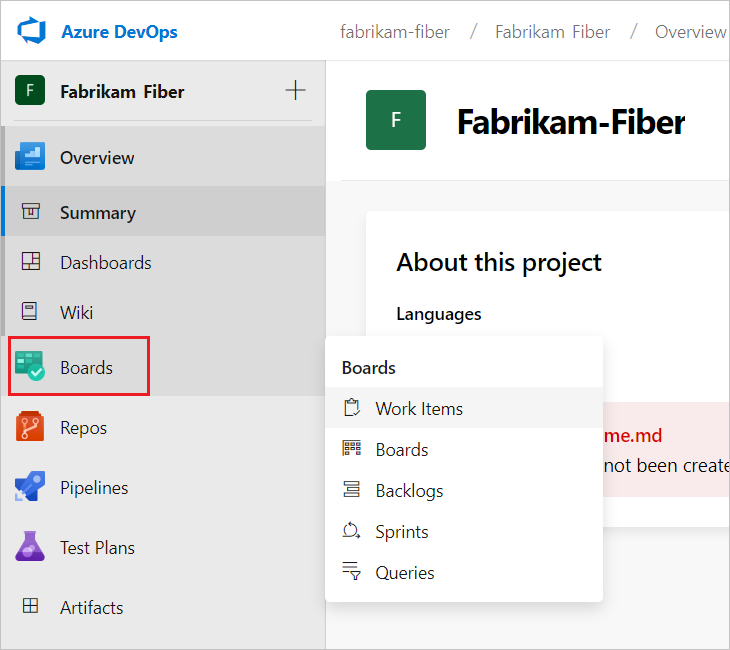  

    ::: moniker-end
 
    ::: moniker range=">= tfs-2017 <=tfs-2018"

    From the project summary page, hover over a service and then choose the page you want. To choose another project, choose the  Azure DevOps logo.

	> [!div class="mx-imgBorder"]  
	>   

    ::: moniker-end

    ::: moniker range=">= tfs-2013 <= tfs-2015"

    Choose your project or team from the set of available links, or choose **Browse** to access all projects and teams.

	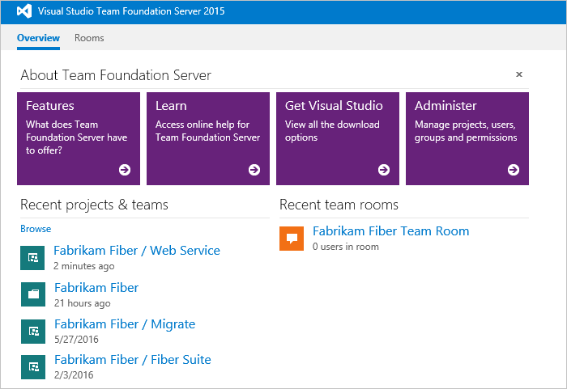 

    ::: moniker-end

To learn more about each page and the tasks you can do, see [Web portal navigation](../../project/navigation/index.md).

### Sign in with different credentials

::: moniker range=">= tfs-2013 <= tfs-2015"

1. Open Windows Security from the context menu associated with your name.

    

1. Enter your credentials.

    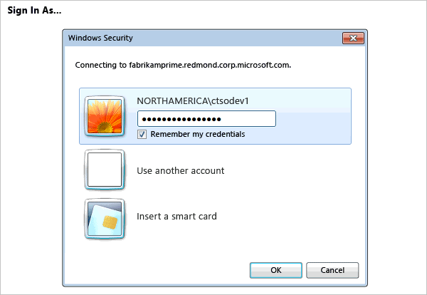

::: moniker-end

::: moniker range=">= tfs-2017"

1. Open your profile menu and choose **Sign out**.

    > [!div class="mx-imgBorder"]  
	> 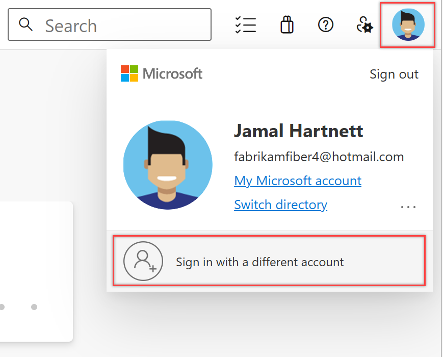

1. Choose **Sign in** and enter your credentials.

::: moniker-end

### Open the web portal from Team Explorer

Open the web portal from the home page.

## Connect from Visual Studio or Team Explorer

If you haven't already, [download and install a version of Visual Studio](https://visualstudio.microsoft.com/downloads/download-visual-studio-vs).

If you're not a member of an Azure DevOps security group, [get added to one](../security/add-users-team-project.md). Check with a team member. You'll need the names of the server, project collection, and project to connect to.

# [Visual Studio 2019](#tab/visual-studio-2019)

### Visual Studio 2019

1. Select the **Manage Connections** button in Team Explorer to open the **Connect** page. Choose **Connect to a Project** to select a project to connect to.

   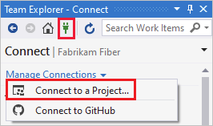  

   **Connect to a Project** shows the projects you can connect to, along with the repos in those projects.

   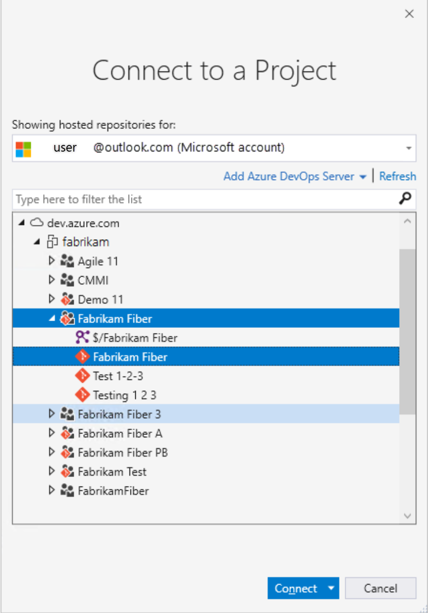

1. Select **Add Azure DevOps Server** to connect to a project in Azure DevOps Services. Enter the URL to your server and select **Add**.

   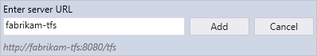

1. Select a project from the list and select **Connect**.

# [Visual Studio 2017](#tab/visual-studio-2017)

### Visual Studio 2017

<a id="vs-2017-connect-dialog" />

1. Select the **Manage Connections** button in Team Explorer to open the **Connect** page. Choose the **Connect to Team Project** link to select a project to connect to.

     

   **Connect to a Project** shows the projects you can connect to, along with the repos in those projects.

   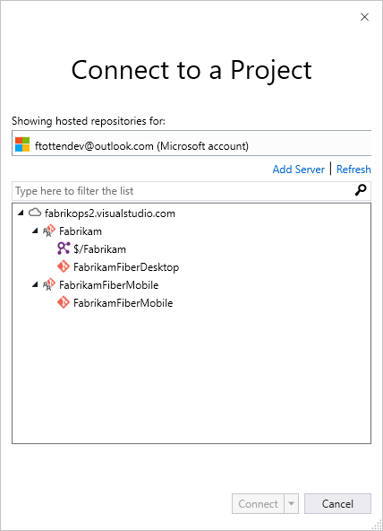

1. Select **Add Server** to connect to a project in Team Foundation Server. Enter the URL to your TFS server and select **Add**.

   

1. Select a project from the list and select **Connect**.

# [Visual Studio 2015](#tab/visual-studio-2015)

### Visual Studio 2015

<a id="connect-dialog" /> 
<a id="vs-2015-connect-dialog" /> 

1. Select the **Manage Connections** button in Team Explorer to open the **Connect** page. Choose **Connect to Team Project** to select a different organization, TFS, or project to connect to.

   

1. Select the projects to work on.

   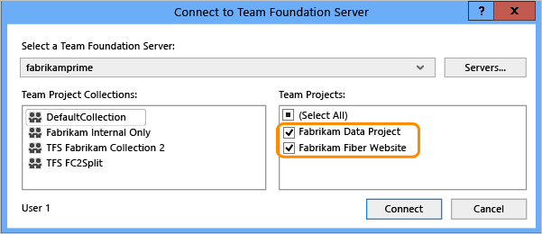

   If it's your first time connecting, add TFS to the list of recognized servers.

   

If you selected just one project, you'll see the **Home** page for that project. The pages differ based on the resources enabled and the source control system selected for your project.

Team Explorer displays the **Home** page for that project. The pages that appear differ based on the resources enabled and the source control system selected for your project.

> [!div class="mx-tdBreakAll"]  
> |Home page with Git  |Home page with TFVC  |
> |-------------|----------|
> |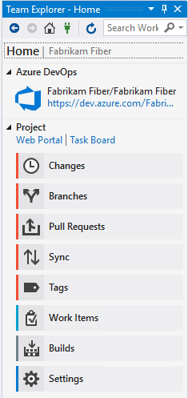|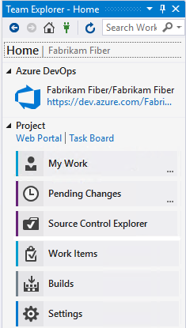|

To learn more about each page and the tasks you can do, see [Navigate in Visual Studio Team Explorer](../../user-guide/work-team-explorer.md).

Your client remembers the set of connections you've configured. You can switch from one project to another from the **Connect** page.

---

### Change sign-in credentials

# [Visual Studio 2019](#tab/visual-studio-2019)

### Visual Studio 2019

1. From **Connect**, choose the **Connect to a Project** link to sign in with different credentials.

     

1. Select a different user or select **Add an account** to access a project using different credentials.

   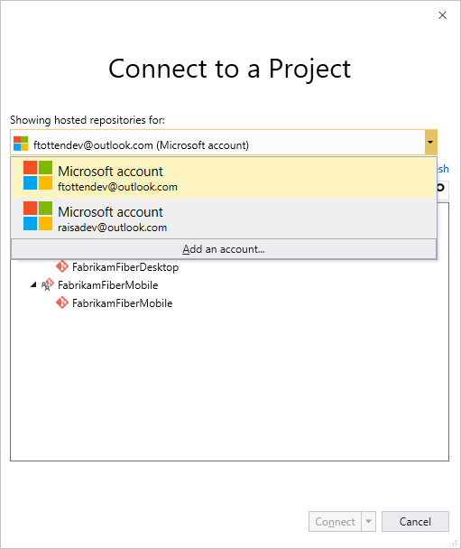 

1. Sign in using an account that is associated with an Azure DevOps project, either a valid Microsoft account or GitHub account.

# [Visual Studio 2017](#tab/visual-studio-2017)

### Visual Studio 2017

<a id="connect-account-dialog" /> 
<a id="vs-2015-connect-account-dialog" />

1. From **Connect**, choose **Connect to Team Project** to sign in with different credentials.

     

1. Select a different user from the drop-down or select **Add an account** to access a project using different credentials.

   

1. Sign in using a valid Microsoft account that is associated with an Azure DevOps Services or TFS project.

# [Visual Studio 2015](#tab/visual-studio-2015)

### Visual Studio 2015

1. From **Connect**, choose **Connect to Team Project** to sign in with different credentials.

     

   The **Switch User** link appears only when you're actively connected to a project on Azure DevOps Services.  

   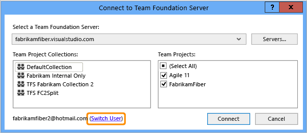

1. Sign in using a valid Microsoft account that is associated with Azure DevOps Services or a TFS project.

---

### Use different Visual Studio credentials

You can run Visual Studio with credentials different from your current Windows user account. Find *devenv.exe* under the *Program Files (86)* folder for your version of Visual Studio.

Select Shift and right-click *devenv.exe*, then select **Run as different user**.

### User accounts and licensing for Visual Studio

To connect to a project, you need your user account added to the project. The [organization owner (Azure DevOps Services)](../accounts/add-organization-users.md) or a [Project Administrator](../security/set-project-collection-level-permissions.md) usually does adds user accounts.

::: moniker range="azure-devops"
Azure DevOps Services provides access to the first five account users free. After that, you need to [pay for more users](../billing/buy-basic-access-add-users.md). 
::: moniker-end

::: moniker range=">= tfs-2013 <= tfs-2018"

For on-premises TFS, each user account must have a TFS client access license (CAL). All Visual Studio subscriptions and paid Azure DevOps Services users include a TFS CAL. Find out more about licensing from the [Team Foundation Server pricing page](https://visualstudio.microsoft.com/team-services/tfs-pricing).

::: moniker-end

You can also provide access to Stakeholders in your organization who have limited access to select features as described in [Work as a Stakeholder](../security/get-started-stakeholder.md).

## Configure Visual Studio to connect to Azure DevOps Proxy Server

If your remote team uses a [Azure DevOps Proxy Server](/azure/devops/server/install/install-proxy-setup-remote) to cache files, you can configure Visual Studio to connect through that proxy server and download files under Team Foundation version control.

1. First, make sure that you've connected to Azure DevOps Server as described [in the previous section](#visual-studio).

1. From the Visual Studio **Tools** menu, select **Options**, then select **Source Control** > **Plug-in Selection**. Select **Visual Studio Team Foundation Server**.

    

1. For **Visual Studio Team Foundation Server**, enter the name and port number for the Azure DevOps Proxy Server. Select **Use SSL encryption (https) to connect**.

    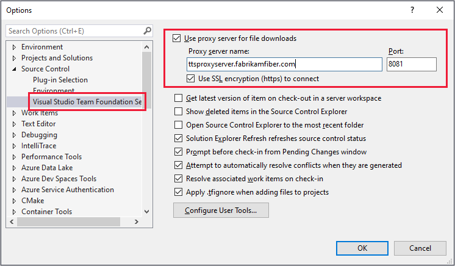

    Make sure you specify the port number that your administrator assigned to TFS Proxy.

To associate a file type with a compare or merge tool, see [Associate a file type with a file-comparison tool](../../repos/tfvc/associate-file-type-file-comparison-tool.md) or [Associate a file type with a merge tool](../../repos/tfvc/associate-file-type-merge-tool.md).

### What other clients support connection to Azure DevOps?

Besides connecting through a web browser, Visual Studio, Eclipse, Excel, and Project you can connect to a project from these clients:

- [Visual Studio Code](https://code.visualstudio.com/Docs)
- [Visual Studio Community](https://visualstudio.microsoft.com/products/visual-studio-community-vs.aspx) 
- [Eclipse: Team Explorer Everywhere](/previous-versions/azure/devops/java/download-eclipse-plug-in) 
- [Azure Test Plans](/previous-versions/azure/devops/test/mtm/guidance-mtm-usage) (formerly Test Manager)
- [Microsoft Feedback Client](../../project/feedback/give-feedback.md) 

### Requirements and client compatibility

Some tasks or features aren't available when you connect to a later version of Azure DevOps Server than your client supports. For more information, see [client compatibility](/azure/devops/server/compatibility).

### Determine your platform version

See [Feedback and support](../../user-guide/provide-feedback.md#platform-version).

## Next steps

Learn more about how to:

- [Work in web portal](../../project/navigation/index.md)  
- [Work in Team Explorer](../../user-guide/work-team-explorer.md) 
- [Work in Office Excel or Project](../../boards/backlogs/office/track-work.md)
- [Troubleshoot connection](../../user-guide/troubleshoot-connection.md)  

If all you need is a code repository and bug tracking solution, then start with the [Get Started with Azure Repos](../../repos/git/gitquickstart.md) and [Manage bugs](../../boards/backlogs/manage-bugs.md).  

To start planning and tracking work, see [Get started with Agile tools to plan and track work](../../boards/get-started/what-is-azure-boards.md).