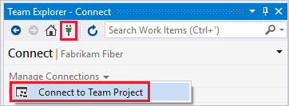
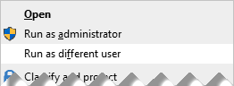

# Connect to a project in Azure DevOps

[!INCLUDE [temp](../../_shared/version-vsts-tfs-all-versions.md)]

To share code, build apps, track work, and collaborate with team members, you connect to a project from one of the following clients:
  
- [Web portal](#web-portal)  
- [Visual Studio or Team Explorer](#visual-studio)  
- [Eclipse/Team Explorer Everywhere](../../repos/git/share-your-code-in-git-eclipse.md)
- [Android Studio with the Azure DevOps Services Plugin for Android Studio](../../java/download-android-studio-plug-in.md)  
- [IntelliJ with the Azure DevOps Services Plugin for IntelliJ](../../java/download-intellij-plug-in.md) 
- [Visual Studio Code](../../java/vscode-extension.md)    

> [!NOTE]
> A project defines a process and data storage in which you manage your software projects from planning to deployment. When you connect to a project, you connect to an organization or project collection. Within that collection, one or more projects may be defined. At a minimum, at least one project must be created in order to use the system. For more information, see [About projects and scaling your organization](about-projects.md).

If you don't have a project yet, [create one](create-project.md). If you need to add a team, see [Add teams](../../organizations/settings/add-teams.md). If you don't have access to the project, [get invited to the team](../security/add-users-team-project.md). 

From each of these clients, you can quickly switch context to a different project and connect under a different sign-in user name. If you work remotely, you can configure your client to [connect to a TFS Proxy server](#proxy).

To get started with a code base, [set up Git](../../repos/git/gitquickstart.md) or [set up TFVC](../../repos/tfvc/overview.md).

## Connect from the web portal

1.  If you're not a member of a security group, ask your project administrator to add you.  

2.  Open a browser window and enter a URL that uses the following form:  

	::: moniker range="azure-devops"
	<pre><code>https://dev.azure.com/<i>OrganizationName</i>/<i>ProjectName</i> </code></pre>
	::: moniker-end

	::: moniker range=">= tfs-2013 <= tfs-2018" 
	<pre><code>http://<i>ServerName</i>:8080/tfs/DefaultCollection/<i>ProjectName</i></code></pre> 

    For example, to connect to the server named **FabrikamPrime**, type: **http://FabrikamPrime:8080/tfs/**.

    The default Port is 8080. Specify the port number and directory for your server if defaults aren't used.
	::: moniker-end

3.  When you access the server for the first time, a Windows Identity dialog box appears. Fill in your credentials and choose the **OK** button.

    > [!TIP]
    > If you select the **Remember me** check box you won't have to enter your credentials the next time you connect. 
 
::: moniker range=">= tfs-2017"   
0. From the project summary page, hover over a service and then choose the page of interest. To choose another project, choose the  Azure DevOps logo.  

	> [!div class="mx-imgBorder"]  
	>   

::: moniker-end  

::: moniker range=">= tfs-2013 <= tfs-2015"   
0.  Choose your project or team from the set of available links, or choose Browse to access all projects and teams.   

	 
::: moniker-end   

To learn more about each page and the tasks you can perform, see [Web portal navigation](../../project/navigation/index.md).

### Log on with different credentials

1.  Open Windows Security from the context menu associated with your name.

    

2.  Enter your credentials.

    

### Open the web portal from Team Explorer

-   Open the web portal from the home page.

    

## Connect from Visual Studio or Team Explorer

1.  If you haven't already, [download and install a version of Visual Studio](https://visualstudio.microsoft.com/downloads/download-visual-studio-vs).

2.  If you're not a member of a TFS security group, [get added as one](../security/add-users-team-project.md).

3.  Check with a team member to determine the names of the server, project collection, and project to connect to.

::: moniker range="tfs-2017"

<a id="vs-2017-connect-dialog" />

### Visual Studio 2017

Select the connect icon in Team Explorer to open up the **Connect** page. Choose the **Connect to Team Project** link to select a project to connect to.

  

The **Connect to a Project** dialog appears and show the projects you can connect to, along with the repos in those projects.

Select the **Add Server** link to connect to a project in Team Foundation Server. Enter the URL to your TFS server and select **Add**. 

Select a project from the list and select **Connect**.

::: moniker-end

::: moniker range="tfs-2015"

<a id="connect-dialog" /> 
<a id="vs-2015-connect-dialog" /> 

### Visual Studio 2015

From the **Connect** page, choose the **Connect to Team Project** link to select a different organization, TFS, or project to connect to.

  
Select the projects to work on.

   

If it's your first time connecting, add TFS to the list of recognized servers.   

   

If you selected just one project, you'll see the Home page for that project. The pages that appear differ based on the resources enabled and the source control system selected for your project.
	
   

Team Explorer displays the Home page for that project. The pages that appear differ based on the resources enabled and the source control system selected for your project.

> [!div class="mx-tdBreakAll"]  
> |Home page with Git  |Home page with TFVC  |
> |-------------|----------|
> |||

To learn more about each page and the tasks you can perform, see [Work in Team Explorer](../../user-guide/work-team-explorer.md).   
   
Your client remembers the set of connections you've configured. You can quickly switch from one project to another from the Connect page.

::: moniker-end

### Change sign-in credentials
 
::: moniker range="tfs-2017"

<a id="connect-account-dialog" /> 
<a id="vs-2015-connect-account-dialog" />

### Visual Studio 2017

1. From the Connect page, choose the **Connect to Team Project** link to sign in with different credentials.

	  

	Select a different user from the drop-down or select **Add an account...** to access a project using different sign-in credentials.

	 

2. Sign in using a valid Microsoft account &mdash; an account that is associated with an Azure DevOps Services or TFS project.

::: moniker-end

::: moniker range="tfs-2015"

### Visual Studio 2015

1. From the Connect page, choose the **Connect to Team Project** link to sign in with different credentials.

	  

	The **Switch User** link appears only when you are actively connected to a project on Azure DevOps Services.  

	 

2. Sign in using a valid Microsoft account &mdash; an account that is associated with Azure DevOps Services or a TFS project. 

::: moniker-end

### Change sign-in credentials

To run Visual Studio under sign-in credentials that are different from your signed-in Windows account, open the context menu for **devenv.exe** to access your run as options.

You can locate the executable in the following folder: *Drive*:\\Program Files (x86)\Microsoft Visual Studio 12.0\Common7\IDE\.

## Related articles

- [Work in web portal](../../project/navigation/index.md)  
- [Work in Team Explorer](../../user-guide/work-team-explorer.md) 
- [Work in Office Excel or Project](../../boards/backlogs/office/track-work.md)   
- [Troubleshoot connection](../../user-guide/troubleshoot-connection.md)  

If all you need is a code repository and bug tracking solution, then start with the [Git get started guide](../../repos/git/gitquickstart.md) and [Manage bugs](../../boards/backlogs/manage-bugs.md).  

To start planning and tracking work, see [Get started with Agile tools to plan and track work](../../boards/get-started/what-is-azure-boards.md). 

### User accounts and licensing

To connect to a project, you need your user account added to the project. This is typically done by the [organization owner (Azure DevOps Services)](../accounts/add-organization-users.md) or a [project administrator](../security/set-project-collection-level-permissions.md). 

::: moniker range="azure-devops"
Azure DevOps Services provides access to the first 5 account users free. After that, you need to [pay for more users](../../billing/buy-basic-access-add-users.md). 
::: moniker-end

::: moniker range=">= tfs-2013 <= tfs-2018"

For on-premises TFS, each user account must have a TFS client access license (CAL). All Visual Studio subscriptions and paid Azure DevOps Services users include a TFS CAL. Find out more about licensing from the [Team Foundation Server pricing page](https://visualstudio.microsoft.com/team-services/tfs-pricing).

::: moniker-end

In addition, you can provide access to stakeholders in your organization who have limited access to select features as described in [Work as a Stakeholder](../security/get-started-stakeholder.md).

## Configure Visual Studio to connect to TFS Proxy

If your remote team uses a [TFS Proxy server](/azure/devops/server/install/install-proxy-setup-remote) to cache files, you can configure Visual Studio to connect through that proxy server and download files under Team Foundation version control.

1.  First, make sure that you have connected to TFS as described [in the previous section](#visual-studio).

2.  From the Visual Studio **Tools** menu, open the Options dialog and expand the Source Control folder. On the Plug-in Selection page, confirm that Visual Studio Team Foundation Server is selected.

    

3.  On the Visual Studio Team Foundation Server page, enter the name and port number for the TFS Proxy server. Select the **Use SSL encryption (https) to connect** checkbox.

    

    Make sure you specify the port number that your administrator assigned to TFS Proxy.

To **Configure User Tools** to associate a file type with a compare or merge tool, see [Associate a file type with a file-comparison tool](../../repos/tfvc/associate-file-type-file-comparison-tool.md) or [Associate a file type with a merge tool](../../repos/tfvc/associate-file-type-merge-tool.md).

### What other clients support connection to Azure DevOps?

In addition to connecting through a web browser, Visual Studio, Eclipse, Excel, and Project you can connect to a  project from these clients: 

- [Visual Studio Code](https://code.visualstudio.com/Docs)
- [Visual Studio Community](https://visualstudio.microsoft.com/products/visual-studio-community-vs.aspx) 
- [Eclipse: Team Explorer Everywhere](/azure/devops/java/download-eclipse-plug-in) 
- [Microsoft Test Manager](../../test/mtm/guidance-mtm-usage.md)
- [Microsoft Feedback Client](../../project/feedback/give-feedback.md) 

### Requirements and client compatibility

Some tasks or features aren't available when you connect to a later version of Azure DevOps Server than which your client supports. For more information, see [Client compatibility](/azure/devops/server/compatibility).

### Determine your platform version

See [Feedback and support](../../user-guide/provide-feedback.md#platform-version).

