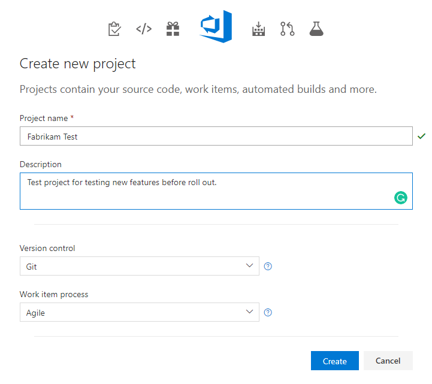

# Create a project

[!INCLUDE [temp](../../_shared/version-vsts-tfs-all-versions.md)]  

You add another project to establish a repository for source code and a place for a group of developers and teams to plan, track progress, and collaborate on building software solutions. Each project you add provides boundaries to isolate data from other projects and must be managed and structured to support your business needs. To learn more about projects and when or when not to add one, see [About projects and scaling your organization](about-projects.md).

<!---Projects differ from [software application projects or solutions](https://msdn.microsoft.com/library/zfzh36t7.aspx). -->  

::: moniker range=">= tfs-2013 <= tfs-2018"
> [!NOTE]
> If you don't want to manage an on-premises server, you can 
[sign up for VSTS and create a project](../accounts/create-organization-msa-or-work-student.md). 
::: moniker-end

If you have a project already, and want to start coding an application project, then see one of the following topics:  [Set up Git on your dev machine](../../repos/git/gitquickstart.md) or [Develop your app in Team Foundation version control](../../repos/git/gitquickstart.md).

::: moniker range=">= tfs-2017"
## Add a project from the web portal 
::: moniker-end

::: moniker range="vsts"
> [!IMPORTANT]  
> To create a Public project, or to make a private project public, see [Create a public project](../public/create-public-project.md) or [Change the project visibility, public or private](../public/make-project-public.md). Additional policy settings must be enabled to work with public projects. 

::: moniker-end

::: moniker range="tfs-2018"
> [!IMPORTANT]  
> When you create a project from the web portal, several process template files are ignored. Specifically, the files that would create a Report Manager site aren't supported. If you want SQL Server Reporting Services  to be to be available, then create your project from Visual Studio or Team Explorer. For details, see [Process template and plug-in files, Client support for project creation](../../work/customize/reference/process-templates/overview-process-template-files.md#client-support).  
::: moniker-end

::: moniker range="tfs-2017"
> [!IMPORTANT]  
> When you create a project from the web portal, several process template files are ignored. Specifically, the files that would create a Report Manager site and a SharePoint project portal aren't supported. 
>
> If you want these features to be to be available on your on-premises TFS, then create your project from Visual Studio or Team Explorer. For details, see [Process template and plug-in files, Client support for project creation](../../work/customize/reference/process-templates/overview-process-template-files.md#client-support).  
::: moniker-end

::: moniker range=">= tfs-2017"

If you're not a member of the Project Collection Administrators Group, [get added as one](../security/set-project-collection-level-permissions.md). To create projects you must have the **Create new projects** permission set to **Allow**.

::: moniker-end

[!INCLUDE [temp](../../_shared/navigation.md)] 

# [New navigation](#tab/new-nav)

::: moniker range="vsts"

0. Choose the  VSTS icon to open the **Projects** page, and then choose **Create Project**.

	> [!div class="mx-imgBorder"]  
	>   

0. Fill out the form provided. Provide a name for your new project, select its initial source control type, select a process, and choose with whom to share the project.

    See [choosing the right version control for your project](../../repos/tfvc/comparison-git-tfvc.md) and [choose a process](../../work/work-items/guidance/choose-process.md) for guidance.  

	> [!div class="mx-imgBorder"]  
	>   

::: moniker-end

::: moniker range=">= tfs-2013  <= tfs-2018"

[!INCLUDE [temp](../../_shared/new-navigation-not-supported.md)]  

::: moniker-end

# [Previous navigation](#tab/previous-nav)

::: moniker range="vsts"

0. Choose the  VSTS icon to open the **Projects** page, and then choose **New Project**.

	> [!div class="mx-imgBorder"]  
	>   

0. Fill out the form provided. Provide a name for your new project, select its initial source control type, select a process, and choose with whom to share the project.

    See [choosing the right version control for your project](../../repos/tfvc/comparison-git-tfvc.md) and [choose a process](../../work/work-items/guidance/choose-process.md) for guidance.  

	> [!div class="mx-imgBorder"]  
	>   

::: moniker-end

::: moniker range="tfs-2018"

> [!NOTE]   
> TFS 2018 and later versions no longer support native integration with SharePoint products. If you're planning to upgrade to TFS 2018, read [About SharePoint integration](/vsts/report/sharepoint-dashboards/about-sharepoint-integration) to learn about the options available to you. 

0. Choose the  VSTS icon to open the **Projects** page, and then choose **New Project**.

	> [!div class="mx-imgBorder"]  
	>   

0. Fill out the form provided. Provide a name for your new project, select its initial source control type, select a process, and choose with whom to share the project.

    See [choosing the right version control for your project](../../repos/tfvc/comparison-git-tfvc.md) and [choose a process](../../work/work-items/guidance/choose-process.md) for guidance.  

	> [!div class="mx-imgBorder"]  
	>  

::: moniker-end

::: moniker range="tfs-2015"

If you're using TFS 2015.2 or later version, then you can create a project from the web as well. It's important to note that for projects created from the web, Reporting and SharePoint integration steps will be skipped when creating the project. You can still set up [Reporting](../../report/admin/add-reports-to-a-team-project.md) and [SharePoint](/tfs/server/admin/add-sharepoint-to-tfs) manually after project creation. 

::: moniker-end

::: moniker range=">= tfs-2015 <= tfs-2017"

0. If you have installed TFS 2017.1 or later version, choose the  gear icon to open the **Projects** page, and then choose **New Project**.

	> [!div class="mx-imgBorder"]  
	>   

	Otherwise, for TFS 2015.2 or TFS 2017, open the administration overview page by choosing the  gear icon at the top of the page and choose **Server settings**. Then choose **New team project...**.

	> [!div class="mx-imgBorder"]  
	> 

	Select the collection administration page for the collection you want to create the project in from the left pane, and choose **Create a new project...**.

0. Fill out the form provided. Provide a name for your new project, select its initial source control type, select a process, and choose with whom to share the project.

    See [choosing the right version control for your project](../../repos/tfvc/comparison-git-tfvc.md) and [choose a process](../../work/work-items/guidance/choose-process.md) for guidance.  

	> [!div class="mx-imgBorder"]  
	>  

::: moniker-end

::: moniker range=">= tfs-2013 <= tfs-2015"
Adding a project from the web portal isn't supported for TFS 2015 and earlier versions. Use [Team Explorer to add a project](#te).  
::: moniker-end

---

::: moniker range=">= tfs-2015 <= tfs-2018" 

## Add a project from Team Explorer 
You can create a project from Team Explorer after you have connected to an on-premises server. 
::: moniker-end

::: moniker range="tfs-2018"  

> [!NOTE]
> For TFS 2018 and later versions, users will be redirected to the web. They will no longer be able to create a project from Visual Studio. 
> 
> TFS 2018 and later versions no longer support native integration with SharePoint products. If you're planning to upgrade to TFS 2018, read [About SharePoint integration](../../report/sharepoint-dashboards/about-sharepoint-integration.md) to learn about the options available to you. 

::: moniker-end

::: moniker range=">= tfs-2015 <= tfs-2018" 

1.  If you're not a member of the Project Collection Administrators Group, [get added as one](../../organizations/security/set-project-collection-level-permissions.md). To create projects you must have the **Create new projects** permission set to **Allow**.

2.  Ask your TFS administrator about the following resources and get additional permissions as needed:

    -   Which project collection you should connect to when you create your project? If you installed TFS using the Basic Server Configuration Wizard, you have only one project collection named **DefaultCollection**. Unless you work in an enterprise organization and will be supporting hundreds of projects, you should add all your projects to a single project collection. If you need to create additional collections, see [Manage project collections](/tfs/server/admin/manage-team-project-collections).

    -   Has SQL Server Analysis Services and SQL Server Reporting Services been configured for the deployment? If so, ask your administrator to [add you as a member of the Team Foundation Content Managers group](../../report/admin/grant-permissions-to-reports.md) on the server that hosts SQL Server Reporting Services. Without these permissions, you'll be unable to create a project.

    -   Has a SharePoint Web application been configured for your deployment? If you want to configure a SharePoint portal when you create your project, ask the SharePoint administrator to give you Full Control permissions on the server that hosts SharePoint Products. Otherwise, you can skip this step and configure a portal at a later time.

3.  Open the same version of Visual Studio as the version of TFS that you're connecting to. If you don't see the Team Explorer pane, open **View\>Team Explorer** from the menu.

    As needed, [Download and install Visual Studio Community](https://visualstudio.microsoft.com/products/visual-studio-community-vs.aspx) to get a free copy of the latest version.

4.  Connect to the server and project collection where you want to create your project.

    

    You can access Team Explorer for free by installing [Visual Studio Community](https://visualstudio.microsoft.com/downloads/download-visual-studio-vs) or any other Visual Studio version.

    You must connect from a client that is at the same version level as TFS. That is, you must connect to TFS 2015 from a version of Visual Studio 2015.

    

    >**Tip:**  If you are running Team Explorer from a server that hosts SharePoint Products and SQL Server Reporting Services, you might need to run Visual Studio as an administrator.

5.  If it's your first time connecting to TFS, you'll need to add TFS to the list of recognized servers.

    

6.  Open the New Team Project Wizard.

    

7.  Name the project. Don't specify more than 64 characters.

    

8.  Choose a process template. For a comparison of the default process templates, see [Choose a process](../../work/work-items/guidance/choose-process.md).

    

9.  Choose your version control, either Git distributed repositories or TFVC, one centralized repo.

    

    Not sure which system to use? Learn more about 
	[Git](../../repos/git/overview.md) or [TFVC](../../repos/tfvc/overview.md). 

	After you've created your project, you can[add repositories](#git-and-tfvs-repos). 

10. Unless your project collection is configured to support a SharePoint project portal, you're done.

    

    If the Next button is active, you can configure your project portal.

    If the wizard encounters a problem, you'll receive an error message and a link to the project creation log. Review the [log file](faq-create-project.md#log-file) for specific errors and exceptions. 

11. When you're finished, you can see your project in Team Explorer. You can also choose the **Web Access** link to connect to your project from the web portal.

	<tbody valign="top">
	</tbody>
	
	<table>
	<tbody valign="top">
	<tr>
	<td></td>
	<td></td>
	</tr>
	</tbody>
	</table>

::: moniker-end

::: moniker range=">= tfs-2017"

## Add a project from the command line or scripts

You can create and get projects and other VSTS items from the command line or scripts using the VSTS CLI. Check out the [VSTS CLI documentation](https://docs.microsoft.com/en-us/cli/vsts/overview?view=vsts-cli-latest) to learn more.

::: moniker-end

::: moniker range="tfs-2017"
> [!NOTE]   
> The VSTS CLI is supported for TFS 2017.2 and later versions. 

::: moniker-end

## Try this next 

Once you've added a project, you'll have a default repository in which to add code. You'll want to add team members and structure your project to support your business needs. See these resources: 

- [Add team members](../../organizations/security/add-users-team-project.md) to enable other users to connect to your project.
- Start [developing your app in Team Foundation version control](../../repos/tfvc/index.md) or [use Git](../../repos/git/overview.md).
- [Additional project structure activities](about-projects.md#project-structure)

<a id="git-and-tfvs-repos" />

::: moniker range=">= tfs-2015"

### Add repositories
From the admin context of the web portal, you can add additional repositories to a project, either Git (distributed) or TFVC (centralized). While you can create many Git repositories, you can only create a single TFVC repository for a project.  Additional steps to address permissions may be required. See [Use Git and TFVC repos in the same team project](../../repos/git/team-projects.md). 

::: moniker-end

::: moniker range=">= tfs-2017"

> [!div class="mx-imgBorder"]  
>   

Name the repository and choose **Create**.

> [!div class="mx-imgBorder"]  
>   

::: moniker-end

::: moniker range="tfs-2015"
 

> [!NOTE]   
> The ability to work from both Git and TFVC repositories from the same project is supported when you connect to TFS 2015.1 and later versions. 

::: moniker-end