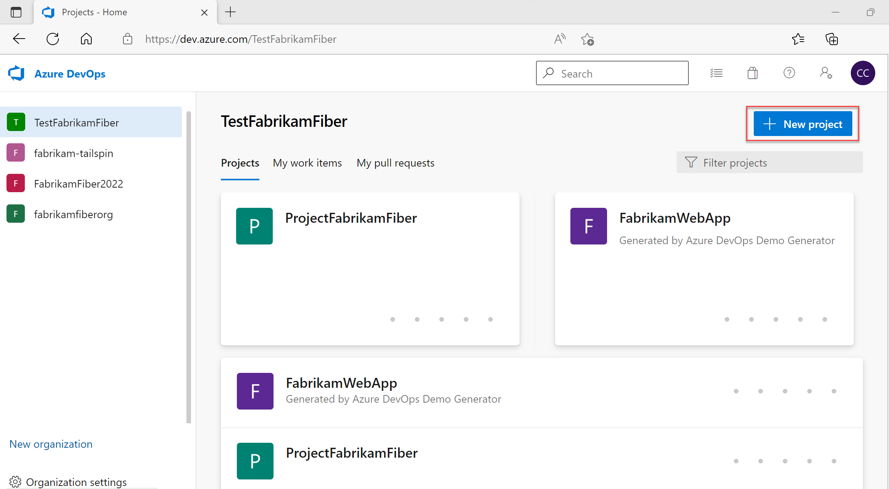
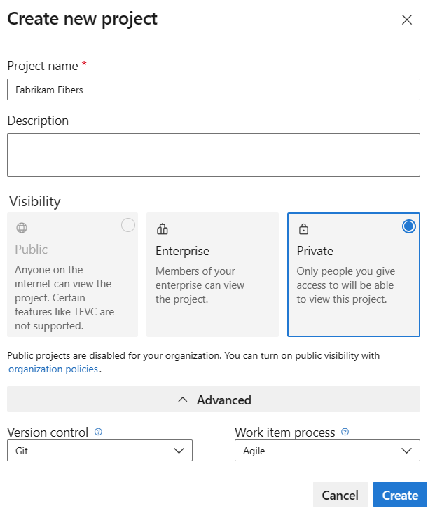
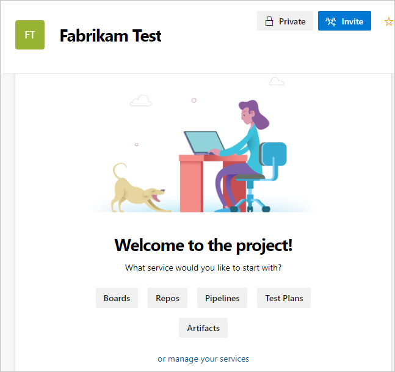
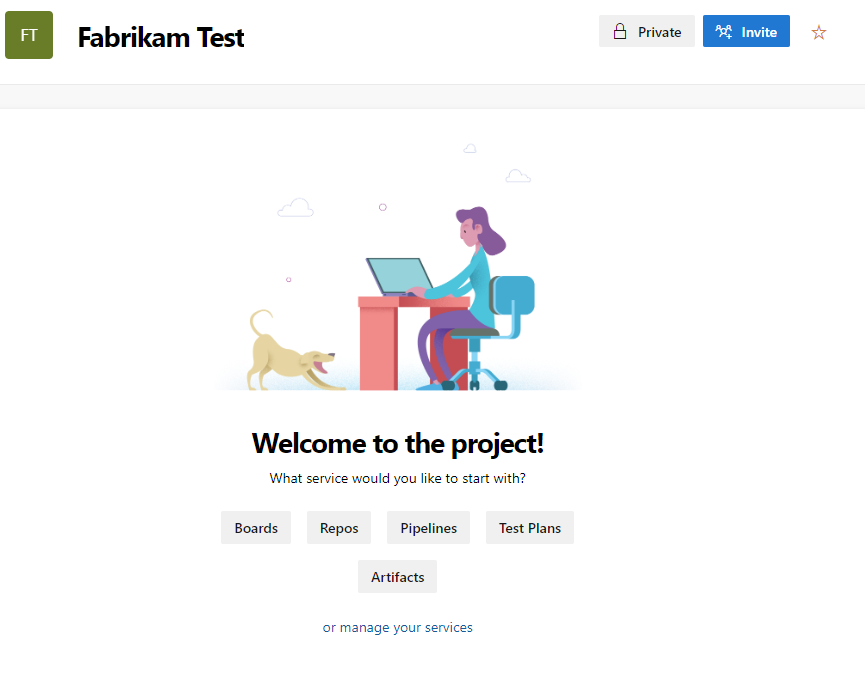
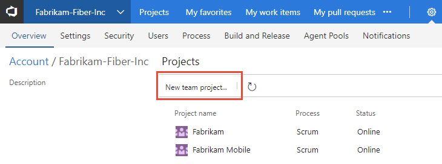
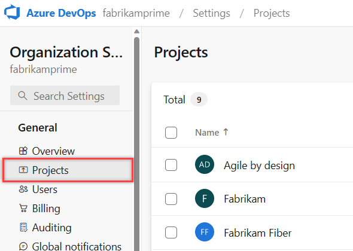
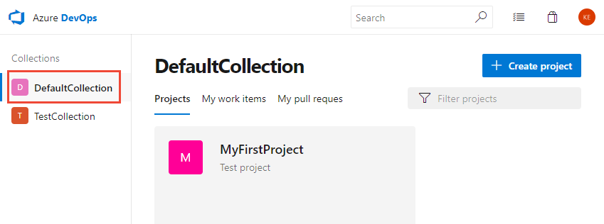
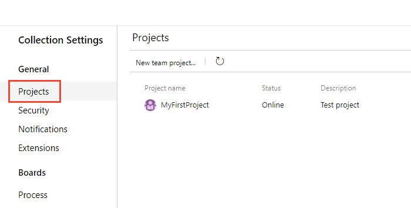
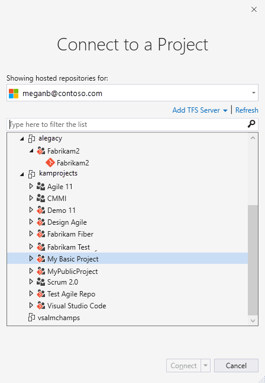

# Create a project in Azure DevOps

[!INCLUDE [version-lt-eq-azure-devops](../../includes/version-lt-eq-azure-devops.md)]

Create an Azure DevOps project to establish a repository for source code and to plan and track work. You can manage and structure your project to support your business needs. Each project provides boundaries to isolate data from other projects. For more information, see [About projects and scaling your organization](about-projects.md).

[!INCLUDE [version-selector](../../includes/version-selector-minimize.md)]

If you don't want to create a project in Azure DevOps, you can create [Azure DevOps Projects](/azure/devops-project/).

<!---Projects differ from [software application projects or solutions](/visualstudio/ide/creating-solutions-and-projects). -->  

::: moniker range="< azure-devops"
> [!NOTE]
> If you don't want to manage an on-premises server, [sign up for Azure DevOps Services](../accounts/create-organization.md) and create a project.
::: moniker-end

## Prerequisites

::: moniker range="azure-devops" 

- You need an organization before you can create a project. If you haven't created an organization yet, create one by following the instructions in [Sign up, sign in to Azure DevOps](../../user-guide/sign-up-invite-teammates.md), which also creates a project. Or see [Create an organization or project collection](../accounts/create-organization.md).  
- You must be a member of the Project Collection Administrators group or have the collection-level "Create new projects" permission set to *Allow*. If you're the Organization owner, you're automatically added to the Project Collection Administrators group. For more information, see [Change project collection-level permissions](../security/change-organization-collection-level-permissions.md).
::: moniker-end

::: moniker range=" < azure-devops"  

- You need a project collection before you can create a project. If you don't have one, [create a project collection now](/azure/devops/server/admin/manage-project-collections?view=azure-devops-2020#create-a-project-collection&preserve-view=true).
- You must be a member of the Project Collection Administrators group or have the "Create new projects permission" set to *Allow*. For more information, see [Change project collection-level permissions](../security/change-organization-collection-level-permissions.md).

::: moniker-end  

::: moniker range="azure-devops"

> [!IMPORTANT]  
> To create a public project or to make a private project public, see the information in [Make a private project public](../projects/make-project-public.md). You must enable additional policy settings to work with public projects. Then, return to this article to create your project.

::: moniker-end

## Create a project

::: moniker range="azure-devops"

You can create up to 1000 projects within an organization in Azure DevOps. For more information, see [Work tracking, process, and project limits](../settings/work/object-limits.md). 

::: moniker-end

::: moniker range=" < azure-devops"

> [!IMPORTANT]  
> When you create a project from the web portal, Azure DevOps ignores several process template files. Specifically, the files that would create a Report Manager site aren't supported. You can add reports later by following the instructions provided in [Add reports to a teams project](/previous-versions/azure/devops/report/admin/add-reports-to-a-team-project). 

There isn't a limit on the number of projects that you can create within a project collection, however for performance purposes, we recommend you limit the number to 300 or fewer. For more information, see [Work tracking, process, and project limits](../settings/work/object-limits.md). 

::: moniker-end

#### [Browser](#tab/browser)

::: moniker range=">= azure-devops-2020"

1. Sign in to your organization (```https://dev.azure.com/{yourorganization}```). 

2. Select **New project**.

   > [!div class="mx-imgBorder"]  
   >   

3. Enter information into the form provided. 
   - Provide a name for your project. Your project name can't contain special characters, such as `/ : \ ~ & % ; @ ' " ? < > | # $ * } { , + = [ ]`, can't begin with an underscore, can't begin or end with a period, and must be 64 or fewer characters. 
   - Enter an optional description. 
   - Choose the visibility, initial source control type, and work item process. 
     For more information, see [Choosing the right version control for your project](../../repos/tfvc/comparison-git-tfvc.md) and [Choose a process](../../boards/work-items/guidance/choose-process.md).

   > [!div class="mx-imgBorder"]  
   >   

   When you choose public visibility, anyone on the internet can view your project. With private visibility, only users you give access to can view your project. For more information about features and access levels for public projects, see [Make a private project public.](make-project-public.md). If the **Public** option isn't available, you need to change the policy.

4. Select **Create**. Azure DevOps displays the project welcome page.

   > [!div class="mx-imgBorder"]  
   > 

   Select one of the following options to continue:

   - **Invite**: Add others to your project. See [Add users to a project or team](../security/add-users-team-project.md). You can only invite users who are already in your organization. For more information, see [Add users to a project](../security/add-users-team-project.md#add-users-to-a-project).
   - **Boards**: Add work items. See [View and add work items using the Work Items page](../../boards/work-items/view-add-work-items.md).
   - **Repos**: Clone or import a repository or initialize a *README* file for your project summary page. See [Clone an existing Git repo](../../repos/git/clone.md).
   - **Pipelines**: Define a pipeline. See [Azure Pipelines documentation](../../pipelines/index.yml).
   - **Test Plans**: Define test plans and test suites. See [Create test plans and test suites](../../test/create-a-test-plan.md).
   - **Artifacts**: Discover, install, and publish NuGet, npm, and Maven packages. See the [Azure Artifacts overview](../../artifacts/start-using-azure-artifacts.md).
   - **manage your services**: Disable the visibility of services. See [Turn a service on or off](../settings/set-services.md).

::: moniker-end

::: moniker range="azure-devops-2019"

1. Sign in to your organization (```https://dev.azure.com/{yourorganization}```). 

2. Select **New project**.

   > [!div class="mx-imgBorder"]  
   > 

3. Enter information into the form provided. 
   - Provide a name for your project. Your project name can't contain special characters, such as `/ : \ ~ & % ; @ ' " ? < > | # $ * } { , + = [ ]`, can't begin with an underscore, can't begin or end with a period, and must be 64 or fewer characters. 
   - Enter an optional description. 
   - Choose the visibility, initial source control type, and work item process. 
     For more information, see [Choosing the right version control for your project](../../repos/tfvc/comparison-git-tfvc.md) and [Choose a process](../../boards/work-items/guidance/choose-process.md).

   > [!div class="mx-imgBorder"]  
   >   

   When you choose public visibility, anyone on the internet can view your project. With private visibility, only people who you give access to can view your project. For more information about public projects, see [Create a public project in your organization](../projects/create-project.md). If the **Public** option isn't available, you need to change the policy.

4. Select **Create**. Azure DevOps displays the welcome page.

   > [!div class="mx-imgBorder"]  
   > 

   Select one of the following options to continue:

   - **Invite**: add others to your project. See [Add users to a project or team](../security/add-users-team-project.md). You can only invite users who are already in your organization. For more information, see [Add users to a project](../security/add-users-team-project.md#add-users-to-a-project).
   - **Boards**: add work items. See [View and add work items using the Work Items page](../../boards/work-items/view-add-work-items.md).
   - **Repos**: clone or import a repository, or initialize a *README* file for your project summary page. See [Clone an existing Git repo](../../repos/git/clone.md).
   - **Pipelines**: define a pipeline. See [Azure Pipelines documentation](../../pipelines/index.yml).
   - **Test Plans**: define test plans and test suites. See [Create test plans and test suites](../../test/create-a-test-plan.md).
   - **Manage your services**: disable the visibility of services. See [Turn a service on or off](../settings/set-services.md).

::: moniker-end

::: moniker range="tfs-2018"

1. Select  **Azure DevOps** to open the **Projects** page. Then, select **New project**.

   > [!div class="mx-imgBorder"]  
   >   

2. Enter a name for your new project, initial source control type, and work item process.

   Azure DevOps displays the project summary. For more information, see [Share your project, view project activity](project-vision-status.md).

   > [!div class="mx-imgBorder"]  
   > 

::: moniker-end

#### [Team Explorer](#tab/team-explorer)

> [!NOTE]
> Creating a project from Visual Studio/Team Explorer is no longer supported. 

<a id="te"> </a>

#### [Azure DevOps CLI](#tab/azure-devops-cli)

<a id="create-project" /> 

::: moniker range="azure-devops" 

Create a project using the [az devops project create](/cli/azure/devops/project#az-devops-project-create) command. For more information, see [Get started with Azure DevOps CLI](../../cli/index.md).  

> [!div class="tabbedCodeSnippets"]
```azurecli
az devops project create --name
                         [--description]
                         [--open]
                         [--org]
                         [--process]
                         [--source-control {git, tfvc}]
                         [--visibility {private, public}]
```

#### Parameters

- **name**: Required. Name of the project to create.  
- **description**: Optional. Short description of the project, enclosed in quotes.  
- **open**: Optional. Once the command creates a project, it opens in the default web browser.
- **org**: Optional. Azure DevOps organization URL. Required if not configured as default or picked up by using `git config`. You can configure the default organization using `az devops configure -d organization=ORG_URL`. Example: `https://dev.azure.com/MyOrganizationName/`.
- **process**: Optional. The process model to use, such as *Agile*, *Basic*, *Scrum*, *CMMI*, or other custom process model. Agile is the default. To learn more, see [About process customization and inherited processes](../settings/work/inheritance-process-model.md).
- **source-control**: Optional. Type of source control repository to create for the project: *git* (default) or *tfvc*. If not, name or ID of the project. Example: `--project "Fabrikam Fiber"`.
- **visibility**: Optional. Project visibility. Accepted values: *private* (default), *public*.

#### Example

The following command creates a new project named *MyFirstProject* under the Fabrikam organization. The project has the *Agile* process, and *git* source control. For more information, see [Output formats for Azure CLI commands](/cli/azure/format-output-azure-cli).

> [!div class="tabbedCodeSnippets"]
```azurecli
az devops project create --name MyFirstProject --description "Test project 1" --org https://dev.azure.com/fabrikam/ --process Agile --source-control  git --output table
ID                                    Name             Visibility    Process    Source Control
------------------------------------  ---------------  ------------  ---------  ----------------
be87c31a-fbb3-4377-b207-57a8caf65e31  MyFirstProject1  Private       Agile      Git
```
::: moniker-end

[!INCLUDE [temp](../../includes/note-cli-not-supported.md)]

* * *

## List projects

#### [Browser](#tab/browser)

::: moniker range=">= azure-devops-2020"

View a list of projects from your web browser.

1. Sign in to your organization (```https://dev.azure.com/{yourorganization}```). 

2. Select **Organization settings** and then select **Projects**.

	> [!div class="mx-imgBorder"]  
	>   

	Open your desired project. For more information, see [About settings at the user, team, project, or organization-level](../settings/about-settings.md).

::: moniker-end
 
::: moniker range=">= tfs-2018 <= azure-devops-2019"  

1. To view the projects defined for a collection, select  **Azure DevOps** to open the **Projects** page. 

2. Choose the collection to view the list of projects. The page lists the last two or three projects you connected to at the upper screen. Choose any project to connect to that project.

	> [!div class="mx-imgBorder"]  
	>   

Or

1. Select **Admin settings** and then choose **Projects** to list all projects.

	> [!div class="mx-imgBorder"]  
	>   

	You can choose a project to open project settings for that project on this page. For more information, see [About settings at the user, team, project, or organization-level](../settings/about-settings.md). Or, you can [rename a project](rename-project.md) or [delete a project](delete-project.md).

::: moniker-end

#### [Team Explorer](#tab/team-explorer)

From Team Explorer, you can view a list of projects by connecting to an organization or server. For more information, see [Connect to a project](connect-to-projects.md).

#### Visual Studio 2019
> [!div class="mx-imgBorder"]  
>   

#### Visual Studio 2017

> [!div class="mx-imgBorder"]  
>   

#### Visual Studio 2015

> [!div class="mx-imgBorder"]  
>   

#### [Azure DevOps CLI](#tab/azure-devops-cli)

<a id="list-projects" /> 

::: moniker range="azure-devops" 

### List projects with CLI

List projects defined for an organization using the [az devops project list](/cli/azure/devops/project#az-devops-project-list) command. For more information, see [Get started with Azure DevOps CLI](../../cli/index.md).  

> [!div class="tabbedCodeSnippets"]
```azurecli
az devops project list [--org]
                       [--skip]
                       [--top]
```

#### Parameters 

- **org**: Optional. Azure DevOps organization URL. You can configure the default organization using `az devops configure -d organization=ORG_URL`. Required if not configured as default or picked up via `git config`. Example: `https://dev.azure.com/MyOrganizationName/`.
- **skip**: Optional. Number of results to skip.
- **top**: Optional. Maximum number of results to list.

#### Example

The following command lists the projects defined under the Fabrikam organization. For other output format options, see [Output formats for Azure CLI commands](/cli/azure/format-output-azure-cli).

> [!div class="tabbedCodeSnippets"]
```azurecli
az devops project list --org https://dev.azure.com/fabrikam/ --output table
ID                                    Name                Visibility
------------------------------------  ------------------  ------------
647c53b6-01aa-462a-adb7-da81d5620167  Agile 11            Private
c5dd744a-574b-4308-925f-386415dc6efc  CMMI                Private
d4195a58-96a9-4753-bbf9-4c0a4ef178e0  Demo 11             Private
80bb92c7-49b2-43db-9843-3baf8f64b85d  Design Agile        Private
5444a5d2-6bd9-4ad1-a25d-eea59855c2a9  Fabrikam Fiber      Private
36946972-3a77-4bb4-875e-2f66a0f4652c  Fabrikam Test       Private
29bb9642-45f2-42bf-b391-f8701999c5fc  My Basic Project    Private
7aafdbeb-8de1-4e84-978f-d0ee4595b90e  MyFirstProject      Private
aba0ed07-3174-4793-9f2c-d2c5fa6b44d7  MyPublicProject     Public
36ca09d1-9de0-4e3e-8277-e10b5cb96f7c  Scrum 2.0           Private

```

<a id="show-project" /> 

### Show project information in the web portal

You can list project information and optionally open the project in the web portal using the [az devops project show](/cli/azure/devops/project#az-devops-project-show) command.  

> [!div class="tabbedCodeSnippets"]
```azurecli
az devops project show --project
                       [--open]
                       [--org]
```

#### Parameters 

- **project**: Required. Name or ID of the project. Example: `--project "Fabrikam Fiber"`.
- **open**: Optional. Open the project in the default web browser.
- **org**: Optional. Azure DevOps organization URL. You can configure the default organization using `az devops configure -d organization=ORG_URL`. Required if not configured as default or picked up by using `git config`. Example: `https://dev.azure.com/MyOrganizationName/`.

#### Example

The following command lists information for `MyFirstProject` under the Fabrikam organization and opens it in the web portal. For other output format options, see [Output formats for Azure CLI commands](/cli/azure/format-output-azure-cli).

> [!div class="tabbedCodeSnippets"]
```azurecli
az devops project show --project MyFirstProject --open --org https://dev.azure.com/fabrikam/ --output table
ID                                    Name            Visibility    Process            Source Control
------------------------------------  --------------  ------------  -----------------  ----------------
40751c1d-236b-418d-9df4-d5cc7c0e7bd6  MyFirstProject  Private       Scrum - Inherited  Git

```
::: moniker-end

[!INCLUDE [temp](../../includes/note-cli-not-supported.md)]

* * *

<a id="add-a-repository" />
<a id="add-a-repository-to-your-project" />

## Add a repository to your project

You can add Git (distributed) or TFVC (centralized) repositories to your project. You can create many Git repositories, but only a single TFVC repository for a project. More steps to address permissions may be required. For more information, see [Use Git and TFVC repos in the same project](../../repos/git/team-projects.md).

## Next steps

> [!div class="nextstepaction"]
> [Structure your project](about-projects.md#project-structure)

## Related articles

- [Rename a project](rename-project.md)
- [Save project data](save-project-data.md)
- [Delete a project](delete-project.md)
- [Restore a project](restore-project.md)
- [Get started as an administrator](../../user-guide/project-admin-tutorial.md)
- [Install extensions](../../marketplace/install-extension.md)

## Frequently asked questions (FAQs)

### Q: How do I resolve permission-related errors?

::: moniker range="azure-devops"
A: If you receive an error message that states you don't have permission to create a project, you need to request organization-level permissions. See [Change permissions at the organization- or collection-level](../security/change-organization-collection-level-permissions.md).  
::: moniker-end
          
::: moniker range=" < azure-devops"
A: If you receive an error message that states you don't have permission to create a project, you need to request collection-level permissions. See [Change permissions at the organization or collection-level](../security/change-organization-collection-level-permissions.md). If you have SQL Reporting Services installed in the collection, you also need permissions for reports to the [Team Foundation Content Managers group](/previous-versions/azure/devops/report/admin/grant-permissions-to-reports).  
::: moniker-end
          
### Q: How do I resolve Error TF30321? 

A: **Error TF30321: The name you entered is already used for another project on the Team Foundation Server** indicates that you should use a different name for your project. The name you entered is either in active use or has undergone partial deletion, but not full deletion.  
          
Even when you've deleted a project, you may get the same name error. Some components could be created or deleted even though others aren't. In this event, you can't reuse the name associated with the project.
          
::: moniker range="tfs-2018"

To verify project deletion or remove remaining components associated with a partially deleted project, use the [Delete project command line tool(TFSDeleteProject)](/azure/devops/server/command-line/tfsdeleteproject-cmd). Then try again to create the project with the same name.
          
Even with troubleshooting, you might not be able to use the same name. Some components of the deleted project could be scheduled for deletion but not yet deleted.

### Q: How do I resolve an error message related to a plug-in?

A: The process template used to create the project contains several XML plug-in files. If one of these files contains a format or other error, an error message appears.

Review the project creation log to determine the plug-in that caused the error. After you discover the problem, you can either contact the developer or vendor that provided the plug-in, or attempt to fix the problem yourself. For more information, see [Customize a process template](../../reference/process-templates/customize-process.md).

### Q: How do I resolve a problem connecting to a server?

A: If you receive an error message about a problem connecting to a server, retrieving information from a server, or checking permissions to create projects, an incorrectly configured server in the deployment could have caused it. This problem is especially common after a server move, failover, or other maintenance activity.
          
Contact the TFS system administrator and request that they verify the server configuration.
          
::: moniker-end

::: moniker range="< azure-devops"
### Q: How do I add my custom process template to the list?
A: [Upload your template](../../boards/work-items/guidance/manage-process-templates.md) using the Process Template Manager. For more information, see [Customize process](../../reference/process-templates/customize-process.md).
          
<a id="log-file">  </a>

### Q: Where is the log file located?

A: The log file is stored in $:\\Users\\*user name*\\AppData\\Local\\Temp and labeled vso\_TeamProjectCreation\_*yyyy\_mm\_dd\_hh\_mm\_ss*.log.
          
The log shows each action taken by the wizard at the time of the failure and may include more details about the error. You can review the log entries to find network or file related issues by searching for **Exception** or **Error**.
                 
### Q: How do I add SQL Server Reporting services?

A: See [Add reports to a project](/previous-versions/azure/devops/report/admin/add-reports-to-a-team-project).
::: moniker-end
